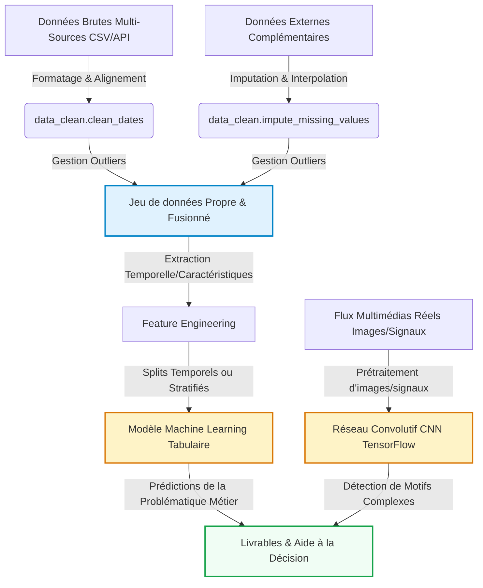

# Mon Projet Data Science
Étudiante 1 : Monica RADIFERA RASAMOELIJAONA, Étudiant 2 : Hocine AKLI
2026-05-19

- [Introduction et Contexte Métier](#sec-intro)
  - [Contexte du Projet](#contexte-du-projet)
  - [Objectif Analytique](#objectif-analytique)
- [Acquisition et Préparation des Données (Data
  Wrangling)](#sec-wrangling)
  - [Audit de Qualité](#audit-de-qualité)
- [🧹 Jalon 1 : Data Wrangling & Nettoyage (Squelette
  Étudiant)](#broom-jalon-1--data-wrangling--nettoyage-squelette-étudiant)
- [Analyse Exploratoire des Données (EDA)](#sec-eda)
  - [Statistiques Descriptives](#statistiques-descriptives)
  - [Statistiques Descriptives](#statistiques-descriptives-1)
  - [Ingénierie de Variables (Feature
    Engineering)](#ingénierie-de-variables-feature-engineering)
- [📊 Jalon 1 : Analyse Exploratoire des Données (EDA) & Visualisation
  (Squelette
  Étudiant)](#bar_chart-jalon-1--analyse-exploratoire-des-données-eda--visualisation-squelette-étudiant)
- [Visualisation Multidimensionnelle (Insights)](#sec-viz)
- [Modélisation et Apprentissage](#sec-modelling)
  - [Schéma Global du Pipeline de
    Données](#schéma-global-du-pipeline-de-données)
  - [Modélisation Tabulaire (Machine
    Learning)](#modélisation-tabulaire-machine-learning)
- [🧠 Jalon 2 : Modélisation Prédictive & Apprentissage (Squelette
  Étudiant)](#brain-jalon-2--modélisation-prédictive--apprentissage-squelette-étudiant)
  - [Modélisation Vision / Deep Learning (Analyse d’Images ou
    Signaux)](#modélisation-vision--deep-learning-analyse-dimages-ou-signaux)
- [📷 Jalon 2 : Brique de Vision par Ordinateur (CNN & TensorFlow)
  (Squelette
  Étudiant)](#camera-jalon-2--brique-de-vision-par-ordinateur-cnn--tensorflow-squelette-étudiant)
- [Évaluation Métrique et Validation](#sec-evaluation)
  - [Stratégie de Validation](#stratégie-de-validation)
  - [Résultats et Interprétation](#résultats-et-interprétation)
- [Data Storytelling et Communication](#sec-storytelling)
  - [Recommandations Stratégiques /
    Métier](#recommandations-stratégiques--métier)
  - [Limites et Perspectives](#limites-et-perspectives)
- [Bibliographie](#bibliographie)

# Introduction et Contexte Métier

[](https://github.com/MonicaRad/aptispace-datascience-projet/actions/workflows/ci.yml)

Ce projet analyse les données sur le Mpox (Monkeypox) pour mieux
comprendre la propagation du virus. Face à l’émergence de cette maladie
dans plusieurs pays, il est important de pouvoir suivre l’évolution des
cas et identifier les zones à risque.

La problématique est de savoir comment prédire et anticiper la
propagation du Mpox à partir de données réelles. Cela pose des questions
scientifiques sur les tendances temporelles, les différences entre pays
et les facteurs influençant la diffusion du virus.

L’objectif est d’offrir des insights utiles pour la prise de décision en
santé publique : où surveiller davantage, quand anticiper un pic, et
comment optimiser les moyens de prévention.

## Contexte du Projet

Ce projet étudie la propagation du Mpox dans le but de détecter des
tendances et des zones à risque. Le domaine d’étude est la santé
publique, avec un focus sur l’épidémiologie et l’analyse de données
temporelles.

Ce sujet est stratégique car le Mpox représente une menace sanitaire
émergente, et sa surveillance permet de mieux préparer les systèmes de
santé. Comprendre sa dynamique aide à prévenir de futures vagues de
contamination.

L’analyse quantitative est indispensable car elle transforme des données
brutes en indicateurs actionnables. Elle permet de mesurer objectivement
l’évolution des cas, de comparer les pays et de fonder les décisions sur
des faits plutôt que sur des intuitions.

## Objectif Analytique

Les variables cibles principales sont la date, le pays, les new cases et
new deaths (nouveaux cas et décès quotidiens), ainsi que les total cases
et total deaths (cas et décès cumulés). L’objectif est d’analyser
l’évolution de ces indicateurs dans le temps et d’identifier les pays
les plus touchés par le Mpox.

Ce dataset est tabulaire avec des données épidémiologiques quotidiennes
par pays sur une période d’un an. L’analyse se concentre sur ces 15
variables disponibles pour comprendre la dynamique de propagation du
virus sans ajouter de données externes.

------------------------------------------------------------------------

# Acquisition et Préparation des Données (Data Wrangling)

Le succès de tout projet de Data Science repose sur la qualité de la
préparation des données ([McKinney 2020](#ref-pandas2020)). Cette
section documente l’audit de qualité et les étapes de nettoyage
appliquées à vos jeux de données bruts.

## Audit de Qualité

Le fichier de données a été vérifié sur les aspects essentiels de
qualité, notamment la structure des colonnes, la présence de valeurs
manquantes et la présence éventuelle de doublons. L’audit a montré que
certaines colonnes contenaient trop de cases vides, ce qui risquait de
nuire à la fiabilité des analyses.

Nous avons donc choisi de supprimer ces colonnes afin de conserver
uniquement les variables réellement exploitables. En parallèle, les
doublons ont aussi été contrôlés pour éviter les répétitions dans le jeu
de données et garantir une base plus propre.

Après ce tri, les données restantes ont pu être analysées sans
difficulté majeure. Le dataset final est donc mieux adapté aux étapes
d’exploration, de visualisation et de modélisation. \## Algorithme de
Nettoyage Le traitement des données a commencé par un nettoyage des
dates afin d’obtenir un format homogène et exploitable pour l’analyse
temporelle. Nous avons ensuite supprimé les colonnes contenant trop de
valeurs manquantes, car elles apportaient peu d’information et
risquaient de fragiliser les analyses.

Comme le jeu de données contenait à la fois des informations au niveau
des pays et des continents, nous avons conservé uniquement les données
par pays afin d’avoir une analyse plus précise et plus cohérente.

Enfin, nous avons supprimé les colonnes jugées non utiles car
redondantes, afin de simplifier le jeu de données et de garder
uniquement les variables pertinentes pour l’analyse. Nous avons
également recalculé les valeurs totals death pour les valeurs
manquantes, afin de garantir la cohérence des données avant l’analyse.
Les données sont ensuite triées par pays et date afin d’avoir une
meilleure visibilité. Ces étapes ont permis de travailler sur une base
plus propre, plus homogène et mieux adaptée aux analyses et à la
modélisation. \## Travaux Pratiques de Wrangling

# 🧹 Jalon 1 : Data Wrangling & Nettoyage (Squelette Étudiant)

Ce notebook correspond à la première étape du **Jalon 1**. L’objectif
est d’importer le jeu de données brut (`data/raw/raw_data_sample.csv`),
d’effectuer un audit de sa qualité (données manquantes, anomalies
physiques, formats de dates hétérogènes) et de le nettoyer à l’aide de
votre package personnalisé `src.data_clean`.

### 1. Importation des packages et chargement des données

### 2. Audit initial des données

**À faire par l’étudiant :** Explorez le dataset brut pour évaluer sa
structure : - Quelles sont les dimensions du dataset ? - Quels sont les
types de données par colonne ? - Reste-t-il des valeurs nulles ? Quel
est le taux de valeurs manquantes par variable ? - Y a-t-il des doublons
?

### 3. Nettoyage des colonnes inutile

### 4. Renommage des colonnes

### 5. Nettoyage de la date

La colonne `date` a été convertie au format datetime afin de permettre
des analyses temporelles : évolution des cas, agrégation par mois, suivi
de la progression de l’épidémie.

### 6. Suppression des agrégats non-pays

Les lignes correspondant aux continents ou aux agrégats globaux ont été
supprimées afin de conserver uniquement les observations par pays.

### 7. Suppression des colonnes redondantes

### 8. Gestion des valeurs manquantes

Les valeurs manquantes des colonnes numériques principales ont été
imputées par la médiane. Ce choix permet de limiter l’influence des
valeurs extrêmes, fréquentes dans les données épidémiologiques où
certains pays peuvent concentrer un nombre de cas beaucoup plus élevé
que d’autres.

### 9. tri, suppression des doublons et validation finale

### 10. Sauvegarde des données propres

Pour ce projet, le travail de data wrangling comprend :

- chargement du CSV brut ;
- audit initial du dataset : dimensions, types, valeurs manquantes et
  doublons ;
- conversion de la colonne date au format datetime ;
- suppression des agrégats globaux et continentaux ;
- renommage des colonnes principales ;
- traitement des valeurs manquantes par imputation ;
- suppression des colonnes redondantes ou peu utiles pour l’analyse ;
- vérification et suppression des doublons ;
- tri des données par pays et par date ;
- sauvegarde du dataset nettoyé pour l’analyse exploratoire.

------------------------------------------------------------------------

# Analyse Exploratoire des Données (EDA)

Dans cette section, nous analysons les relations statistiques
fondamentales qui régissent votre domaine d’étude au sein du jeu de
données.

## Statistiques Descriptives

## Statistiques Descriptives

Le jeu de données nettoyé contient les variables principales liées au
suivi du Mpox, notamment le pays, la date, le nombre total de cas, le
nombre total de décès, les nouveaux cas quotidiens et les nouveaux décès
quotidiens. Les premières observations montrent une structure temporelle
cohérente, avec des valeurs numériques qui varient selon les pays.

Les variables cumulées comme `total_cases` et `total_deaths` permettent
de suivre l’évolution globale de l’épidémie, tandis que les variables
journalières `daily_new_cases` et `daily_new_deaths` mettent en évidence
les fluctuations d’un jour à l’autre. On observe aussi que, dans
certains pays, les décès restent nuls sur plusieurs périodes, ce qui
traduit une faible mortalité observée dans ces données.

Dans l’ensemble, les variables nettoyées sont bien adaptées à une
analyse descriptive, car elles permettent de comparer les pays,
d’étudier l’évolution dans le temps et d’identifier les zones où la
propagation est la plus marquée.

## Ingénierie de Variables (Feature Engineering)

Dans notre cas, l’ingénierie de variables est restée assez limitée, car
le dataset contient déjà les informations utiles pour suivre l’évolution
du Mpox. Nous avons donc conservé les variables principales comme le
pays, la date, les nouveaux cas, les nouveaux décès, les cas totaux et
les décès totaux. Quand certaines valeurs de total_deaths étaient
manquantes, nous les avons recalculées à partir des informations
disponibles afin de garder une variable exploitable et cohérente.

L’intérêt de cette étape est de s’assurer que les données utilisées pour
la suite du projet soient fiables et complètes. Cela permet aussi de
garder une base propre pour l’analyse descriptive et la modélisation,
sans ajouter de variables artificielles qui ne viennent pas du dataset.
En pratique, cela montre une démarche rigoureuse de préparation des
données, ce qui est important dans un projet de data science. Cette
étape a surtout servi à nettoyer, compléter et organiser les variables
déjà présentes, plutôt qu’à créer de nouvelles caractéristiques. C’est
une approche adaptée à un rapport étudiant, parce qu’elle reste fidèle
aux données réelles et au travail effectivement réalisé. \## Travaux
Pratiques d’Exploration Visuelle (EDA)

# 📊 Jalon 1 : Analyse Exploratoire des Données (EDA) & Visualisation (Squelette Étudiant)

Ce notebook est dédié à la découverte de relations clés et à l’analyse
visuelle de nos données. À partir du jeu de données propre généré
précédemment, nous allons enrichir nos variables explicatives et appeler
les fonctions de notre module de visualisation `src.utils_viz` pour
générer des graphiques professionnels.

### 1. Importation des packages et configuration du style

### 2. Ingénierie de variables temporelles

**À faire par l’étudiant :** Appliquez la fonction `feature_engineering`
de `src.data_clean` pour enrichir votre DataFrame en caractéristiques de
temps classiques .

### 3. Visualisations Professionnelles

#### A. Profils d’évolution et tendances

**À faire par l’étudiant :** Appliquez la fonction `plot_generic_trends`
de votre module `src.utils_viz` pour tracer l’évolution de la valeur par
rapport au temps.

#### B. Répartition mondiale des cas cumulés de mpox par pays

Cette carte permet de visualiser la répartition géographique des cas
cumulés de mpox.  
Elle est pertinente car le dataset contient une dimension spatiale avec
une variable pays.  
Contrairement à un simple tableau, la carte facilite l’identification
rapide des zones les plus touchées et permet de comparer visuellement
l’intensité de l’épidémie entre les pays.

#### C. Carte animée de la propagation du mpox

**À faire par l’étudiant :** Générez un nuage de points de la relation
heure vs valeur en colorant les points selon la variable `dayofweek`, en
utilisant votre fonction `plot_bivariate_scatter`.

### 4. Synthèse des observations clés

Sur la base de vos figures, listez les **insights majeurs** observés sur
le comportement de vos variables.

------------------------------------------------------------------------

# Visualisation Multidimensionnelle (Insights)

Cette section présente les principaux résultats de l’exploration
visuelle du dataset et met en évidence les tendances les plus
importantes observées à travers les figures générées. \## Profils et
Distributions Caractéristiques

``` python
#| label: fig-top5-countries
#| fig-cap: "Évolution des cas totaux dans les 5 pays les plus touchés."
#| echo: false

# Sélection des 5 pays les plus touchés
top_5_countries = (
    df_feat.groupby('country')['total_cases']
    .max()
    .sort_values(ascending=False)
    .head(5)
    .index
)

# Filtrage du dataset
df_top5 = df_feat[df_feat['country'].isin(top_5_countries)]

# Visualisation des tendances
fig1 = uv.plot_generic_trends(
    df_top5,
    x_col='date',
    y_col='total_cases',
    group_col='country'
)

plt.show()
```

Cette figure montre l’évolution du nombre total de cas dans cinq pays au
cours du temps. On observe d’abord une forte montée des cas à partir de
l’été 2022, avec des rythmes différents selon les pays, puis une
stabilisation progressive vers le début de l’année 2023.

Un premier constat est que les États-Unis présentent le niveau de cas le
plus élevé sur toute la période, avec une croissance rapide puis un
plateau autour de 30 000 cas. Le Brésil arrive ensuite avec une
progression plus lente mais continue, tandis que l’Espagne atteint
également un niveau important avant de se stabiliser. La France et la
Colombie affichent des volumes plus faibles, avec une montée plus
tardive et une stabilisation autour de 4 000 cas.

Cette figure permet donc de voir que la propagation du Mpox n’a pas été
uniforme selon les pays. Elle met en évidence des dynamiques très
différentes, ce qui justifie une analyse par pays plutôt qu’une lecture
globale unique. \## Répartition mondiale

``` python
#| label: fig-correlation
#| fig-cap: "Répartiton mondiale."
#| echo: false

import plotly.express as px

map_data = (
    df_feat.groupby("country", as_index=False)["total_cases"]
    .max()
    .sort_values(by="total_cases", ascending=False)
)

fig = px.choropleth(
    map_data,
    locations="country",
    locationmode="country names",
    color="total_cases",
    hover_name="country",
    color_continuous_scale="Reds",
    title="Répartition mondiale des cas cumulés de Mpox par pays"
)

fig.update_layout(
    title_x=0.5,
    geo=dict(showframe=False, showcoastlines=True)
)

fig.show()
```

Cette carte montre la répartition mondiale des cas cumulés de Mpox par
pays. On voit clairement que les cas sont très concentrés dans quelques
pays, surtout en Amérique du Nord et en Amérique du Sud, tandis que la
majorité des autres pays affichent des niveaux plus faibles.

Un premier insight est que les États-Unis apparaissent comme le pays le
plus touché sur cette carte, avec une couleur beaucoup plus foncée que
les autres. On observe aussi un niveau élevé au Brésil, alors que les
pays d’Europe, d’Afrique et d’Asie semblent globalement moins touchés
dans ce jeu de données.

Cette visualisation est utile car elle permet de repérer rapidement les
zones géographiques les plus concernées. Elle confirme que la
propagation du Mpox n’est pas homogène à l’échelle mondiale et qu’une
approche par pays reste nécessaire pour bien interpréter les données.

------------------------------------------------------------------------

# Modélisation et Apprentissage

## Schéma Global du Pipeline de Données

Le pipeline complet intègre à la fois la branche analytique tabulaire
(Machine Learning) et la branche d’analyse visuelle ou de signaux
complexes (Deep Learning CNN) :



## Modélisation Tabulaire (Machine Learning)

*À rédiger par les étudiants : Expliquez le choix de vos algorithmes
d’apprentissage (supervisé ou non supervisé) et décrivez l’importance
des variables explicatives.*

\[Détailler votre modélisation ici\]

### Travaux Pratiques de Modélisation Tabulaire

# 🧠 Jalon 2 : Modélisation Prédictive & Apprentissage (Squelette Étudiant)

Dans ce notebook du **Jalon 2**, l’objectif est d’implémenter un
pipeline complet d’apprentissage supervisé pour prédire une variable
cible (`value`) à l’aide de Scikit-Learn.

Vous devrez mettre en œuvre une stratégie de découpage train/test
chronologique pour respecter la causalité temporelle.

### 1. Préparation de l’environnement

### 2. Définition des variables et split chronologique

**À faire par l’étudiant :** - Identifiez vos colonnes prédictives
(`features`) et la colonne cible (`value`). - Séparez chronologiquement
vos données en ensembles d’entraînement (`Train`) et de test (`Test`).
N’utilisez pas de split aléatoire !

### 3. Entraînement du modèle de Forêt Aléatoire

**À faire par l’étudiant :** - Instanciez et entraînez un modèle
`RandomForestRegressor`. - Générez les prédictions `y_pred` sur
l’ensemble de test.

### 4. Évaluation métrique

**À faire par l’étudiant :** Calculez et affichez les scores
d’évaluation requis : - **MAE** (Mean Absolute Error) - **RMSE** (Root
Mean Squared Error) - **R²** (Coefficient de détermination)

### 5. Importance des variables explicatives

**À faire par l’étudiant :** Extrayez et affichez l’importance relative
de chaque caractéristique prédictive.

## Modélisation Vision / Deep Learning (Analyse d’Images ou Signaux)

*À rédiger par les étudiants : Expliquez l’intérêt de la brique de Deep
Learning (images, signaux ou traitement de données structurées
complexes) pour classifier ou enrichir vos prédictions. Détaillez
l’architecture de votre réseau de neurones convolutif (CNN) conçu sous
TensorFlow/Keras (conv, pooling, dense, dropout, activation) et
commentez les courbes d’apprentissage obtenues.*

\[Détailler votre architecture CNN et analyse ici\]

### Travaux Pratiques de Vision par Ordinateur (CNN)

# 📷 Jalon 2 : Brique de Vision par Ordinateur (CNN & TensorFlow) (Squelette Étudiant)

Ce notebook est dédié à la brique d’analyse d’images du **Jalon 2**.
L’objectif est de concevoir un Réseau de Neurones Convolutif (CNN) sous
TensorFlow/Keras pour classifier des motifs géométriques simples (Classe
0: Cercle vs Classe 1: Multiples Rectangles).

### 1. Préparation de l’environnement

### 2. Génération du jeu d’images synthétiques

Pour travailler de manière autonome sans importer de lourdes bases
d’images externes, cette fonction utilitaire génère des images simulées
en $64 \times 64$ pixels de formes simples (Cercle vs Rectangles).

### 3. Split d’évaluation (Entraînement / Validation)

**À faire par l’étudiant :** Divisez vos données d’images `X_images` et
`y_labels` en $80\%$ pour l’entraînement et $20\%$ pour la validation.

### 4. Conception de l’architecture du CNN

**À faire par l’étudiant :** Instanciez un réseau convolutif séquentiel
Keras comprenant des couches `Conv2D`, `MaxPooling2D`, `Flatten`,
`Dense` et un `Dropout` pour classifier nos deux formes géométriques.

### 5. Compilation et Entraînement

**À faire par l’étudiant :** - Compilez le modèle avec l’optimiseur
`'adam'` et la fonction de perte binaire. - Entraînez votre CNN sur
environ 5 époques.

------------------------------------------------------------------------

# Évaluation Métrique et Validation

## Stratégie de Validation

*À rédiger par les étudiants : Expliquez pourquoi le découpage
d’évaluation choisi (ex: validation temporelle, stratifiée ou par
groupe) est adapté à la structure de vos données pour éviter les fuites
de données.*

\[Rédiger la section de validation ici\]

## Résultats et Interprétation

*À rédiger par les étudiants : Complétez le tableau d’évaluation
ci-dessous en reportant vos résultats de modélisation.*

| Modèle | Métrique 1 (ex: MAE / Précision) | Métrique 2 (ex: RMSE / F1-Score) | R² / Score (%) |
|----|----|----|----|
| Baseline (ex: Naïve / Moyenne) | \[À compléter\] | \[À compléter\] | \[À compléter\] |
| **Modèle Choisi** | **\[À compléter\]** | **\[À compléter\]** | **\[À compléter\]** |

\[Interpréter et comparer les métriques d’erreur calculées ici\]

------------------------------------------------------------------------

# Data Storytelling et Communication

## Recommandations Stratégiques / Métier

*À rédiger par les étudiants : Formulez des recommandations
stratégiques, opérationnelles et innovantes basées sur vos découvertes
analytiques et prédictives pour guider les décideurs.*

\[Rédiger vos recommandations ici\]

## Limites et Perspectives

*À rédiger par les étudiants : Identifiez honnêtement les biais ou
limites de votre approche et proposez des pistes d’amélioration futures
(ex: intégration de données externes réelles, modélisation plus
poussée).*

\[Rédiger les limites et perspectives ici\]

Ce document dynamique a été compilé en Quarto ([Team
2024](#ref-quarto2024)).

------------------------------------------------------------------------

# Bibliographie

<div id="refs" class="references csl-bib-body hanging-indent">

<div id="ref-pandas2020" class="csl-entry">

McKinney, Wes. 2020. *Python for Data Analysis: Data Wrangling with
Pandas, NumPy, and IPython*. O’Reilly Media.

</div>

<div id="ref-quarto2024" class="csl-entry">

Team, Quarto Development. 2024. “Quarto Dynamic Publishing System:
Collaborative Scientific and Technical Publishing.”
<https://quarto.org/>.

</div>

</div>
