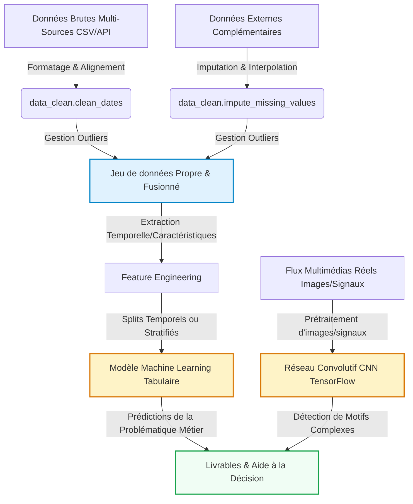

# Mon Projet Data Science
Étudiante 1 : Monica RADIFERA RASAMOELIJAONA, Étudiant 2 : Hocine AKLI
2026-05-20

- [Introduction et Contexte Métier](#sec-intro)
  - [Contexte du Projet](#contexte-du-projet)
  - [Objectif Analytique](#objectif-analytique)
- [Acquisition et Préparation des Données (Data
  Wrangling)](#sec-wrangling)
  - [Audit de Qualité](#audit-de-qualité)
- [🧹 Jalon 1 : Data Wrangling & Nettoyage (Squelette
  Étudiant)](#broom-jalon-1--data-wrangling--nettoyage-squelette-étudiant)
- [Analyse Exploratoire des Données (EDA)](#sec-eda)
  - [Statistiques Descriptives](#statistiques-descriptives)
  - [Ingénierie de Variables (Feature
    Engineering)](#ingénierie-de-variables-feature-engineering)
- [📊 Jalon 1 : Analyse Exploratoire des Données (EDA) & Visualisation
  (Squelette
  Étudiant)](#bar_chart-jalon-1--analyse-exploratoire-des-données-eda--visualisation-squelette-étudiant)
- [Visualisation Multidimensionnelle (Insights)](#sec-viz)
- [Modélisation et Apprentissage](#sec-modelling)
  - [Schéma Global du Pipeline de
    Données](#schéma-global-du-pipeline-de-données)
  - [Modélisation Tabulaire (Machine
    Learning)](#modélisation-tabulaire-machine-learning)
  - [Modélisation Vision / Deep Learning (Analyse d’Images ou
    Signaux)](#modélisation-vision--deep-learning-analyse-dimages-ou-signaux)
- [Évaluation Métrique et Validation](#sec-evaluation)
  - [Stratégie de Validation](#stratégie-de-validation)
  - [Résultats et Interprétation](#résultats-et-interprétation)
- [Data Storytelling et Communication](#sec-storytelling)
  - [Recommandations Stratégiques /
    Métier](#recommandations-stratégiques--métier)
  - [Limites et Perspectives](#limites-et-perspectives)
- [Bibliographie](#bibliographie)

# Introduction et Contexte Métier

[](https://github.com/MonicaRad/aptispace-datascience-projet/actions/workflows/ci.yml)

Ce projet analyse les données sur le Mpox (Monkeypox) pour mieux
comprendre la propagation du virus. Face à l’émergence de cette maladie
dans plusieurs pays, il est important de pouvoir suivre l’évolution des
cas et identifier les zones à risque.

La problématique est de savoir comment prédire et anticiper la
propagation du Mpox à partir de données réelles. Cela pose des questions
scientifiques sur les tendances temporelles, les différences entre pays
et les facteurs influençant la diffusion du virus.

L’objectif est d’offrir des insights utiles pour la prise de décision en
santé publique : où surveiller davantage, quand anticiper un pic, et
comment optimiser les moyens de prévention.

## Contexte du Projet

Ce projet étudie la propagation du Mpox dans le but de détecter des
tendances et des zones à risque. Le domaine d’étude est la santé
publique, avec un focus sur l’épidémiologie et l’analyse de données
temporelles.

Ce sujet est stratégique car le Mpox représente une menace sanitaire
émergente, et sa surveillance permet de mieux préparer les systèmes de
santé. Comprendre sa dynamique aide à prévenir de futures vagues de
contamination.

L’analyse quantitative est indispensable car elle transforme des données
brutes en indicateurs actionnables. Elle permet de mesurer objectivement
l’évolution des cas, de comparer les pays et de fonder les décisions sur
des faits plutôt que sur des intuitions.

## Objectif Analytique

Les variables cibles principales sont la date, le pays, les new cases et
new deaths (nouveaux cas et décès quotidiens), ainsi que les total cases
et total deaths (cas et décès cumulés). L’objectif est d’analyser
l’évolution de ces indicateurs dans le temps et d’identifier les pays
les plus touchés par le Mpox.

Ce dataset est tabulaire avec des données épidémiologiques quotidiennes
par pays sur une période d’un an. L’analyse se concentre sur les
variables principales conservées après nettoyage

------------------------------------------------------------------------

# Acquisition et Préparation des Données (Data Wrangling)

Le succès de tout projet de Data Science repose sur la qualité de la
préparation des données ([McKinney 2020](#ref-pandas2020)). Cette
section documente l’audit de qualité et les étapes de nettoyage
appliquées à vos jeux de données bruts.

## Audit de Qualité

Le fichier de données a été vérifié sur les aspects essentiels de
qualité, notamment la structure des colonnes, la présence de valeurs
manquantes et la présence éventuelle de doublons. L’audit a montré que
certaines colonnes contenaient trop de cases vides, ce qui risquait de
nuire à la fiabilité des analyses.

Nous avons donc choisi de supprimer ces colonnes afin de conserver
uniquement les variables réellement exploitables. En parallèle, les
doublons ont aussi été contrôlés pour éviter les répétitions dans le jeu
de données et garantir une base plus propre.

Après ce tri, les données restantes ont pu être analysées sans
difficulté majeure. Le dataset final est donc mieux adapté aux étapes
d’exploration, de visualisation et de modélisation. \## Algorithme de
Nettoyage Le traitement des données a commencé par un nettoyage des
dates afin d’obtenir un format homogène et exploitable pour l’analyse
temporelle. Nous avons ensuite supprimé les colonnes contenant trop de
valeurs manquantes, car elles apportaient peu d’information et
risquaient de fragiliser les analyses.

Comme le jeu de données contenait à la fois des informations au niveau
des pays et des continents, nous avons conservé uniquement les données
par pays afin d’avoir une analyse plus précise et plus cohérente.

Enfin, nous avons supprimé les colonnes jugées non utiles car
redondantes, afin de simplifier le jeu de données et de garder
uniquement les variables pertinentes pour l’analyse. Nous avons
également traité les valeurs manquantes de la variable `total_deaths` à
l’aide d’une imputation adaptée, afin de garantir la cohérence du
dataset avant l’analyse. \## Travaux Pratiques de Wrangling

# 🧹 Jalon 1 : Data Wrangling & Nettoyage (Squelette Étudiant)

Ce notebook correspond à la première étape du **Jalon 1**. L’objectif
est d’importer le jeu de données brut et d’effectuer un audit de sa
qualité (données manquantes, anomalies physiques, formats de dates
hétérogènes) et de le nettoyer à l’aide de votre package personnalisé
`src.data_clean`.

### 1. Importation des packages et chargement des données

    Libraries importées avec succès ! Prêt à démarrer le Wrangling.

<div>
<style scoped>
    .dataframe tbody tr th:only-of-type {
        vertical-align: middle;
    }
&#10;    .dataframe tbody tr th {
        vertical-align: top;
    }
&#10;    .dataframe thead th {
        text-align: right;
    }
</style>

|  | location | iso_code | date | total_cases | total_deaths | new_cases | new_deaths | new_cases_smoothed | new_deaths_smoothed | new_cases_per_million | total_cases_per_million | new_cases_smoothed_per_million | new_deaths_per_million | total_deaths_per_million | new_deaths_smoothed_per_million |
|----|----|----|----|----|----|----|----|----|----|----|----|----|----|----|----|
| 0 | Africa | OWID_AFR | 2022-05-01 | 27.0 | 2.0 | 0.0 | 0.0 | 0.29 | NaN | NaN | NaN | NaN | NaN | 0.0014 | 0.0 |
| 1 | Africa | OWID_AFR | 2022-05-02 | 27.0 | 2.0 | 0.0 | 0.0 | 0.29 | NaN | NaN | 0.019 | NaN | 0.0 | 0.0014 | 0.0 |
| 2 | Africa | OWID_AFR | 2022-05-03 | 27.0 | 2.0 | 0.0 | 0.0 | 0.29 | 0.0 | NaN | NaN | 0.0 | NaN | 0.0014 | 0.0 |
| 3 | Africa | OWID_AFR | 2022-05-04 | 27.0 | 2.0 | 0.0 | 0.0 | 0.29 | NaN | 0.0 | 0.019 | NaN | 0.0 | 0.0014 | 0.0 |
| 4 | Africa | OWID_AFR | 2022-05-05 | 27.0 | 2.0 | 0.0 | 0.0 | 0.29 | NaN | 0.0 | NaN | NaN | NaN | 0.0014 | 0.0 |

</div>

### 2. Audit initial des données

Explorez le dataset brut pour évaluer sa structure : - Quelles sont les
dimensions du dataset ? - Quels sont les types de données par colonne
? - Reste-t-il des valeurs nulles ? Quel est le taux de valeurs
manquantes par variable ? - Y a-t-il des doublons ?

    Dimensions : (33669, 15)
    <class 'pandas.core.frame.DataFrame'>
    RangeIndex: 33669 entries, 0 to 33668
    Data columns (total 15 columns):
     #   Column                           Non-Null Count  Dtype  
    ---  ------                           --------------  -----  
     0   location                         33669 non-null  object 
     1   iso_code                         33669 non-null  object 
     2   date                             33669 non-null  object 
     3   total_cases                      33669 non-null  float64
     4   total_deaths                     33663 non-null  float64
     5   new_cases                        33663 non-null  float64
     6   new_deaths                       33666 non-null  float64
     7   new_cases_smoothed               33669 non-null  float64
     8   new_deaths_smoothed              13391 non-null  float64
     9   new_cases_per_million            13494 non-null  float64
     10  total_cases_per_million          13484 non-null  float64
     11  new_cases_smoothed_per_million   13408 non-null  float64
     12  new_deaths_per_million           13606 non-null  float64
     13  total_deaths_per_million         33669 non-null  float64
     14  new_deaths_smoothed_per_million  33669 non-null  float64
    dtypes: float64(12), object(3)
    memory usage: 3.9+ MB

    Valeurs manquantes par colonne :

    location                               0
    iso_code                               0
    date                                   0
    total_cases                            0
    total_deaths                           6
    new_cases                              6
    new_deaths                             3
    new_cases_smoothed                     0
    new_deaths_smoothed                20278
    new_cases_per_million              20175
    total_cases_per_million            20185
    new_cases_smoothed_per_million     20261
    new_deaths_per_million             20063
    total_deaths_per_million               0
    new_deaths_smoothed_per_million        0
    dtype: int64

    Taux de valeurs manquantes (%) :

    new_deaths_smoothed                60.227509
    new_cases_smoothed_per_million     60.177017
    total_cases_per_million            59.951291
    new_cases_per_million              59.921590
    new_deaths_per_million             59.588939
    new_cases                           0.017821
    total_deaths                        0.017821
    new_deaths                          0.008910
    location                            0.000000
    iso_code                            0.000000
    date                                0.000000
    total_cases                         0.000000
    new_cases_smoothed                  0.000000
    total_deaths_per_million            0.000000
    new_deaths_smoothed_per_million     0.000000
    dtype: float64

    Nombre de doublons : 3

<div>
<style scoped>
    .dataframe tbody tr th:only-of-type {
        vertical-align: middle;
    }
&#10;    .dataframe tbody tr th {
        vertical-align: top;
    }
&#10;    .dataframe thead th {
        text-align: right;
    }
</style>

|  | total_cases | total_deaths | new_cases | new_deaths | new_cases_smoothed | new_deaths_smoothed | new_cases_per_million | total_cases_per_million | new_cases_smoothed_per_million | new_deaths_per_million | total_deaths_per_million | new_deaths_smoothed_per_million |
|----|----|----|----|----|----|----|----|----|----|----|----|----|
| count | 33669.000000 | 33663.000000 | 33663.000000 | 33666.000000 | 33669.000000 | 13391.000000 | 13494.000000 | 13484.000000 | 13408.000000 | 13606.000000 | 33669.000000 | 33669.000000 |
| mean | 1938.812944 | 1.708879 | 7.784422 | 0.012297 | 7.780489 | 0.012493 | 0.085680 | 19.413230 | 0.072734 | 0.000068 | 0.011201 | 0.000080 |
| std | 8458.943848 | 8.498339 | 63.688841 | 0.216703 | 49.287428 | 0.089431 | 1.046114 | 30.643406 | 0.313962 | 0.002010 | 0.041833 | 0.000991 |
| min | 0.000000 | 0.000000 | 0.000000 | 0.000000 | 0.000000 | 0.000000 | 0.000000 | 0.000000 | 0.000000 | 0.000000 | 0.000000 | 0.000000 |
| 25% | 4.000000 | 0.000000 | 0.000000 | 0.000000 | 0.000000 | 0.000000 | 0.000000 | 0.688500 | 0.000000 | 0.000000 | 0.000000 | 0.000000 |
| 50% | 21.000000 | 0.000000 | 0.000000 | 0.000000 | 0.000000 | 0.000000 | 0.000000 | 4.878000 | 0.000000 | 0.000000 | 0.000000 | 0.000000 |
| 75% | 257.000000 | 0.000000 | 0.000000 | 0.000000 | 0.570000 | 0.000000 | 0.000000 | 28.180000 | 0.024000 | 0.000000 | 0.000000 | 0.000000 |
| max | 87376.000000 | 140.000000 | 1802.000000 | 12.000000 | 1089.140000 | 1.710000 | 82.212000 | 183.615000 | 17.443000 | 0.111100 | 0.587380 | 0.031760 |

</div>

### 3. Nettoyage des colonnes inutile

Supression de la colonne iso_code

<div>
<style scoped>
    .dataframe tbody tr th:only-of-type {
        vertical-align: middle;
    }
&#10;    .dataframe tbody tr th {
        vertical-align: top;
    }
&#10;    .dataframe thead th {
        text-align: right;
    }
</style>

|  | location | date | total_cases | total_deaths | new_cases | new_deaths | new_cases_smoothed | new_deaths_smoothed | new_cases_per_million | total_cases_per_million | new_cases_smoothed_per_million | new_deaths_per_million | total_deaths_per_million | new_deaths_smoothed_per_million |
|----|----|----|----|----|----|----|----|----|----|----|----|----|----|----|
| 0 | Africa | 2022-05-01 | 27.0 | 2.0 | 0.0 | 0.0 | 0.29 | NaN | NaN | NaN | NaN | NaN | 0.0014 | 0.0 |
| 1 | Africa | 2022-05-02 | 27.0 | 2.0 | 0.0 | 0.0 | 0.29 | NaN | NaN | 0.019 | NaN | 0.0 | 0.0014 | 0.0 |
| 2 | Africa | 2022-05-03 | 27.0 | 2.0 | 0.0 | 0.0 | 0.29 | 0.0 | NaN | NaN | 0.0 | NaN | 0.0014 | 0.0 |
| 3 | Africa | 2022-05-04 | 27.0 | 2.0 | 0.0 | 0.0 | 0.29 | NaN | 0.0 | 0.019 | NaN | 0.0 | 0.0014 | 0.0 |
| 4 | Africa | 2022-05-05 | 27.0 | 2.0 | 0.0 | 0.0 | 0.29 | NaN | 0.0 | NaN | NaN | NaN | 0.0014 | 0.0 |

</div>

### 4. Renommage des colonnes

Renommage des colonnes cibles pour une analyse exploitable

<div>
<style scoped>
    .dataframe tbody tr th:only-of-type {
        vertical-align: middle;
    }
&#10;    .dataframe tbody tr th {
        vertical-align: top;
    }
&#10;    .dataframe thead th {
        text-align: right;
    }
</style>

|  | country | date | total_cases | total_deaths | daily_new_cases | daily_new_deaths | new_cases_smoothed | new_deaths_smoothed | new_cases_per_million | total_cases_per_million | new_cases_smoothed_per_million | new_deaths_per_million | total_deaths_per_million | new_deaths_smoothed_per_million |
|----|----|----|----|----|----|----|----|----|----|----|----|----|----|----|
| 0 | Africa | 2022-05-01 | 27.0 | 2.0 | 0.0 | 0.0 | 0.29 | NaN | NaN | NaN | NaN | NaN | 0.0014 | 0.0 |
| 1 | Africa | 2022-05-02 | 27.0 | 2.0 | 0.0 | 0.0 | 0.29 | NaN | NaN | 0.019 | NaN | 0.0 | 0.0014 | 0.0 |
| 2 | Africa | 2022-05-03 | 27.0 | 2.0 | 0.0 | 0.0 | 0.29 | 0.0 | NaN | NaN | 0.0 | NaN | 0.0014 | 0.0 |
| 3 | Africa | 2022-05-04 | 27.0 | 2.0 | 0.0 | 0.0 | 0.29 | NaN | 0.0 | 0.019 | NaN | 0.0 | 0.0014 | 0.0 |
| 4 | Africa | 2022-05-05 | 27.0 | 2.0 | 0.0 | 0.0 | 0.29 | NaN | 0.0 | NaN | NaN | NaN | 0.0014 | 0.0 |

</div>

### 5. Nettoyage de la date

La colonne `date` a été convertie au format datetime afin de permettre
des analyses temporelles : évolution des cas, agrégation par mois, suivi
de la progression de l’épidémie.

    0

<div>
<style scoped>
    .dataframe tbody tr th:only-of-type {
        vertical-align: middle;
    }
&#10;    .dataframe tbody tr th {
        vertical-align: top;
    }
&#10;    .dataframe thead th {
        text-align: right;
    }
</style>

|     | date       |
|-----|------------|
| 0   | 2022-05-01 |
| 1   | 2022-05-02 |
| 2   | 2022-05-03 |
| 3   | 2022-05-04 |
| 4   | 2022-05-05 |

</div>

### 6. Suppression des agrégats non-pays

Les lignes correspondant aux continents ou aux agrégats globaux ont été
supprimées afin de conserver uniquement les observations par pays.

    array(['Andorra', 'Argentina', 'Aruba', 'Australia', 'Austria', 'Bahamas',
           'Bahrain', 'Barbados', 'Belgium', 'Benin', 'Bermuda', 'Bolivia',
           'Bosnia and Herzegovina', 'Brazil', 'Bulgaria', 'Cameroon',
           'Canada', 'Central African Republic', 'Chile', 'China'],
          dtype=object)

### 7. Suppression des colonnes redondantes

    Colonnes supprimées : ['new_cases_smoothed', 'new_deaths_smoothed', 'new_cases_per_million', 'total_cases_per_million', 'new_cases_smoothed_per_million', 'new_deaths_per_million', 'total_deaths_per_million', 'new_deaths_smoothed_per_million']

<div>
<style scoped>
    .dataframe tbody tr th:only-of-type {
        vertical-align: middle;
    }
&#10;    .dataframe tbody tr th {
        vertical-align: top;
    }
&#10;    .dataframe thead th {
        text-align: right;
    }
</style>

|  | country | date | total_cases | total_deaths | daily_new_cases | daily_new_deaths |
|----|----|----|----|----|----|----|
| 370 | Andorra | 2022-07-25 | 2.0 | 0.0 | 2.0 | 0.0 |
| 371 | Andorra | 2022-07-26 | 3.0 | 0.0 | 1.0 | 0.0 |
| 372 | Andorra | 2022-07-27 | 3.0 | 0.0 | 0.0 | 0.0 |
| 373 | Andorra | 2022-07-28 | 3.0 | 0.0 | 0.0 | 0.0 |
| 374 | Andorra | 2022-07-29 | 3.0 | 0.0 | 0.0 | 0.0 |

</div>

### 8. Gestion des valeurs manquantes

Les valeurs manquantes des colonnes numériques principales ont été
imputées par la médiane. Ce choix permet de limiter l’influence des
valeurs extrêmes, fréquentes dans les données épidémiologiques où
certains pays peuvent concentrer un nombre de cas beaucoup plus élevé
que d’autres.

    Valeurs manquantes après imputation :
    total_deaths        0
    daily_new_cases     0
    daily_new_deaths    0
    dtype: int64

### 9. tri, suppression des doublons et validation finale

<div>
<style scoped>
    .dataframe tbody tr th:only-of-type {
        vertical-align: middle;
    }
&#10;    .dataframe tbody tr th {
        vertical-align: top;
    }
&#10;    .dataframe thead th {
        text-align: right;
    }
</style>

|  | country | date | total_cases | total_deaths | daily_new_cases | daily_new_deaths |
|----|----|----|----|----|----|----|
| 0 | Andorra | 2022-07-25 | 2.0 | 0.0 | 2.0 | 0.0 |
| 1 | Andorra | 2022-07-26 | 3.0 | 0.0 | 1.0 | 0.0 |
| 2 | Andorra | 2022-07-27 | 3.0 | 0.0 | 0.0 | 0.0 |
| 3 | Andorra | 2022-07-28 | 3.0 | 0.0 | 0.0 | 0.0 |
| 4 | Andorra | 2022-07-29 | 3.0 | 0.0 | 0.0 | 0.0 |

</div>

    Dimensions finales : (30836, 6)
    Doublons restants : 0
    Valeurs manquantes restantes :

    country             0
    date                0
    total_cases         0
    total_deaths        0
    daily_new_cases     0
    daily_new_deaths    0
    dtype: int64

### 10. Sauvegarde des données propres

Pour ce projet, le travail de data wrangling comprend :

- chargement du CSV brut ;
- audit initial du dataset : dimensions, types, valeurs manquantes et
  doublons ;
- conversion de la colonne date au format datetime ;
- suppression des agrégats globaux et continentaux ;
- renommage des colonnes principales ;
- traitement des valeurs manquantes par imputation ;
- suppression des colonnes redondantes ou peu utiles pour l’analyse ;
- vérification et suppression des doublons ;
- tri des données par pays et par date ;
- sauvegarde du dataset nettoyé pour l’analyse exploratoire.

<!-- -->

    Données nettoyées sauvegardées dans : ../data/processed/owid-monkeypox-data_clean.csv

------------------------------------------------------------------------

# Analyse Exploratoire des Données (EDA)

Dans cette section, nous analysons les relations statistiques
fondamentales qui régissent votre domaine d’étude au sein du jeu de
données.

## Statistiques Descriptives

Le jeu de données nettoyé contient les variables principales liées au
suivi du Mpox, notamment le pays, la date, le nombre total de cas, le
nombre total de décès, les nouveaux cas quotidiens et les nouveaux décès
quotidiens. Les premières observations montrent une structure temporelle
cohérente, avec des valeurs numériques qui varient selon les pays.

Les variables cumulées comme `total_cases` et `total_deaths` permettent
de suivre l’évolution globale de l’épidémie, tandis que les variables
journalières `daily_new_cases` et `daily_new_deaths` mettent en évidence
les fluctuations d’un jour à l’autre. On observe aussi que, dans
certains pays, les décès restent nuls sur plusieurs périodes, ce qui
traduit une faible mortalité observée dans ces données.

Dans l’ensemble, les variables nettoyées sont bien adaptées à une
analyse descriptive, car elles permettent de comparer les pays,
d’étudier l’évolution dans le temps et d’identifier les zones où la
propagation est la plus marquée.

## Ingénierie de Variables (Feature Engineering)

Dans notre cas, l’ingénierie de variables est restée assez limitée, car
le dataset contient déjà les informations utiles pour suivre l’évolution
du Mpox. Nous avons donc conservé les variables principales comme le
pays, la date, les nouveaux cas, les nouveaux décès, les cas totaux et
les décès totaux. Quand certaines valeurs de total_deaths étaient
manquantes, nous les avons recalculées à partir des informations
disponibles afin de garder une variable exploitable et cohérente.

L’intérêt de cette étape est de s’assurer que les données utilisées pour
la suite du projet soient fiables et complètes. Cela permet aussi de
garder une base propre pour l’analyse descriptive et la modélisation. En
pratique, cela montre une démarche rigoureuse de préparation des
données, ce qui est important dans un projet de data science. Cette
étape a surtout servi à nettoyer, compléter et organiser les variables
déjà présentes et enrichir la colonne `date` avec des variables
temporelles simples : l’année, le mois, le mois au format année-mois et
le jour de la semaine. Ces variables permettent de faciliter les
regroupements temporels et l’analyse de l’évolution du Mpox dans le
temps. C’est une approche adaptée à un rapport étudiant, parce qu’elle
reste fidèle aux données réelles et au travail effectivement réalisé.
\## Travaux Pratiques d’Exploration Visuelle (EDA)

# 📊 Jalon 1 : Analyse Exploratoire des Données (EDA) & Visualisation (Squelette Étudiant)

Ce notebook est dédié à la découverte de relations clés et à l’analyse
visuelle de nos données. À partir du jeu de données propre généré
précédemment, nous allons enrichir nos variables explicatives et appeler
les fonctions de notre module de visualisation `src.utils_viz` pour
générer des graphiques professionnels.

### 1. Importation des packages et configuration du style

    🎨 Charte graphique 'light' initialisée avec succès.

<div>
<style scoped>
    .dataframe tbody tr th:only-of-type {
        vertical-align: middle;
    }
&#10;    .dataframe tbody tr th {
        vertical-align: top;
    }
&#10;    .dataframe thead th {
        text-align: right;
    }
</style>

|  | country | date | total_cases | total_deaths | daily_new_cases | daily_new_deaths |
|----|----|----|----|----|----|----|
| 0 | Andorra | 2022-07-25 | 2.0 | 0.0 | 2.0 | 0.0 |
| 1 | Andorra | 2022-07-26 | 3.0 | 0.0 | 1.0 | 0.0 |
| 2 | Andorra | 2022-07-27 | 3.0 | 0.0 | 0.0 | 0.0 |
| 3 | Andorra | 2022-07-28 | 3.0 | 0.0 | 0.0 | 0.0 |
| 4 | Andorra | 2022-07-29 | 3.0 | 0.0 | 0.0 | 0.0 |

</div>

### 2. Ingénierie de variables temporelles

Appliquez la fonction `feature_engineering` de `src.data_clean` pour
enrichir votre DataFrame en caractéristiques de temps classiques .

<div>
<style scoped>
    .dataframe tbody tr th:only-of-type {
        vertical-align: middle;
    }
&#10;    .dataframe tbody tr th {
        vertical-align: top;
    }
&#10;    .dataframe thead th {
        text-align: right;
    }
</style>

|  | country | date | total_cases | total_deaths | daily_new_cases | daily_new_deaths | year | month | year_month | dayofweek |
|----|----|----|----|----|----|----|----|----|----|----|
| 0 | Andorra | 2022-07-25 | 2.0 | 0.0 | 2.0 | 0.0 | 2022 | 7 | 2022-07 | 0 |
| 1 | Andorra | 2022-07-26 | 3.0 | 0.0 | 1.0 | 0.0 | 2022 | 7 | 2022-07 | 1 |
| 2 | Andorra | 2022-07-27 | 3.0 | 0.0 | 0.0 | 0.0 | 2022 | 7 | 2022-07 | 2 |
| 3 | Andorra | 2022-07-28 | 3.0 | 0.0 | 0.0 | 0.0 | 2022 | 7 | 2022-07 | 3 |
| 4 | Andorra | 2022-07-29 | 3.0 | 0.0 | 0.0 | 0.0 | 2022 | 7 | 2022-07 | 4 |

</div>

### 3. Visualisations Professionnelles

#### A. Profils d’évolution et tendances

Appliquez la fonction `plot_generic_trends` de votre module
`src.utils_viz` pour tracer l’évolution de la valeur par rapport au
temps.


#### B. Répartition mondiale des cas cumulés de mpox par pays

Cette carte permet de visualiser la répartition géographique des cas
cumulés de mpox.  
Elle est pertinente car le dataset contient une dimension spatiale avec
une variable pays.  
Contrairement à un simple tableau, la carte facilite l’identification
rapide des zones les plus touchées et permet de comparer visuellement
l’intensité de l’épidémie entre les pays.

        <script type="text/javascript">
        window.PlotlyConfig = {MathJaxConfig: 'local'};
        if (window.MathJax && window.MathJax.Hub && window.MathJax.Hub.Config) {window.MathJax.Hub.Config({SVG: {font: "STIX-Web"}});}
        </script>
        <script type="module">import "https://cdn.plot.ly/plotly-3.0.1.min"</script>
        

<div>            <script src="https://cdnjs.cloudflare.com/ajax/libs/mathjax/2.7.5/MathJax.js?config=TeX-AMS-MML_SVG"></script><script type="text/javascript">if (window.MathJax && window.MathJax.Hub && window.MathJax.Hub.Config) {window.MathJax.Hub.Config({SVG: {font: "STIX-Web"}});}</script>                <script type="text/javascript">window.PlotlyConfig = {MathJaxConfig: 'local'};</script>
        <script charset="utf-8" src="https://cdn.plot.ly/plotly-3.0.1.min.js"></script>                <div id="ed899945-8e0c-4ccf-bb08-d17c7969883c" class="plotly-graph-div" style="height:525px; width:100%;"></div>            <script type="text/javascript">                window.PLOTLYENV=window.PLOTLYENV || {};                                if (document.getElementById("ed899945-8e0c-4ccf-bb08-d17c7969883c")) {                    Plotly.newPlot(                        "ed899945-8e0c-4ccf-bb08-d17c7969883c",                        [{"coloraxis":"coloraxis","geo":"geo","hovertemplate":"\u003cb\u003e%{hovertext}\u003c\u002fb\u003e\u003cbr\u003e\u003cbr\u003ecountry=%{location}\u003cbr\u003etotal_cases=%{z}\u003cextra\u003e\u003c\u002fextra\u003e","hovertext":["United States","Brazil","Spain","France","Colombia","Mexico","Peru","United Kingdom","Germany","Canada","Chile","Netherlands","Argentina","Italy","Portugal","Nigeria","Belgium","Democratic Republic of Congo","Switzerland","Ecuador","Guatemala","Austria","Bolivia","Israel","Sweden","Ireland","Panama","Costa Rica","Poland","Denmark","Australia","Japan","Paraguay","Ghana","El Salvador","Norway","Greece","Hungary","China","Czechia","South Korea","Luxembourg","Dominican Republic","Romania","Slovenia","Finland","Honduras","New Zealand","Serbia","Malta","Croatia","Central African Republic","Lebanon","Singapore","India","Thailand","Jamaica","Uruguay","Sudan","Cameroon","United Arab Emirates","Iceland","Slovakia","Venezuela","Liberia","Turkey","Estonia","Bosnia and Herzegovina","Saudi Arabia","Cuba","Martinique","Gibraltar","Latvia","Bulgaria","Ukraine","Cyprus","Congo","Lithuania","Qatar","South Africa","Andorra","Philippines","Morocco","Monaco","Benin","Aruba","Egypt","Curacao","Guyana","Russia","Bahamas","Bahrain","Greenland","Georgia","Vietnam","Moldova","Pakistan","Montenegro","Sri Lanka","Guadeloupe","Barbados","Bermuda","Guam","Mozambique","Iran","Jordan","Indonesia","New Caledonia","Saint Martin (French part)","San Marino"],"locationmode":"country names","locations":["United States","Brazil","Spain","France","Colombia","Mexico","Peru","United Kingdom","Germany","Canada","Chile","Netherlands","Argentina","Italy","Portugal","Nigeria","Belgium","Democratic Republic of Congo","Switzerland","Ecuador","Guatemala","Austria","Bolivia","Israel","Sweden","Ireland","Panama","Costa Rica","Poland","Denmark","Australia","Japan","Paraguay","Ghana","El Salvador","Norway","Greece","Hungary","China","Czechia","South Korea","Luxembourg","Dominican Republic","Romania","Slovenia","Finland","Honduras","New Zealand","Serbia","Malta","Croatia","Central African Republic","Lebanon","Singapore","India","Thailand","Jamaica","Uruguay","Sudan","Cameroon","United Arab Emirates","Iceland","Slovakia","Venezuela","Liberia","Turkey","Estonia","Bosnia and Herzegovina","Saudi Arabia","Cuba","Martinique","Gibraltar","Latvia","Bulgaria","Ukraine","Cyprus","Congo","Lithuania","Qatar","South Africa","Andorra","Philippines","Morocco","Monaco","Benin","Aruba","Egypt","Curacao","Guyana","Russia","Bahamas","Bahrain","Greenland","Georgia","Vietnam","Moldova","Pakistan","Montenegro","Sri Lanka","Guadeloupe","Barbados","Bermuda","Guam","Mozambique","Iran","Jordan","Indonesia","New Caledonia","Saint Martin (French part)","San Marino"],"name":"","z":{"dtype":"f8","bdata":"AAAAAIBy3UAAAAAAAFTFQAAAAAAAf71AAAAAAAAysEAAAAAAAPSvQAAAAAAAVK9AAAAAAACwrUAAAAAAADqtQAAAAAAA1qxAAAAAAAAwl0AAAAAAAISWQAAAAAAAwJNAAAAAAACkkUAAAAAAAOiNQAAAAAAAyI1AAAAAAAAYikAAAAAAAMiIQAAAAAAAYIFAAAAAAABAgUAAAAAAAKiAQAAAAAAAQHlAAAAAAACAdEAAAAAAAJBwQAAAAAAAYHBAAAAAAABAcEAAAAAAAKBsQAAAAAAAQGxAAAAAAACga0AAAAAAACBrQAAAAAAAgGhAAAAAAAAgYkAAAAAAAMBfQAAAAAAAQF9AAAAAAAAAX0AAAAAAAABaQAAAAAAAwFdAAAAAAAAAVkAAAAAAAABUQAAAAAAAwFFAAAAAAADAUUAAAAAAAABOQAAAAAAAgExAAAAAAAAASkAAAAAAAIBHQAAAAAAAgEdAAAAAAAAARUAAAAAAAABFQAAAAAAAgERAAAAAAAAAREAAAAAAAABBQAAAAAAAgEBAAAAAAAAAPEAAAAAAAAA7QAAAAAAAADlAAAAAAAAANkAAAAAAAAA1QAAAAAAAADVAAAAAAAAAM0AAAAAAAAAzQAAAAAAAADJAAAAAAAAAMEAAAAAAAAAwQAAAAAAAACxAAAAAAAAAKEAAAAAAAAAoQAAAAAAAAChAAAAAAAAAJkAAAAAAAAAiQAAAAAAAACBAAAAAAAAAIEAAAAAAAAAcQAAAAAAAABhAAAAAAAAAGEAAAAAAAAAYQAAAAAAAABRAAAAAAAAAFEAAAAAAAAAUQAAAAAAAABRAAAAAAAAAFEAAAAAAAAAUQAAAAAAAABBAAAAAAAAAEEAAAAAAAAAIQAAAAAAAAAhAAAAAAAAACEAAAAAAAAAIQAAAAAAAAAhAAAAAAAAACEAAAAAAAAAAQAAAAAAAAABAAAAAAAAAAEAAAAAAAAAAQAAAAAAAAABAAAAAAAAAAEAAAAAAAAAAQAAAAAAAAABAAAAAAAAAAEAAAAAAAAAAQAAAAAAAAABAAAAAAAAA8D8AAAAAAADwPwAAAAAAAPA\u002fAAAAAAAA8D8AAAAAAADwPwAAAAAAAPA\u002fAAAAAAAA8D8AAAAAAADwPwAAAAAAAPA\u002fAAAAAAAA8D8AAAAAAADwPw=="},"type":"choropleth"}],                        {"template":{"data":{"histogram2dcontour":[{"type":"histogram2dcontour","colorbar":{"outlinewidth":0,"ticks":""},"colorscale":[[0.0,"#0d0887"],[0.1111111111111111,"#46039f"],[0.2222222222222222,"#7201a8"],[0.3333333333333333,"#9c179e"],[0.4444444444444444,"#bd3786"],[0.5555555555555556,"#d8576b"],[0.6666666666666666,"#ed7953"],[0.7777777777777778,"#fb9f3a"],[0.8888888888888888,"#fdca26"],[1.0,"#f0f921"]]}],"choropleth":[{"type":"choropleth","colorbar":{"outlinewidth":0,"ticks":""}}],"histogram2d":[{"type":"histogram2d","colorbar":{"outlinewidth":0,"ticks":""},"colorscale":[[0.0,"#0d0887"],[0.1111111111111111,"#46039f"],[0.2222222222222222,"#7201a8"],[0.3333333333333333,"#9c179e"],[0.4444444444444444,"#bd3786"],[0.5555555555555556,"#d8576b"],[0.6666666666666666,"#ed7953"],[0.7777777777777778,"#fb9f3a"],[0.8888888888888888,"#fdca26"],[1.0,"#f0f921"]]}],"heatmap":[{"type":"heatmap","colorbar":{"outlinewidth":0,"ticks":""},"colorscale":[[0.0,"#0d0887"],[0.1111111111111111,"#46039f"],[0.2222222222222222,"#7201a8"],[0.3333333333333333,"#9c179e"],[0.4444444444444444,"#bd3786"],[0.5555555555555556,"#d8576b"],[0.6666666666666666,"#ed7953"],[0.7777777777777778,"#fb9f3a"],[0.8888888888888888,"#fdca26"],[1.0,"#f0f921"]]}],"contourcarpet":[{"type":"contourcarpet","colorbar":{"outlinewidth":0,"ticks":""}}],"contour":[{"type":"contour","colorbar":{"outlinewidth":0,"ticks":""},"colorscale":[[0.0,"#0d0887"],[0.1111111111111111,"#46039f"],[0.2222222222222222,"#7201a8"],[0.3333333333333333,"#9c179e"],[0.4444444444444444,"#bd3786"],[0.5555555555555556,"#d8576b"],[0.6666666666666666,"#ed7953"],[0.7777777777777778,"#fb9f3a"],[0.8888888888888888,"#fdca26"],[1.0,"#f0f921"]]}],"surface":[{"type":"surface","colorbar":{"outlinewidth":0,"ticks":""},"colorscale":[[0.0,"#0d0887"],[0.1111111111111111,"#46039f"],[0.2222222222222222,"#7201a8"],[0.3333333333333333,"#9c179e"],[0.4444444444444444,"#bd3786"],[0.5555555555555556,"#d8576b"],[0.6666666666666666,"#ed7953"],[0.7777777777777778,"#fb9f3a"],[0.8888888888888888,"#fdca26"],[1.0,"#f0f921"]]}],"mesh3d":[{"type":"mesh3d","colorbar":{"outlinewidth":0,"ticks":""}}],"scatter":[{"fillpattern":{"fillmode":"overlay","size":10,"solidity":0.2},"type":"scatter"}],"parcoords":[{"type":"parcoords","line":{"colorbar":{"outlinewidth":0,"ticks":""}}}],"scatterpolargl":[{"type":"scatterpolargl","marker":{"colorbar":{"outlinewidth":0,"ticks":""}}}],"bar":[{"error_x":{"color":"#2a3f5f"},"error_y":{"color":"#2a3f5f"},"marker":{"line":{"color":"#E5ECF6","width":0.5},"pattern":{"fillmode":"overlay","size":10,"solidity":0.2}},"type":"bar"}],"scattergeo":[{"type":"scattergeo","marker":{"colorbar":{"outlinewidth":0,"ticks":""}}}],"scatterpolar":[{"type":"scatterpolar","marker":{"colorbar":{"outlinewidth":0,"ticks":""}}}],"histogram":[{"marker":{"pattern":{"fillmode":"overlay","size":10,"solidity":0.2}},"type":"histogram"}],"scattergl":[{"type":"scattergl","marker":{"colorbar":{"outlinewidth":0,"ticks":""}}}],"scatter3d":[{"type":"scatter3d","line":{"colorbar":{"outlinewidth":0,"ticks":""}},"marker":{"colorbar":{"outlinewidth":0,"ticks":""}}}],"scattermap":[{"type":"scattermap","marker":{"colorbar":{"outlinewidth":0,"ticks":""}}}],"scattermapbox":[{"type":"scattermapbox","marker":{"colorbar":{"outlinewidth":0,"ticks":""}}}],"scatterternary":[{"type":"scatterternary","marker":{"colorbar":{"outlinewidth":0,"ticks":""}}}],"scattercarpet":[{"type":"scattercarpet","marker":{"colorbar":{"outlinewidth":0,"ticks":""}}}],"carpet":[{"aaxis":{"endlinecolor":"#2a3f5f","gridcolor":"white","linecolor":"white","minorgridcolor":"white","startlinecolor":"#2a3f5f"},"baxis":{"endlinecolor":"#2a3f5f","gridcolor":"white","linecolor":"white","minorgridcolor":"white","startlinecolor":"#2a3f5f"},"type":"carpet"}],"table":[{"cells":{"fill":{"color":"#EBF0F8"},"line":{"color":"white"}},"header":{"fill":{"color":"#C8D4E3"},"line":{"color":"white"}},"type":"table"}],"barpolar":[{"marker":{"line":{"color":"#E5ECF6","width":0.5},"pattern":{"fillmode":"overlay","size":10,"solidity":0.2}},"type":"barpolar"}],"pie":[{"automargin":true,"type":"pie"}]},"layout":{"autotypenumbers":"strict","colorway":["#636efa","#EF553B","#00cc96","#ab63fa","#FFA15A","#19d3f3","#FF6692","#B6E880","#FF97FF","#FECB52"],"font":{"color":"#2a3f5f"},"hovermode":"closest","hoverlabel":{"align":"left"},"paper_bgcolor":"white","plot_bgcolor":"#E5ECF6","polar":{"bgcolor":"#E5ECF6","angularaxis":{"gridcolor":"white","linecolor":"white","ticks":""},"radialaxis":{"gridcolor":"white","linecolor":"white","ticks":""}},"ternary":{"bgcolor":"#E5ECF6","aaxis":{"gridcolor":"white","linecolor":"white","ticks":""},"baxis":{"gridcolor":"white","linecolor":"white","ticks":""},"caxis":{"gridcolor":"white","linecolor":"white","ticks":""}},"coloraxis":{"colorbar":{"outlinewidth":0,"ticks":""}},"colorscale":{"sequential":[[0.0,"#0d0887"],[0.1111111111111111,"#46039f"],[0.2222222222222222,"#7201a8"],[0.3333333333333333,"#9c179e"],[0.4444444444444444,"#bd3786"],[0.5555555555555556,"#d8576b"],[0.6666666666666666,"#ed7953"],[0.7777777777777778,"#fb9f3a"],[0.8888888888888888,"#fdca26"],[1.0,"#f0f921"]],"sequentialminus":[[0.0,"#0d0887"],[0.1111111111111111,"#46039f"],[0.2222222222222222,"#7201a8"],[0.3333333333333333,"#9c179e"],[0.4444444444444444,"#bd3786"],[0.5555555555555556,"#d8576b"],[0.6666666666666666,"#ed7953"],[0.7777777777777778,"#fb9f3a"],[0.8888888888888888,"#fdca26"],[1.0,"#f0f921"]],"diverging":[[0,"#8e0152"],[0.1,"#c51b7d"],[0.2,"#de77ae"],[0.3,"#f1b6da"],[0.4,"#fde0ef"],[0.5,"#f7f7f7"],[0.6,"#e6f5d0"],[0.7,"#b8e186"],[0.8,"#7fbc41"],[0.9,"#4d9221"],[1,"#276419"]]},"xaxis":{"gridcolor":"white","linecolor":"white","ticks":"","title":{"standoff":15},"zerolinecolor":"white","automargin":true,"zerolinewidth":2},"yaxis":{"gridcolor":"white","linecolor":"white","ticks":"","title":{"standoff":15},"zerolinecolor":"white","automargin":true,"zerolinewidth":2},"scene":{"xaxis":{"backgroundcolor":"#E5ECF6","gridcolor":"white","linecolor":"white","showbackground":true,"ticks":"","zerolinecolor":"white","gridwidth":2},"yaxis":{"backgroundcolor":"#E5ECF6","gridcolor":"white","linecolor":"white","showbackground":true,"ticks":"","zerolinecolor":"white","gridwidth":2},"zaxis":{"backgroundcolor":"#E5ECF6","gridcolor":"white","linecolor":"white","showbackground":true,"ticks":"","zerolinecolor":"white","gridwidth":2}},"shapedefaults":{"line":{"color":"#2a3f5f"}},"annotationdefaults":{"arrowcolor":"#2a3f5f","arrowhead":0,"arrowwidth":1},"geo":{"bgcolor":"white","landcolor":"#E5ECF6","subunitcolor":"white","showland":true,"showlakes":true,"lakecolor":"white"},"title":{"x":0.05},"mapbox":{"style":"light"},"margin":{"b":0,"l":0,"r":0,"t":30}}},"geo":{"domain":{"x":[0.0,1.0],"y":[0.0,1.0]},"center":{},"showframe":false,"showcoastlines":true},"coloraxis":{"colorbar":{"title":{"text":"total_cases"}},"colorscale":[[0.0,"rgb(255,245,240)"],[0.125,"rgb(254,224,210)"],[0.25,"rgb(252,187,161)"],[0.375,"rgb(252,146,114)"],[0.5,"rgb(251,106,74)"],[0.625,"rgb(239,59,44)"],[0.75,"rgb(203,24,29)"],[0.875,"rgb(165,15,21)"],[1.0,"rgb(103,0,13)"]]},"legend":{"tracegroupgap":0},"title":{"text":"R\u00e9partition mondiale des cas cumul\u00e9s de mpox par pays","x":0.5}},                        {"responsive": true}                    ).then(function(){
                            &#10;var gd = document.getElementById('ed899945-8e0c-4ccf-bb08-d17c7969883c');
var x = new MutationObserver(function (mutations, observer) {{
        var display = window.getComputedStyle(gd).display;
        if (!display || display === 'none') {{
            console.log([gd, 'removed!']);
            Plotly.purge(gd);
            observer.disconnect();
        }}
}});
&#10;// Listen for the removal of the full notebook cells
var notebookContainer = gd.closest('#notebook-container');
if (notebookContainer) {{
    x.observe(notebookContainer, {childList: true});
}}
&#10;// Listen for the clearing of the current output cell
var outputEl = gd.closest('.output');
if (outputEl) {{
    x.observe(outputEl, {childList: true});
}}
&#10;                        })                };            </script>        </div>

#### C. Carte animée de la propagation du mpox

Cette visualisation permet d’observer l’évolution géographique des cas
de mpox au fil du temps.  
Comme le dataset contient une dimension temporelle (`year_month`) et une
dimension géographique (`country`), une carte animée est pertinente pour
analyser la propagation de l’épidémie entre les pays.

<div>            <script src="https://cdnjs.cloudflare.com/ajax/libs/mathjax/2.7.5/MathJax.js?config=TeX-AMS-MML_SVG"></script><script type="text/javascript">if (window.MathJax && window.MathJax.Hub && window.MathJax.Hub.Config) {window.MathJax.Hub.Config({SVG: {font: "STIX-Web"}});}</script>                <script type="text/javascript">window.PlotlyConfig = {MathJaxConfig: 'local'};</script>
        <script charset="utf-8" src="https://cdn.plot.ly/plotly-3.0.1.min.js"></script>                <div id="4218f469-0c5e-4b65-99dd-07509178eb1a" class="plotly-graph-div" style="height:525px; width:100%;"></div>            <script type="text/javascript">                window.PLOTLYENV=window.PLOTLYENV || {};                                if (document.getElementById("4218f469-0c5e-4b65-99dd-07509178eb1a")) {                    Plotly.newPlot(                        "4218f469-0c5e-4b65-99dd-07509178eb1a",                        [{"coloraxis":"coloraxis","customdata":[[9.0,9.0,"2022-05","Ireland"],[2.0,2.0,"2022-05","Denmark"],[4.0,4.0,"2022-05","Switzerland"],[190.0,190.0,"2022-05","United Kingdom"],[1.0,1.0,"2022-05","Malta"],[1.0,1.0,"2022-05","Norway"],[4.0,4.0,"2022-05","United Arab Emirates"],[1.0,1.0,"2022-05","Finland"],[10.0,10.0,"2022-05","Belgium"],[2.0,2.0,"2022-05","Australia"],[98.0,98.0,"2022-05","Spain"],[4.0,0.0,"2022-05","Central African Republic"],[26.0,26.0,"2022-05","Netherlands"],[4.0,4.0,"2022-05","Sweden"],[1.0,1.0,"2022-05","Austria"],[2.0,0.0,"2022-05","Congo"],[21.0,6.0,"2022-05","Nigeria"],[100.0,100.0,"2022-05","Portugal"],[2.0,2.0,"2022-05","Israel"],[1.0,1.0,"2022-05","Hungary"],[17.0,17.0,"2022-05","France"],[10.0,10.0,"2022-05","Democratic Republic of Congo"],[5.0,5.0,"2022-05","Czechia"],[2.0,2.0,"2022-05","Slovenia"],[4.0,0.0,"2022-05","Cameroon"],[2.0,0.0,"2022-05","Ghana"],[14.0,14.0,"2022-05","Italy"],[33.0,33.0,"2022-05","Germany"],[0.0,0.0,"2022-05","Japan"]],"geo":"geo","hovertemplate":"\u003cb\u003e%{hovertext}\u003c\u002fb\u003e\u003cbr\u003e\u003cbr\u003eyear_month=%{customdata[2]}\u003cbr\u003etotal_cases=%{z}\u003cbr\u003edaily_new_cases=%{customdata[1]}\u003cextra\u003e\u003c\u002fextra\u003e","hovertext":["Ireland","Denmark","Switzerland","United Kingdom","Malta","Norway","United Arab Emirates","Finland","Belgium","Australia","Spain","Central African Republic","Netherlands","Sweden","Austria","Congo","Nigeria","Portugal","Israel","Hungary","France","Democratic Republic of Congo","Czechia","Slovenia","Cameroon","Ghana","Italy","Germany","Japan"],"locationmode":"country names","locations":["Ireland","Denmark","Switzerland","United Kingdom","Malta","Norway","United Arab Emirates","Finland","Belgium","Australia","Spain","Central African Republic","Netherlands","Sweden","Austria","Congo","Nigeria","Portugal","Israel","Hungary","France","Democratic Republic of Congo","Czechia","Slovenia","Cameroon","Ghana","Italy","Germany","Japan"],"name":"","z":{"dtype":"f8","bdata":"AAAAAAAAIkAAAAAAAAAAQAAAAAAAABBAAAAAAADAZ0AAAAAAAADwPwAAAAAAAPA\u002fAAAAAAAAEEAAAAAAAADwPwAAAAAAACRAAAAAAAAAAEAAAAAAAIBYQAAAAAAAABBAAAAAAAAAOkAAAAAAAAAQQAAAAAAAAPA\u002fAAAAAAAAAEAAAAAAAAA1QAAAAAAAAFlAAAAAAAAAAEAAAAAAAADwPwAAAAAAADFAAAAAAAAAJEAAAAAAAAAUQAAAAAAAAABAAAAAAAAAEEAAAAAAAAAAQAAAAAAAACxAAAAAAACAQEAAAAAAAAAAAA=="},"type":"choropleth"}],                        {"template":{"data":{"histogram2dcontour":[{"type":"histogram2dcontour","colorbar":{"outlinewidth":0,"ticks":""},"colorscale":[[0.0,"#0d0887"],[0.1111111111111111,"#46039f"],[0.2222222222222222,"#7201a8"],[0.3333333333333333,"#9c179e"],[0.4444444444444444,"#bd3786"],[0.5555555555555556,"#d8576b"],[0.6666666666666666,"#ed7953"],[0.7777777777777778,"#fb9f3a"],[0.8888888888888888,"#fdca26"],[1.0,"#f0f921"]]}],"choropleth":[{"type":"choropleth","colorbar":{"outlinewidth":0,"ticks":""}}],"histogram2d":[{"type":"histogram2d","colorbar":{"outlinewidth":0,"ticks":""},"colorscale":[[0.0,"#0d0887"],[0.1111111111111111,"#46039f"],[0.2222222222222222,"#7201a8"],[0.3333333333333333,"#9c179e"],[0.4444444444444444,"#bd3786"],[0.5555555555555556,"#d8576b"],[0.6666666666666666,"#ed7953"],[0.7777777777777778,"#fb9f3a"],[0.8888888888888888,"#fdca26"],[1.0,"#f0f921"]]}],"heatmap":[{"type":"heatmap","colorbar":{"outlinewidth":0,"ticks":""},"colorscale":[[0.0,"#0d0887"],[0.1111111111111111,"#46039f"],[0.2222222222222222,"#7201a8"],[0.3333333333333333,"#9c179e"],[0.4444444444444444,"#bd3786"],[0.5555555555555556,"#d8576b"],[0.6666666666666666,"#ed7953"],[0.7777777777777778,"#fb9f3a"],[0.8888888888888888,"#fdca26"],[1.0,"#f0f921"]]}],"contourcarpet":[{"type":"contourcarpet","colorbar":{"outlinewidth":0,"ticks":""}}],"contour":[{"type":"contour","colorbar":{"outlinewidth":0,"ticks":""},"colorscale":[[0.0,"#0d0887"],[0.1111111111111111,"#46039f"],[0.2222222222222222,"#7201a8"],[0.3333333333333333,"#9c179e"],[0.4444444444444444,"#bd3786"],[0.5555555555555556,"#d8576b"],[0.6666666666666666,"#ed7953"],[0.7777777777777778,"#fb9f3a"],[0.8888888888888888,"#fdca26"],[1.0,"#f0f921"]]}],"surface":[{"type":"surface","colorbar":{"outlinewidth":0,"ticks":""},"colorscale":[[0.0,"#0d0887"],[0.1111111111111111,"#46039f"],[0.2222222222222222,"#7201a8"],[0.3333333333333333,"#9c179e"],[0.4444444444444444,"#bd3786"],[0.5555555555555556,"#d8576b"],[0.6666666666666666,"#ed7953"],[0.7777777777777778,"#fb9f3a"],[0.8888888888888888,"#fdca26"],[1.0,"#f0f921"]]}],"mesh3d":[{"type":"mesh3d","colorbar":{"outlinewidth":0,"ticks":""}}],"scatter":[{"fillpattern":{"fillmode":"overlay","size":10,"solidity":0.2},"type":"scatter"}],"parcoords":[{"type":"parcoords","line":{"colorbar":{"outlinewidth":0,"ticks":""}}}],"scatterpolargl":[{"type":"scatterpolargl","marker":{"colorbar":{"outlinewidth":0,"ticks":""}}}],"bar":[{"error_x":{"color":"#2a3f5f"},"error_y":{"color":"#2a3f5f"},"marker":{"line":{"color":"#E5ECF6","width":0.5},"pattern":{"fillmode":"overlay","size":10,"solidity":0.2}},"type":"bar"}],"scattergeo":[{"type":"scattergeo","marker":{"colorbar":{"outlinewidth":0,"ticks":""}}}],"scatterpolar":[{"type":"scatterpolar","marker":{"colorbar":{"outlinewidth":0,"ticks":""}}}],"histogram":[{"marker":{"pattern":{"fillmode":"overlay","size":10,"solidity":0.2}},"type":"histogram"}],"scattergl":[{"type":"scattergl","marker":{"colorbar":{"outlinewidth":0,"ticks":""}}}],"scatter3d":[{"type":"scatter3d","line":{"colorbar":{"outlinewidth":0,"ticks":""}},"marker":{"colorbar":{"outlinewidth":0,"ticks":""}}}],"scattermap":[{"type":"scattermap","marker":{"colorbar":{"outlinewidth":0,"ticks":""}}}],"scattermapbox":[{"type":"scattermapbox","marker":{"colorbar":{"outlinewidth":0,"ticks":""}}}],"scatterternary":[{"type":"scatterternary","marker":{"colorbar":{"outlinewidth":0,"ticks":""}}}],"scattercarpet":[{"type":"scattercarpet","marker":{"colorbar":{"outlinewidth":0,"ticks":""}}}],"carpet":[{"aaxis":{"endlinecolor":"#2a3f5f","gridcolor":"white","linecolor":"white","minorgridcolor":"white","startlinecolor":"#2a3f5f"},"baxis":{"endlinecolor":"#2a3f5f","gridcolor":"white","linecolor":"white","minorgridcolor":"white","startlinecolor":"#2a3f5f"},"type":"carpet"}],"table":[{"cells":{"fill":{"color":"#EBF0F8"},"line":{"color":"white"}},"header":{"fill":{"color":"#C8D4E3"},"line":{"color":"white"}},"type":"table"}],"barpolar":[{"marker":{"line":{"color":"#E5ECF6","width":0.5},"pattern":{"fillmode":"overlay","size":10,"solidity":0.2}},"type":"barpolar"}],"pie":[{"automargin":true,"type":"pie"}]},"layout":{"autotypenumbers":"strict","colorway":["#636efa","#EF553B","#00cc96","#ab63fa","#FFA15A","#19d3f3","#FF6692","#B6E880","#FF97FF","#FECB52"],"font":{"color":"#2a3f5f"},"hovermode":"closest","hoverlabel":{"align":"left"},"paper_bgcolor":"white","plot_bgcolor":"#E5ECF6","polar":{"bgcolor":"#E5ECF6","angularaxis":{"gridcolor":"white","linecolor":"white","ticks":""},"radialaxis":{"gridcolor":"white","linecolor":"white","ticks":""}},"ternary":{"bgcolor":"#E5ECF6","aaxis":{"gridcolor":"white","linecolor":"white","ticks":""},"baxis":{"gridcolor":"white","linecolor":"white","ticks":""},"caxis":{"gridcolor":"white","linecolor":"white","ticks":""}},"coloraxis":{"colorbar":{"outlinewidth":0,"ticks":""}},"colorscale":{"sequential":[[0.0,"#0d0887"],[0.1111111111111111,"#46039f"],[0.2222222222222222,"#7201a8"],[0.3333333333333333,"#9c179e"],[0.4444444444444444,"#bd3786"],[0.5555555555555556,"#d8576b"],[0.6666666666666666,"#ed7953"],[0.7777777777777778,"#fb9f3a"],[0.8888888888888888,"#fdca26"],[1.0,"#f0f921"]],"sequentialminus":[[0.0,"#0d0887"],[0.1111111111111111,"#46039f"],[0.2222222222222222,"#7201a8"],[0.3333333333333333,"#9c179e"],[0.4444444444444444,"#bd3786"],[0.5555555555555556,"#d8576b"],[0.6666666666666666,"#ed7953"],[0.7777777777777778,"#fb9f3a"],[0.8888888888888888,"#fdca26"],[1.0,"#f0f921"]],"diverging":[[0,"#8e0152"],[0.1,"#c51b7d"],[0.2,"#de77ae"],[0.3,"#f1b6da"],[0.4,"#fde0ef"],[0.5,"#f7f7f7"],[0.6,"#e6f5d0"],[0.7,"#b8e186"],[0.8,"#7fbc41"],[0.9,"#4d9221"],[1,"#276419"]]},"xaxis":{"gridcolor":"white","linecolor":"white","ticks":"","title":{"standoff":15},"zerolinecolor":"white","automargin":true,"zerolinewidth":2},"yaxis":{"gridcolor":"white","linecolor":"white","ticks":"","title":{"standoff":15},"zerolinecolor":"white","automargin":true,"zerolinewidth":2},"scene":{"xaxis":{"backgroundcolor":"#E5ECF6","gridcolor":"white","linecolor":"white","showbackground":true,"ticks":"","zerolinecolor":"white","gridwidth":2},"yaxis":{"backgroundcolor":"#E5ECF6","gridcolor":"white","linecolor":"white","showbackground":true,"ticks":"","zerolinecolor":"white","gridwidth":2},"zaxis":{"backgroundcolor":"#E5ECF6","gridcolor":"white","linecolor":"white","showbackground":true,"ticks":"","zerolinecolor":"white","gridwidth":2}},"shapedefaults":{"line":{"color":"#2a3f5f"}},"annotationdefaults":{"arrowcolor":"#2a3f5f","arrowhead":0,"arrowwidth":1},"geo":{"bgcolor":"white","landcolor":"#E5ECF6","subunitcolor":"white","showland":true,"showlakes":true,"lakecolor":"white"},"title":{"x":0.05},"mapbox":{"style":"light"},"margin":{"b":0,"l":0,"r":0,"t":30}}},"geo":{"domain":{"x":[0.0,1.0],"y":[0.0,1.0]},"center":{},"showframe":false,"showcoastlines":true},"coloraxis":{"colorbar":{"title":{"text":"total_cases"}},"colorscale":[[0.0,"rgb(255,245,240)"],[0.125,"rgb(254,224,210)"],[0.25,"rgb(252,187,161)"],[0.375,"rgb(252,146,114)"],[0.5,"rgb(251,106,74)"],[0.625,"rgb(239,59,44)"],[0.75,"rgb(203,24,29)"],[0.875,"rgb(165,15,21)"],[1.0,"rgb(103,0,13)"]]},"legend":{"tracegroupgap":0},"title":{"text":"Propagation du mpox dans le monde au fil du temps","x":0.5},"updatemenus":[{"buttons":[{"args":[null,{"frame":{"duration":500,"redraw":true},"mode":"immediate","fromcurrent":true,"transition":{"duration":500,"easing":"linear"}}],"label":"&#9654;","method":"animate"},{"args":[[null],{"frame":{"duration":0,"redraw":true},"mode":"immediate","fromcurrent":true,"transition":{"duration":0,"easing":"linear"}}],"label":"&#9724;","method":"animate"}],"direction":"left","pad":{"r":10,"t":70},"showactive":false,"type":"buttons","x":0.1,"xanchor":"right","y":0,"yanchor":"top"}],"sliders":[{"active":0,"currentvalue":{"prefix":"year_month="},"len":0.9,"pad":{"b":10,"t":60},"steps":[{"args":[["2022-05"],{"frame":{"duration":0,"redraw":true},"mode":"immediate","fromcurrent":true,"transition":{"duration":0,"easing":"linear"}}],"label":"2022-05","method":"animate"},{"args":[["2022-06"],{"frame":{"duration":0,"redraw":true},"mode":"immediate","fromcurrent":true,"transition":{"duration":0,"easing":"linear"}}],"label":"2022-06","method":"animate"},{"args":[["2022-07"],{"frame":{"duration":0,"redraw":true},"mode":"immediate","fromcurrent":true,"transition":{"duration":0,"easing":"linear"}}],"label":"2022-07","method":"animate"},{"args":[["2022-08"],{"frame":{"duration":0,"redraw":true},"mode":"immediate","fromcurrent":true,"transition":{"duration":0,"easing":"linear"}}],"label":"2022-08","method":"animate"},{"args":[["2022-09"],{"frame":{"duration":0,"redraw":true},"mode":"immediate","fromcurrent":true,"transition":{"duration":0,"easing":"linear"}}],"label":"2022-09","method":"animate"},{"args":[["2022-10"],{"frame":{"duration":0,"redraw":true},"mode":"immediate","fromcurrent":true,"transition":{"duration":0,"easing":"linear"}}],"label":"2022-10","method":"animate"},{"args":[["2022-11"],{"frame":{"duration":0,"redraw":true},"mode":"immediate","fromcurrent":true,"transition":{"duration":0,"easing":"linear"}}],"label":"2022-11","method":"animate"},{"args":[["2022-12"],{"frame":{"duration":0,"redraw":true},"mode":"immediate","fromcurrent":true,"transition":{"duration":0,"easing":"linear"}}],"label":"2022-12","method":"animate"},{"args":[["2023-01"],{"frame":{"duration":0,"redraw":true},"mode":"immediate","fromcurrent":true,"transition":{"duration":0,"easing":"linear"}}],"label":"2023-01","method":"animate"},{"args":[["2023-02"],{"frame":{"duration":0,"redraw":true},"mode":"immediate","fromcurrent":true,"transition":{"duration":0,"easing":"linear"}}],"label":"2023-02","method":"animate"},{"args":[["2023-03"],{"frame":{"duration":0,"redraw":true},"mode":"immediate","fromcurrent":true,"transition":{"duration":0,"easing":"linear"}}],"label":"2023-03","method":"animate"},{"args":[["2023-04"],{"frame":{"duration":0,"redraw":true},"mode":"immediate","fromcurrent":true,"transition":{"duration":0,"easing":"linear"}}],"label":"2023-04","method":"animate"},{"args":[["2023-05"],{"frame":{"duration":0,"redraw":true},"mode":"immediate","fromcurrent":true,"transition":{"duration":0,"easing":"linear"}}],"label":"2023-05","method":"animate"}],"x":0.1,"xanchor":"left","y":0,"yanchor":"top"}]},                        {"responsive": true}                    ).then(function(){
                            Plotly.addFrames('4218f469-0c5e-4b65-99dd-07509178eb1a', [{"data":[{"coloraxis":"coloraxis","customdata":[[9.0,9.0,"2022-05","Ireland"],[2.0,2.0,"2022-05","Denmark"],[4.0,4.0,"2022-05","Switzerland"],[190.0,190.0,"2022-05","United Kingdom"],[1.0,1.0,"2022-05","Malta"],[1.0,1.0,"2022-05","Norway"],[4.0,4.0,"2022-05","United Arab Emirates"],[1.0,1.0,"2022-05","Finland"],[10.0,10.0,"2022-05","Belgium"],[2.0,2.0,"2022-05","Australia"],[98.0,98.0,"2022-05","Spain"],[4.0,0.0,"2022-05","Central African Republic"],[26.0,26.0,"2022-05","Netherlands"],[4.0,4.0,"2022-05","Sweden"],[1.0,1.0,"2022-05","Austria"],[2.0,0.0,"2022-05","Congo"],[21.0,6.0,"2022-05","Nigeria"],[100.0,100.0,"2022-05","Portugal"],[2.0,2.0,"2022-05","Israel"],[1.0,1.0,"2022-05","Hungary"],[17.0,17.0,"2022-05","France"],[10.0,10.0,"2022-05","Democratic Republic of Congo"],[5.0,5.0,"2022-05","Czechia"],[2.0,2.0,"2022-05","Slovenia"],[4.0,0.0,"2022-05","Cameroon"],[2.0,0.0,"2022-05","Ghana"],[14.0,14.0,"2022-05","Italy"],[33.0,33.0,"2022-05","Germany"],[0.0,0.0,"2022-05","Japan"]],"geo":"geo","hovertemplate":"\u003cb\u003e%{hovertext}\u003c\u002fb\u003e\u003cbr\u003e\u003cbr\u003eyear_month=%{customdata[2]}\u003cbr\u003etotal_cases=%{z}\u003cbr\u003edaily_new_cases=%{customdata[1]}\u003cextra\u003e\u003c\u002fextra\u003e","hovertext":["Ireland","Denmark","Switzerland","United Kingdom","Malta","Norway","United Arab Emirates","Finland","Belgium","Australia","Spain","Central African Republic","Netherlands","Sweden","Austria","Congo","Nigeria","Portugal","Israel","Hungary","France","Democratic Republic of Congo","Czechia","Slovenia","Cameroon","Ghana","Italy","Germany","Japan"],"locationmode":"country names","locations":["Ireland","Denmark","Switzerland","United Kingdom","Malta","Norway","United Arab Emirates","Finland","Belgium","Australia","Spain","Central African Republic","Netherlands","Sweden","Austria","Congo","Nigeria","Portugal","Israel","Hungary","France","Democratic Republic of Congo","Czechia","Slovenia","Cameroon","Ghana","Italy","Germany","Japan"],"name":"","z":{"dtype":"f8","bdata":"AAAAAAAAIkAAAAAAAAAAQAAAAAAAABBAAAAAAADAZ0AAAAAAAADwPwAAAAAAAPA\u002fAAAAAAAAEEAAAAAAAADwPwAAAAAAACRAAAAAAAAAAEAAAAAAAIBYQAAAAAAAABBAAAAAAAAAOkAAAAAAAAAQQAAAAAAAAPA\u002fAAAAAAAAAEAAAAAAAAA1QAAAAAAAAFlAAAAAAAAAAEAAAAAAAADwPwAAAAAAADFAAAAAAAAAJEAAAAAAAAAUQAAAAAAAAABAAAAAAAAAEEAAAAAAAAAAQAAAAAAAACxAAAAAAACAQEAAAAAAAAAAAA=="},"type":"choropleth"}],"name":"2022-05"},{"data":[{"coloraxis":"coloraxis","customdata":[[11.0,11.0,"2022-06","Romania"],[8.0,3.0,"2022-06","Czechia"],[159.0,145.0,"2022-06","Italy"],[3.0,3.0,"2022-06","Luxembourg"],[4.0,4.0,"2022-06","Iceland"],[28.0,24.0,"2022-06","Sweden"],[36.0,36.0,"2022-06","Brazil"],[278.0,278.0,"2022-06","Canada"],[1.0,1.0,"2022-06","Bahamas"],[4.0,0.0,"2022-06","Central African Republic"],[15.0,14.0,"2022-06","Norway"],[800.0,702.0,"2022-06","Spain"],[0.0,0.0,"2022-06","Japan"],[1.0,1.0,"2022-06","Serbia"],[1.0,1.0,"2022-06","Morocco"],[3.0,3.0,"2022-06","Benin"],[100.0,90.0,"2022-06","Democratic Republic of Congo"],[9.0,7.0,"2022-06","Slovenia"],[3.0,3.0,"2022-06","Colombia"],[2.0,2.0,"2022-06","Latvia"],[1.0,1.0,"2022-06","South Korea"],[39.0,30.0,"2022-06","Ireland"],[42.0,40.0,"2022-06","Israel"],[117.0,107.0,"2022-06","Belgium"],[1.0,1.0,"2022-06","Lebanon"],[20.0,18.0,"2022-06","Denmark"],[83.0,79.0,"2022-06","Switzerland"],[4.0,3.0,"2022-06","Finland"],[12.0,10.0,"2022-06","Australia"],[13.0,9.0,"2022-06","United Arab Emirates"],[1235.0,1045.0,"2022-06","United Kingdom"],[6.0,5.0,"2022-06","Malta"],[18.0,17.0,"2022-06","Hungary"],[3.0,3.0,"2022-06","Bulgaria"],[1.0,1.0,"2022-06","Gibraltar"],[306.0,306.0,"2022-06","United States"],[6.0,6.0,"2022-06","Chile"],[3.0,3.0,"2022-06","Peru"],[23.0,21.0,"2022-06","Ghana"],[4.0,4.0,"2022-06","Argentina"],[498.0,481.0,"2022-06","France"],[1.0,1.0,"2022-06","Venezuela"],[15.0,15.0,"2022-06","Mexico"],[6.0,2.0,"2022-06","Cameroon"],[969.0,936.0,"2022-06","Germany"],[1.0,1.0,"2022-06","Georgia"],[10.0,10.0,"2022-06","Poland"],[3.0,3.0,"2022-06","Greece"],[1.0,1.0,"2022-06","Singapore"],[257.0,231.0,"2022-06","Netherlands"],[2.0,0.0,"2022-06","Congo"],[63.0,42.0,"2022-06","Nigeria"],[1.0,1.0,"2022-06","Croatia"],[20.0,19.0,"2022-06","Austria"],[402.0,302.0,"2022-06","Portugal"],[1.0,1.0,"2022-06","Estonia"],[1.0,1.0,"2022-06","Turkey"],[1.0,1.0,"2022-06","China"]],"geo":"geo","hovertemplate":"\u003cb\u003e%{hovertext}\u003c\u002fb\u003e\u003cbr\u003e\u003cbr\u003eyear_month=%{customdata[2]}\u003cbr\u003etotal_cases=%{z}\u003cbr\u003edaily_new_cases=%{customdata[1]}\u003cextra\u003e\u003c\u002fextra\u003e","hovertext":["Romania","Czechia","Italy","Luxembourg","Iceland","Sweden","Brazil","Canada","Bahamas","Central African Republic","Norway","Spain","Japan","Serbia","Morocco","Benin","Democratic Republic of Congo","Slovenia","Colombia","Latvia","South Korea","Ireland","Israel","Belgium","Lebanon","Denmark","Switzerland","Finland","Australia","United Arab Emirates","United Kingdom","Malta","Hungary","Bulgaria","Gibraltar","United States","Chile","Peru","Ghana","Argentina","France","Venezuela","Mexico","Cameroon","Germany","Georgia","Poland","Greece","Singapore","Netherlands","Congo","Nigeria","Croatia","Austria","Portugal","Estonia","Turkey","China"],"locationmode":"country names","locations":["Romania","Czechia","Italy","Luxembourg","Iceland","Sweden","Brazil","Canada","Bahamas","Central African Republic","Norway","Spain","Japan","Serbia","Morocco","Benin","Democratic Republic of Congo","Slovenia","Colombia","Latvia","South Korea","Ireland","Israel","Belgium","Lebanon","Denmark","Switzerland","Finland","Australia","United Arab Emirates","United Kingdom","Malta","Hungary","Bulgaria","Gibraltar","United States","Chile","Peru","Ghana","Argentina","France","Venezuela","Mexico","Cameroon","Germany","Georgia","Poland","Greece","Singapore","Netherlands","Congo","Nigeria","Croatia","Austria","Portugal","Estonia","Turkey","China"],"name":"","z":{"dtype":"f8","bdata":"AAAAAAAAJkAAAAAAAAAgQAAAAAAA4GNAAAAAAAAACEAAAAAAAAAQQAAAAAAAADxAAAAAAAAAQkAAAAAAAGBxQAAAAAAAAPA\u002fAAAAAAAAEEAAAAAAAAAuQAAAAAAAAIlAAAAAAAAAAAAAAAAAAADwPwAAAAAAAPA\u002fAAAAAAAACEAAAAAAAABZQAAAAAAAACJAAAAAAAAACEAAAAAAAAAAQAAAAAAAAPA\u002fAAAAAACAQ0AAAAAAAABFQAAAAAAAQF1AAAAAAAAA8D8AAAAAAAA0QAAAAAAAwFRAAAAAAAAAEEAAAAAAAAAoQAAAAAAAACpAAAAAAABMk0AAAAAAAAAYQAAAAAAAADJAAAAAAAAACEAAAAAAAADwPwAAAAAAIHNAAAAAAAAAGEAAAAAAAAAIQAAAAAAAADdAAAAAAAAAEEAAAAAAACB\u002fQAAAAAAAAPA\u002fAAAAAAAALkAAAAAAAAAYQAAAAAAASI5AAAAAAAAA8D8AAAAAAAAkQAAAAAAAAAhAAAAAAAAA8D8AAAAAABBwQAAAAAAAAABAAAAAAACAT0AAAAAAAADwPwAAAAAAADRAAAAAAAAgeUAAAAAAAADwPwAAAAAAAPA\u002fAAAAAAAA8D8="},"type":"choropleth"}],"name":"2022-06"},{"data":[{"coloraxis":"coloraxis","customdata":[[12.0,9.0,"2022-07","Colombia"],[16.0,8.0,"2022-07","Czechia"],[1.0,1.0,"2022-07","Montenegro"],[23.0,20.0,"2022-07","Luxembourg"],[803.0,525.0,"2022-07","Canada"],[11.0,10.0,"2022-07","Croatia"],[2.0,2.0,"2022-07","Jamaica"],[10.0,9.0,"2022-07","Serbia"],[2.0,2.0,"2022-07","Qatar"],[269.0,266.0,"2022-07","Peru"],[1.0,1.0,"2022-07","Martinique"],[633.0,231.0,"2022-07","Portugal"],[1.0,1.0,"2022-07","Russia"],[1.0,1.0,"2022-07","Philippines"],[3.0,3.0,"2022-07","Costa Rica"],[4.0,4.0,"2022-07","Saudi Arabia"],[3.0,1.0,"2022-07","Latvia"],[1.0,1.0,"2022-07","Bosnia and Herzegovina"],[53.0,43.0,"2022-07","Poland"],[20.0,9.0,"2022-07","Romania"],[4.0,3.0,"2022-07","Lebanon"],[1.0,1.0,"2022-07","Panama"],[2.0,0.0,"2022-07","Congo"],[17.0,11.0,"2022-07","Malta"],[2.0,2.0,"2022-07","Japan"],[4.0,1.0,"2022-07","Bulgaria"],[1.0,1.0,"2022-07","Liberia"],[978.0,942.0,"2022-07","Brazil"],[3.0,3.0,"2022-07","Andorra"],[11.0,10.0,"2022-07","Singapore"],[1.0,0.0,"2022-07","Bahamas"],[264.0,181.0,"2022-07","Switzerland"],[2.0,1.0,"2022-07","China"],[2.0,2.0,"2022-07","Thailand"],[157.0,94.0,"2022-07","Nigeria"],[118.0,98.0,"2022-07","Austria"],[1.0,0.0,"2022-07","Turkey"],[5.0,4.0,"2022-07","Estonia"],[32.0,29.0,"2022-07","Greece"],[45.0,33.0,"2022-07","Australia"],[16.0,3.0,"2022-07","United Arab Emirates"],[2432.0,1197.0,"2022-07","United Kingdom"],[17.0,13.0,"2022-07","Finland"],[55.0,49.0,"2022-07","Chile"],[5.0,4.0,"2022-07","Gibraltar"],[4897.0,4591.0,"2022-07","United States"],[879.0,622.0,"2022-07","Netherlands"],[51.0,28.0,"2022-07","Ghana"],[1.0,1.0,"2022-07","Uruguay"],[20.0,16.0,"2022-07","Argentina"],[1837.0,1339.0,"2022-07","France"],[1.0,0.0,"2022-07","Georgia"],[1.0,0.0,"2022-07","Venezuela"],[2.0,2.0,"2022-07","New Zealand"],[2595.0,1626.0,"2022-07","Germany"],[37.0,19.0,"2022-07","Hungary"],[1.0,1.0,"2022-07","Bermuda"],[59.0,44.0,"2022-07","Mexico"],[8.0,2.0,"2022-07","Cameroon"],[33.0,24.0,"2022-07","Slovenia"],[100.0,0.0,"2022-07","Democratic Republic of Congo"],[51.0,36.0,"2022-07","Norway"],[3.0,3.0,"2022-07","South Africa"],[1.0,1.0,"2022-07","New Caledonia"],[393.0,276.0,"2022-07","Belgium"],[85.0,46.0,"2022-07","Ireland"],[3.0,3.0,"2022-07","Ecuador"],[1.0,0.0,"2022-07","South Korea"],[81.0,61.0,"2022-07","Denmark"],[6.0,6.0,"2022-07","Slovakia"],[1.0,1.0,"2022-07","Barbados"],[3738.0,2938.0,"2022-07","Spain"],[4.0,4.0,"2022-07","India"],[3.0,3.0,"2022-07","Dominican Republic"],[6.0,2.0,"2022-07","Central African Republic"],[1.0,0.0,"2022-07","Morocco"],[9.0,5.0,"2022-07","Iceland"],[426.0,267.0,"2022-07","Italy"],[85.0,57.0,"2022-07","Sweden"],[3.0,0.0,"2022-07","Benin"],[121.0,79.0,"2022-07","Israel"]],"geo":"geo","hovertemplate":"\u003cb\u003e%{hovertext}\u003c\u002fb\u003e\u003cbr\u003e\u003cbr\u003eyear_month=%{customdata[2]}\u003cbr\u003etotal_cases=%{z}\u003cbr\u003edaily_new_cases=%{customdata[1]}\u003cextra\u003e\u003c\u002fextra\u003e","hovertext":["Colombia","Czechia","Montenegro","Luxembourg","Canada","Croatia","Jamaica","Serbia","Qatar","Peru","Martinique","Portugal","Russia","Philippines","Costa Rica","Saudi Arabia","Latvia","Bosnia and Herzegovina","Poland","Romania","Lebanon","Panama","Congo","Malta","Japan","Bulgaria","Liberia","Brazil","Andorra","Singapore","Bahamas","Switzerland","China","Thailand","Nigeria","Austria","Turkey","Estonia","Greece","Australia","United Arab Emirates","United Kingdom","Finland","Chile","Gibraltar","United States","Netherlands","Ghana","Uruguay","Argentina","France","Georgia","Venezuela","New Zealand","Germany","Hungary","Bermuda","Mexico","Cameroon","Slovenia","Democratic Republic of Congo","Norway","South Africa","New Caledonia","Belgium","Ireland","Ecuador","South Korea","Denmark","Slovakia","Barbados","Spain","India","Dominican Republic","Central African Republic","Morocco","Iceland","Italy","Sweden","Benin","Israel"],"locationmode":"country names","locations":["Colombia","Czechia","Montenegro","Luxembourg","Canada","Croatia","Jamaica","Serbia","Qatar","Peru","Martinique","Portugal","Russia","Philippines","Costa Rica","Saudi Arabia","Latvia","Bosnia and Herzegovina","Poland","Romania","Lebanon","Panama","Congo","Malta","Japan","Bulgaria","Liberia","Brazil","Andorra","Singapore","Bahamas","Switzerland","China","Thailand","Nigeria","Austria","Turkey","Estonia","Greece","Australia","United Arab Emirates","United Kingdom","Finland","Chile","Gibraltar","United States","Netherlands","Ghana","Uruguay","Argentina","France","Georgia","Venezuela","New Zealand","Germany","Hungary","Bermuda","Mexico","Cameroon","Slovenia","Democratic Republic of Congo","Norway","South Africa","New Caledonia","Belgium","Ireland","Ecuador","South Korea","Denmark","Slovakia","Barbados","Spain","India","Dominican Republic","Central African Republic","Morocco","Iceland","Italy","Sweden","Benin","Israel"],"name":"","z":{"dtype":"f8","bdata":"AAAAAAAAKEAAAAAAAAAwQAAAAAAAAPA\u002fAAAAAAAAN0AAAAAAABiJQAAAAAAAACZAAAAAAAAAAEAAAAAAAAAkQAAAAAAAAABAAAAAAADQcEAAAAAAAADwPwAAAAAAyINAAAAAAAAA8D8AAAAAAADwPwAAAAAAAAhAAAAAAAAAEEAAAAAAAAAIQAAAAAAAAPA\u002fAAAAAACASkAAAAAAAAA0QAAAAAAAABBAAAAAAAAA8D8AAAAAAAAAQAAAAAAAADFAAAAAAAAAAEAAAAAAAAAQQAAAAAAAAPA\u002fAAAAAACQjkAAAAAAAAAIQAAAAAAAACZAAAAAAAAA8D8AAAAAAIBwQAAAAAAAAABAAAAAAAAAAEAAAAAAAKBjQAAAAAAAgF1AAAAAAAAA8D8AAAAAAAAUQAAAAAAAAEBAAAAAAACARkAAAAAAAAAwQAAAAAAAAKNAAAAAAAAAMUAAAAAAAIBLQAAAAAAAABRAAAAAAAAhs0AAAAAAAHiLQAAAAAAAgElAAAAAAAAA8D8AAAAAAAA0QAAAAAAAtJxAAAAAAAAA8D8AAAAAAADwPwAAAAAAAABAAAAAAABGpEAAAAAAAIBCQAAAAAAAAPA\u002fAAAAAACATUAAAAAAAAAgQAAAAAAAgEBAAAAAAAAAWUAAAAAAAIBJQAAAAAAAAAhAAAAAAAAA8D8AAAAAAJB4QAAAAAAAQFVAAAAAAAAACEAAAAAAAADwPwAAAAAAQFRAAAAAAAAAGEAAAAAAAADwPwAAAAAANK1AAAAAAAAAEEAAAAAAAAAIQAAAAAAAABhAAAAAAAAA8D8AAAAAAAAiQAAAAAAAoHpAAAAAAABAVUAAAAAAAAAIQAAAAAAAQF5A"},"type":"choropleth"}],"name":"2022-07"},{"data":[{"coloraxis":"coloraxis","customdata":[[2.0,1.0,"2022-08","Montenegro"],[3.0,2.0,"2022-08","Morocco"],[582.0,570.0,"2022-08","Colombia"],[3.0,3.0,"2022-08","Monaco"],[2.0,2.0,"2022-08","Moldova"],[3.0,1.0,"2022-08","Congo"],[3.0,1.0,"2022-08","China"],[234.0,113.0,"2022-08","Israel"],[1.0,0.0,"2022-08","Martinique"],[7.0,4.0,"2022-08","Dominican Republic"],[12.0,3.0,"2022-08","Iceland"],[70.0,33.0,"2022-08","Hungary"],[51.0,48.0,"2022-08","Ecuador"],[4.0,4.0,"2022-08","Honduras"],[2.0,2.0,"2022-08","Guyana"],[6.0,6.0,"2022-08","Guatemala"],[10.0,6.0,"2022-08","India"],[1.0,1.0,"2022-08","Guadeloupe"],[10.0,5.0,"2022-08","Estonia"],[56.0,24.0,"2022-08","Greece"],[6.0,1.0,"2022-08","Gibraltar"],[22.0,5.0,"2022-08","Finland"],[85.0,34.0,"2022-08","Ghana"],[3547.0,1710.0,"2022-08","France"],[3467.0,872.0,"2022-08","Germany"],[2.0,2.0,"2022-08","Greenland"],[1.0,1.0,"2022-08","Indonesia"],[1.0,1.0,"2022-08","Iran"],[174.0,93.0,"2022-08","Denmark"],[3.0,0.0,"2022-08","Costa Rica"],[31.0,14.0,"2022-08","Malta"],[53.0,30.0,"2022-08","Luxembourg"],[26.0,15.0,"2022-08","Croatia"],[5.0,5.0,"2022-08","Lithuania"],[3.0,2.0,"2022-08","Liberia"],[1.0,1.0,"2022-08","Cuba"],[6.0,2.0,"2022-08","Lebanon"],[1.0,1.0,"2022-08","Curacao"],[4.0,1.0,"2022-08","Latvia"],[4.0,2.0,"2022-08","Japan"],[5.0,5.0,"2022-08","Cyprus"],[5.0,3.0,"2022-08","Jamaica"],[48.0,32.0,"2022-08","Czechia"],[760.0,334.0,"2022-08","Italy"],[174.0,74.0,"2022-08","Democratic Republic of Congo"],[144.0,59.0,"2022-08","Ireland"],[504.0,445.0,"2022-08","Mexico"],[1160.0,281.0,"2022-08","Netherlands"],[2.0,1.0,"2022-08","Georgia"],[7.0,5.0,"2022-08","Thailand"],[1.0,0.0,"2022-08","Turkey"],[265.0,147.0,"2022-08","Austria"],[4.0,3.0,"2022-08","Philippines"],[130.0,77.0,"2022-08","Poland"],[4.0,0.0,"2022-08","Bulgaria"],[12.0,6.0,"2022-08","Slovakia"],[846.0,213.0,"2022-08","Portugal"],[456.0,192.0,"2022-08","Switzerland"],[4693.0,3715.0,"2022-08","Brazil"],[3.0,1.0,"2022-08","Qatar"],[2.0,1.0,"2022-08","Bahamas"],[36.0,16.0,"2022-08","Romania"],[157.0,72.0,"2022-08","Sweden"],[1463.0,1194.0,"2022-08","Peru"],[2.0,2.0,"2022-08","Sudan"],[1.0,0.0,"2022-08","Russia"],[6543.0,2805.0,"2022-08","Spain"],[1.0,0.0,"2022-08","Barbados"],[1.0,1.0,"2022-08","Saint Martin (French part)"],[1.0,0.0,"2022-08","South Korea"],[5.0,2.0,"2022-08","South Africa"],[706.0,313.0,"2022-08","Belgium"],[73.0,73.0,"2022-08","Bolivia"],[8.0,4.0,"2022-08","Saudi Arabia"],[31.0,21.0,"2022-08","Serbia"],[43.0,10.0,"2022-08","Slovenia"],[3.0,0.0,"2022-08","Benin"],[1.0,0.0,"2022-08","Bermuda"],[3.0,2.0,"2022-08","Bosnia and Herzegovina"],[8.0,0.0,"2022-08","Cameroon"],[16.0,5.0,"2022-08","Singapore"],[133.0,113.0,"2022-08","Argentina"],[3.0,2.0,"2022-08","Venezuela"],[10.0,9.0,"2022-08","Panama"],[80.0,29.0,"2022-08","Norway"],[1228.0,425.0,"2022-08","Canada"],[8.0,2.0,"2022-08","Central African Republic"],[2.0,2.0,"2022-08","Aruba"],[17994.0,13097.0,"2022-08","United States"],[3413.0,981.0,"2022-08","United Kingdom"],[277.0,120.0,"2022-08","Nigeria"],[4.0,1.0,"2022-08","Andorra"],[4.0,2.0,"2022-08","New Zealand"],[1.0,1.0,"2022-08","Paraguay"],[4.0,3.0,"2022-08","Uruguay"],[344.0,289.0,"2022-08","Chile"],[106.0,61.0,"2022-08","Australia"]],"geo":"geo","hovertemplate":"\u003cb\u003e%{hovertext}\u003c\u002fb\u003e\u003cbr\u003e\u003cbr\u003eyear_month=%{customdata[2]}\u003cbr\u003etotal_cases=%{z}\u003cbr\u003edaily_new_cases=%{customdata[1]}\u003cextra\u003e\u003c\u002fextra\u003e","hovertext":["Montenegro","Morocco","Colombia","Monaco","Moldova","Congo","China","Israel","Martinique","Dominican Republic","Iceland","Hungary","Ecuador","Honduras","Guyana","Guatemala","India","Guadeloupe","Estonia","Greece","Gibraltar","Finland","Ghana","France","Germany","Greenland","Indonesia","Iran","Denmark","Costa Rica","Malta","Luxembourg","Croatia","Lithuania","Liberia","Cuba","Lebanon","Curacao","Latvia","Japan","Cyprus","Jamaica","Czechia","Italy","Democratic Republic of Congo","Ireland","Mexico","Netherlands","Georgia","Thailand","Turkey","Austria","Philippines","Poland","Bulgaria","Slovakia","Portugal","Switzerland","Brazil","Qatar","Bahamas","Romania","Sweden","Peru","Sudan","Russia","Spain","Barbados","Saint Martin (French part)","South Korea","South Africa","Belgium","Bolivia","Saudi Arabia","Serbia","Slovenia","Benin","Bermuda","Bosnia and Herzegovina","Cameroon","Singapore","Argentina","Venezuela","Panama","Norway","Canada","Central African Republic","Aruba","United States","United Kingdom","Nigeria","Andorra","New Zealand","Paraguay","Uruguay","Chile","Australia"],"locationmode":"country names","locations":["Montenegro","Morocco","Colombia","Monaco","Moldova","Congo","China","Israel","Martinique","Dominican Republic","Iceland","Hungary","Ecuador","Honduras","Guyana","Guatemala","India","Guadeloupe","Estonia","Greece","Gibraltar","Finland","Ghana","France","Germany","Greenland","Indonesia","Iran","Denmark","Costa Rica","Malta","Luxembourg","Croatia","Lithuania","Liberia","Cuba","Lebanon","Curacao","Latvia","Japan","Cyprus","Jamaica","Czechia","Italy","Democratic Republic of Congo","Ireland","Mexico","Netherlands","Georgia","Thailand","Turkey","Austria","Philippines","Poland","Bulgaria","Slovakia","Portugal","Switzerland","Brazil","Qatar","Bahamas","Romania","Sweden","Peru","Sudan","Russia","Spain","Barbados","Saint Martin (French part)","South Korea","South Africa","Belgium","Bolivia","Saudi Arabia","Serbia","Slovenia","Benin","Bermuda","Bosnia and Herzegovina","Cameroon","Singapore","Argentina","Venezuela","Panama","Norway","Canada","Central African Republic","Aruba","United States","United Kingdom","Nigeria","Andorra","New Zealand","Paraguay","Uruguay","Chile","Australia"],"name":"","z":{"dtype":"f8","bdata":"AAAAAAAAAEAAAAAAAAAIQAAAAAAAMIJAAAAAAAAACEAAAAAAAAAAQAAAAAAAAAhAAAAAAAAACEAAAAAAAEBtQAAAAAAAAPA\u002fAAAAAAAAHEAAAAAAAAAoQAAAAAAAgFFAAAAAAACASUAAAAAAAAAQQAAAAAAAAABAAAAAAAAAGEAAAAAAAAAkQAAAAAAAAPA\u002fAAAAAAAAJEAAAAAAAABMQAAAAAAAABhAAAAAAAAANkAAAAAAAEBVQAAAAAAAtqtAAAAAAAAWq0AAAAAAAAAAQAAAAAAAAPA\u002fAAAAAAAA8D8AAAAAAMBlQAAAAAAAAAhAAAAAAAAAP0AAAAAAAIBKQAAAAAAAADpAAAAAAAAAFEAAAAAAAAAIQAAAAAAAAPA\u002fAAAAAAAAGEAAAAAAAADwPwAAAAAAABBAAAAAAAAAEEAAAAAAAAAUQAAAAAAAABRAAAAAAAAASEAAAAAAAMCHQAAAAAAAwGVAAAAAAAAAYkAAAAAAAIB\u002fQAAAAAAAIJJAAAAAAAAAAEAAAAAAAAAcQAAAAAAAAPA\u002fAAAAAACQcEAAAAAAAAAQQAAAAAAAQGBAAAAAAAAAEEAAAAAAAAAoQAAAAAAAcIpAAAAAAACAfEAAAAAAAFWyQAAAAAAAAAhAAAAAAAAAAEAAAAAAAABCQAAAAAAAoGNAAAAAAADclkAAAAAAAAAAQAAAAAAAAPA\u002fAAAAAACPuUAAAAAAAADwPwAAAAAAAPA\u002fAAAAAAAA8D8AAAAAAAAUQAAAAAAAEIZAAAAAAABAUkAAAAAAAAAgQAAAAAAAAD9AAAAAAACARUAAAAAAAAAIQAAAAAAAAPA\u002fAAAAAAAACEAAAAAAAAAgQAAAAAAAADBAAAAAAACgYEAAAAAAAAAIQAAAAAAAACRAAAAAAAAAVEAAAAAAADCTQAAAAAAAACBAAAAAAAAAAEAAAAAAgJLRQAAAAAAAqqpAAAAAAABQcUAAAAAAAAAQQAAAAAAAABBAAAAAAAAA8D8AAAAAAAAQQAAAAAAAgHVAAAAAAACAWkA="},"type":"choropleth"}],"name":"2022-08"},{"data":[{"coloraxis":"coloraxis","customdata":[[8.0,4.0,"2022-09","Uruguay"],[1.0,0.0,"2022-09","Indonesia"],[3999.0,452.0,"2022-09","France"],[12.0,2.0,"2022-09","India"],[185.0,11.0,"2022-09","Denmark"],[7188.0,645.0,"2022-09","Spain"],[1.0,0.0,"2022-09","Barbados"],[80.0,24.0,"2022-09","Greece"],[3625.0,158.0,"2022-09","Germany"],[5.0,0.0,"2022-09","South Africa"],[183.0,39.0,"2022-09","Ireland"],[4.0,0.0,"2022-09","Andorra"],[770.0,64.0,"2022-09","Belgium"],[202.0,28.0,"2022-09","Democratic Republic of Congo"],[47.0,4.0,"2022-09","Slovenia"],[2.0,0.0,"2022-09","Georgia"],[3.0,0.0,"2022-09","Benin"],[14.0,2.0,"2022-09","Slovakia"],[1219.0,59.0,"2022-09","Netherlands"],[2.0,1.0,"2022-09","South Korea"],[5.0,2.0,"2022-09","Venezuela"],[7.0,5.0,"2022-09","Sudan"],[31.0,24.0,"2022-09","Dominican Republic"],[11.0,1.0,"2022-09","Estonia"],[136.0,30.0,"2022-09","Australia"],[1.0,0.0,"2022-09","Turkey"],[6.0,0.0,"2022-09","Gibraltar"],[8.0,1.0,"2022-09","Thailand"],[2.0,0.0,"2022-09","Greenland"],[3.0,1.0,"2022-09","Aruba"],[1.0,0.0,"2022-09","Guadeloupe"],[1.0,1.0,"2022-09","Guam"],[313.0,48.0,"2022-09","Austria"],[5.0,5.0,"2022-09","El Salvador"],[24.0,18.0,"2022-09","Guatemala"],[40.0,18.0,"2022-09","Finland"],[1.0,1.0,"2022-09","Egypt"],[2.0,0.0,"2022-09","Guyana"],[6.0,2.0,"2022-09","Honduras"],[513.0,57.0,"2022-09","Switzerland"],[3635.0,222.0,"2022-09","United Kingdom"],[104.0,19.0,"2022-09","Ghana"],[120.0,69.0,"2022-09","Ecuador"],[2.0,0.0,"2022-09","Bahamas"],[195.0,38.0,"2022-09","Sweden"],[77.0,7.0,"2022-09","Hungary"],[25434.0,7440.0,"2022-09","United States"],[396.0,263.0,"2022-09","Argentina"],[3.0,3.0,"2022-09","Ukraine"],[14.0,2.0,"2022-09","Iceland"],[1.0,1.0,"2022-09","Bahrain"],[250.0,16.0,"2022-09","Israel"],[880.0,536.0,"2022-09","Chile"],[926.0,80.0,"2022-09","Portugal"],[1396.0,168.0,"2022-09","Canada"],[5.0,2.0,"2022-09","Bosnia and Herzegovina"],[11.0,5.0,"2022-09","Lebanon"],[3.0,2.0,"2022-09","Cuba"],[40.0,4.0,"2022-09","Romania"],[3.0,0.0,"2022-09","Monaco"],[3.0,0.0,"2022-09","Liberia"],[2.0,0.0,"2022-09","Moldova"],[5.0,2.0,"2022-09","Qatar"],[5.0,0.0,"2022-09","Lithuania"],[14.0,4.0,"2022-09","Panama"],[5.0,1.0,"2022-09","Latvia"],[29.0,3.0,"2022-09","Croatia"],[1627.0,1123.0,"2022-09","Mexico"],[19.0,3.0,"2022-09","Singapore"],[55.0,2.0,"2022-09","Luxembourg"],[2.0,1.0,"2022-09","Paraguay"],[188.0,58.0,"2022-09","Poland"],[6.0,2.0,"2022-09","Bulgaria"],[33.0,2.0,"2022-09","Malta"],[4.0,1.0,"2022-09","Costa Rica"],[5.0,2.0,"2022-09","Congo"],[10.0,2.0,"2022-09","Cameroon"],[2480.0,1017.0,"2022-09","Peru"],[7687.0,2994.0,"2022-09","Brazil"],[2.0,1.0,"2022-09","Russia"],[2042.0,1460.0,"2022-09","Colombia"],[1.0,0.0,"2022-09","Martinique"],[481.0,204.0,"2022-09","Nigeria"],[3.0,2.0,"2022-09","Curacao"],[10.0,2.0,"2022-09","Central African Republic"],[5.0,0.0,"2022-09","Cyprus"],[185.0,112.0,"2022-09","Bolivia"],[0.0,0.0,"2022-09","San Marino"],[850.0,90.0,"2022-09","Italy"],[5.0,2.0,"2022-09","China"],[40.0,9.0,"2022-09","Serbia"],[6.0,2.0,"2022-09","Japan"],[1.0,0.0,"2022-09","Bermuda"],[9.0,5.0,"2022-09","New Zealand"],[1.0,1.0,"2022-09","Jordan"],[1.0,0.0,"2022-09","Saint Martin (French part)"],[2.0,0.0,"2022-09","Montenegro"],[67.0,19.0,"2022-09","Czechia"],[92.0,12.0,"2022-09","Norway"],[14.0,9.0,"2022-09","Jamaica"]],"geo":"geo","hovertemplate":"\u003cb\u003e%{hovertext}\u003c\u002fb\u003e\u003cbr\u003e\u003cbr\u003eyear_month=%{customdata[2]}\u003cbr\u003etotal_cases=%{z}\u003cbr\u003edaily_new_cases=%{customdata[1]}\u003cextra\u003e\u003c\u002fextra\u003e","hovertext":["Uruguay","Indonesia","France","India","Denmark","Spain","Barbados","Greece","Germany","South Africa","Ireland","Andorra","Belgium","Democratic Republic of Congo","Slovenia","Georgia","Benin","Slovakia","Netherlands","South Korea","Venezuela","Sudan","Dominican Republic","Estonia","Australia","Turkey","Gibraltar","Thailand","Greenland","Aruba","Guadeloupe","Guam","Austria","El Salvador","Guatemala","Finland","Egypt","Guyana","Honduras","Switzerland","United Kingdom","Ghana","Ecuador","Bahamas","Sweden","Hungary","United States","Argentina","Ukraine","Iceland","Bahrain","Israel","Chile","Portugal","Canada","Bosnia and Herzegovina","Lebanon","Cuba","Romania","Monaco","Liberia","Moldova","Qatar","Lithuania","Panama","Latvia","Croatia","Mexico","Singapore","Luxembourg","Paraguay","Poland","Bulgaria","Malta","Costa Rica","Congo","Cameroon","Peru","Brazil","Russia","Colombia","Martinique","Nigeria","Curacao","Central African Republic","Cyprus","Bolivia","San Marino","Italy","China","Serbia","Japan","Bermuda","New Zealand","Jordan","Saint Martin (French part)","Montenegro","Czechia","Norway","Jamaica"],"locationmode":"country names","locations":["Uruguay","Indonesia","France","India","Denmark","Spain","Barbados","Greece","Germany","South Africa","Ireland","Andorra","Belgium","Democratic Republic of Congo","Slovenia","Georgia","Benin","Slovakia","Netherlands","South Korea","Venezuela","Sudan","Dominican Republic","Estonia","Australia","Turkey","Gibraltar","Thailand","Greenland","Aruba","Guadeloupe","Guam","Austria","El Salvador","Guatemala","Finland","Egypt","Guyana","Honduras","Switzerland","United Kingdom","Ghana","Ecuador","Bahamas","Sweden","Hungary","United States","Argentina","Ukraine","Iceland","Bahrain","Israel","Chile","Portugal","Canada","Bosnia and Herzegovina","Lebanon","Cuba","Romania","Monaco","Liberia","Moldova","Qatar","Lithuania","Panama","Latvia","Croatia","Mexico","Singapore","Luxembourg","Paraguay","Poland","Bulgaria","Malta","Costa Rica","Congo","Cameroon","Peru","Brazil","Russia","Colombia","Martinique","Nigeria","Curacao","Central African Republic","Cyprus","Bolivia","San Marino","Italy","China","Serbia","Japan","Bermuda","New Zealand","Jordan","Saint Martin (French part)","Montenegro","Czechia","Norway","Jamaica"],"name":"","z":{"dtype":"f8","bdata":"AAAAAAAAIEAAAAAAAADwPwAAAAAAPq9AAAAAAAAAKEAAAAAAACBnQAAAAAAAFLxAAAAAAAAA8D8AAAAAAABUQAAAAAAAUqxAAAAAAAAAFEAAAAAAAOBmQAAAAAAAABBAAAAAAAAQiEAAAAAAAEBpQAAAAAAAgEdAAAAAAAAAAEAAAAAAAAAIQAAAAAAAACxAAAAAAAAMk0AAAAAAAAAAQAAAAAAAABRAAAAAAAAAHEAAAAAAAAA\u002fQAAAAAAAACZAAAAAAAAAYUAAAAAAAADwPwAAAAAAABhAAAAAAAAAIEAAAAAAAAAAQAAAAAAAAAhAAAAAAAAA8D8AAAAAAADwPwAAAAAAkHNAAAAAAAAAFEAAAAAAAAA4QAAAAAAAAERAAAAAAAAA8D8AAAAAAAAAQAAAAAAAABhAAAAAAAAIgEAAAAAAAGasQAAAAAAAAFpAAAAAAAAAXkAAAAAAAAAAQAAAAAAAYGhAAAAAAABAU0AAAAAAgNbYQAAAAAAAwHhAAAAAAAAACEAAAAAAAAAsQAAAAAAAAPA\u002fAAAAAABAb0AAAAAAAICLQAAAAAAA8IxAAAAAAADQlUAAAAAAAAAUQAAAAAAAACZAAAAAAAAACEAAAAAAAABEQAAAAAAAAAhAAAAAAAAACEAAAAAAAAAAQAAAAAAAABRAAAAAAAAAFEAAAAAAAAAsQAAAAAAAABRAAAAAAAAAPUAAAAAAAGyZQAAAAAAAADNAAAAAAACAS0AAAAAAAAAAQAAAAAAAgGdAAAAAAAAAGEAAAAAAAIBAQAAAAAAAABBAAAAAAAAAFEAAAAAAAAAkQAAAAAAAYKNAAAAAAAAHvkAAAAAAAAAAQAAAAAAA6J9AAAAAAAAA8D8AAAAAABB+QAAAAAAAAAhAAAAAAAAAJEAAAAAAAAAUQAAAAAAAIGdAAAAAAAAAAAAAAAAAAJCKQAAAAAAAABRAAAAAAAAAREAAAAAAAAAYQAAAAAAAAPA\u002fAAAAAAAAIkAAAAAAAADwPwAAAAAAAPA\u002fAAAAAAAAAEAAAAAAAMBQQAAAAAAAAFdAAAAAAAAALEA="},"type":"choropleth"}],"name":"2022-09"},{"data":[{"coloraxis":"coloraxis","customdata":[[28.0,19.0,"2022-10","New Zealand"],[84.0,4.0,"2022-10","Greece"],[2.0,0.0,"2022-10","Georgia"],[3.0,1.0,"2022-10","Paraguay"],[6.0,0.0,"2022-10","Gibraltar"],[12.0,11.0,"2022-10","Turkey"],[93.0,1.0,"2022-10","Norway"],[16.0,2.0,"2022-10","Panama"],[5.0,2.0,"2022-10","Ukraine"],[2654.0,1027.0,"2022-10","Mexico"],[3662.0,37.0,"2022-10","Germany"],[2.0,0.0,"2022-10","Moldova"],[604.0,123.0,"2022-10","Nigeria"],[13.0,5.0,"2022-10","Uruguay"],[3698.0,63.0,"2022-10","United Kingdom"],[2.0,0.0,"2022-10","Montenegro"],[107.0,3.0,"2022-10","Ghana"],[3.0,0.0,"2022-10","Monaco"],[1.0,0.0,"2022-10","Martinique"],[28049.0,2615.0,"2022-10","United States"],[10.0,5.0,"2022-10","Venezuela"],[1.0,1.0,"2022-10","Mozambique"],[19.0,0.0,"2022-10","Singapore"],[3048.0,568.0,"2022-10","Peru"],[17.0,5.0,"2022-10","India"],[1.0,0.0,"2022-10","Indonesia"],[2.0,0.0,"2022-10","Russia"],[2.0,0.0,"2022-10","South Korea"],[7.0,1.0,"2022-10","Japan"],[5.0,0.0,"2022-10","South Africa"],[1.0,0.0,"2022-10","Saint Martin (French part)"],[206.0,23.0,"2022-10","Ireland"],[1.0,1.0,"2022-10","San Marino"],[47.0,0.0,"2022-10","Slovenia"],[16.0,2.0,"2022-10","Jamaica"],[894.0,44.0,"2022-10","Italy"],[14.0,0.0,"2022-10","Slovakia"],[40.0,0.0,"2022-10","Serbia"],[262.0,12.0,"2022-10","Israel"],[6.0,1.0,"2022-10","Latvia"],[7317.0,129.0,"2022-10","Spain"],[18.0,7.0,"2022-10","Lebanon"],[16.0,2.0,"2022-10","Iceland"],[2.0,0.0,"2022-10","Greenland"],[33.0,0.0,"2022-10","Malta"],[1.0,0.0,"2022-10","Guadeloupe"],[206.0,18.0,"2022-10","Poland"],[74.0,50.0,"2022-10","Guatemala"],[55.0,0.0,"2022-10","Luxembourg"],[2.0,0.0,"2022-10","Guyana"],[12.0,4.0,"2022-10","Thailand"],[546.0,33.0,"2022-10","Switzerland"],[7.0,1.0,"2022-10","Honduras"],[5.0,0.0,"2022-10","Lithuania"],[212.0,17.0,"2022-10","Sweden"],[3.0,0.0,"2022-10","Liberia"],[80.0,3.0,"2022-10","Hungary"],[18.0,11.0,"2022-10","Sudan"],[43.0,3.0,"2022-10","Romania"],[944.0,18.0,"2022-10","Portugal"],[1235.0,16.0,"2022-10","Netherlands"],[2.0,2.0,"2022-10","Vietnam"],[1.0,0.0,"2022-10","Egypt"],[29.0,0.0,"2022-10","Croatia"],[2.0,0.0,"2022-10","Bahamas"],[16.0,6.0,"2022-10","Cameroon"],[4.0,0.0,"2022-10","Andorra"],[41.0,1.0,"2022-10","Finland"],[3.0,0.0,"2022-10","Aruba"],[1.0,0.0,"2022-10","Barbados"],[191.0,6.0,"2022-10","Denmark"],[241.0,56.0,"2022-10","Bolivia"],[6.0,1.0,"2022-10","China"],[323.0,10.0,"2022-10","Austria"],[9.0,4.0,"2022-10","Bosnia and Herzegovina"],[52.0,21.0,"2022-10","Dominican Republic"],[6.0,0.0,"2022-10","Bulgaria"],[11.0,0.0,"2022-10","Estonia"],[5.0,0.0,"2022-10","Congo"],[3298.0,1256.0,"2022-10","Colombia"],[9183.0,1496.0,"2022-10","Brazil"],[8.0,4.0,"2022-10","Costa Rica"],[251.0,49.0,"2022-10","Democratic Republic of Congo"],[243.0,123.0,"2022-10","Ecuador"],[1.0,0.0,"2022-10","Bahrain"],[785.0,15.0,"2022-10","Belgium"],[140.0,4.0,"2022-10","Australia"],[1.0,0.0,"2022-10","Bermuda"],[13.0,3.0,"2022-10","Central African Republic"],[5.0,0.0,"2022-10","Cyprus"],[675.0,279.0,"2022-10","Argentina"],[1163.0,283.0,"2022-10","Chile"],[4.0,1.0,"2022-10","Cuba"],[13.0,8.0,"2022-10","El Salvador"],[3.0,0.0,"2022-10","Curacao"],[3.0,0.0,"2022-10","Benin"],[70.0,3.0,"2022-10","Czechia"],[1435.0,39.0,"2022-10","Canada"],[4094.0,95.0,"2022-10","France"]],"geo":"geo","hovertemplate":"\u003cb\u003e%{hovertext}\u003c\u002fb\u003e\u003cbr\u003e\u003cbr\u003eyear_month=%{customdata[2]}\u003cbr\u003etotal_cases=%{z}\u003cbr\u003edaily_new_cases=%{customdata[1]}\u003cextra\u003e\u003c\u002fextra\u003e","hovertext":["New Zealand","Greece","Georgia","Paraguay","Gibraltar","Turkey","Norway","Panama","Ukraine","Mexico","Germany","Moldova","Nigeria","Uruguay","United Kingdom","Montenegro","Ghana","Monaco","Martinique","United States","Venezuela","Mozambique","Singapore","Peru","India","Indonesia","Russia","South Korea","Japan","South Africa","Saint Martin (French part)","Ireland","San Marino","Slovenia","Jamaica","Italy","Slovakia","Serbia","Israel","Latvia","Spain","Lebanon","Iceland","Greenland","Malta","Guadeloupe","Poland","Guatemala","Luxembourg","Guyana","Thailand","Switzerland","Honduras","Lithuania","Sweden","Liberia","Hungary","Sudan","Romania","Portugal","Netherlands","Vietnam","Egypt","Croatia","Bahamas","Cameroon","Andorra","Finland","Aruba","Barbados","Denmark","Bolivia","China","Austria","Bosnia and Herzegovina","Dominican Republic","Bulgaria","Estonia","Congo","Colombia","Brazil","Costa Rica","Democratic Republic of Congo","Ecuador","Bahrain","Belgium","Australia","Bermuda","Central African Republic","Cyprus","Argentina","Chile","Cuba","El Salvador","Curacao","Benin","Czechia","Canada","France"],"locationmode":"country names","locations":["New Zealand","Greece","Georgia","Paraguay","Gibraltar","Turkey","Norway","Panama","Ukraine","Mexico","Germany","Moldova","Nigeria","Uruguay","United Kingdom","Montenegro","Ghana","Monaco","Martinique","United States","Venezuela","Mozambique","Singapore","Peru","India","Indonesia","Russia","South Korea","Japan","South Africa","Saint Martin (French part)","Ireland","San Marino","Slovenia","Jamaica","Italy","Slovakia","Serbia","Israel","Latvia","Spain","Lebanon","Iceland","Greenland","Malta","Guadeloupe","Poland","Guatemala","Luxembourg","Guyana","Thailand","Switzerland","Honduras","Lithuania","Sweden","Liberia","Hungary","Sudan","Romania","Portugal","Netherlands","Vietnam","Egypt","Croatia","Bahamas","Cameroon","Andorra","Finland","Aruba","Barbados","Denmark","Bolivia","China","Austria","Bosnia and Herzegovina","Dominican Republic","Bulgaria","Estonia","Congo","Colombia","Brazil","Costa Rica","Democratic Republic of Congo","Ecuador","Bahrain","Belgium","Australia","Bermuda","Central African Republic","Cyprus","Argentina","Chile","Cuba","El Salvador","Curacao","Benin","Czechia","Canada","France"],"name":"","z":{"dtype":"f8","bdata":"AAAAAAAAPEAAAAAAAABVQAAAAAAAAABAAAAAAAAACEAAAAAAAAAYQAAAAAAAAChAAAAAAABAV0AAAAAAAAAwQAAAAAAAABRAAAAAAAC8pEAAAAAAAJysQAAAAAAAAABAAAAAAADggkAAAAAAAAAqQAAAAAAA5KxAAAAAAAAAAEAAAAAAAMBaQAAAAAAAAAhAAAAAAAAA8D8AAAAAQGTbQAAAAAAAACRAAAAAAAAA8D8AAAAAAAAzQAAAAAAA0KdAAAAAAAAAMUAAAAAAAADwPwAAAAAAAABAAAAAAAAAAEAAAAAAAAAcQAAAAAAAABRAAAAAAAAA8D8AAAAAAMBpQAAAAAAAAPA\u002fAAAAAACAR0AAAAAAAAAwQAAAAAAA8ItAAAAAAAAALEAAAAAAAABEQAAAAAAAYHBAAAAAAAAAGEAAAAAAAJW8QAAAAAAAADJAAAAAAAAAMEAAAAAAAAAAQAAAAAAAgEBAAAAAAAAA8D8AAAAAAMBpQAAAAAAAgFJAAAAAAACAS0AAAAAAAAAAQAAAAAAAAChAAAAAAAAQgUAAAAAAAAAcQAAAAAAAABRAAAAAAACAakAAAAAAAAAIQAAAAAAAAFRAAAAAAAAAMkAAAAAAAIBFQAAAAAAAgI1AAAAAAABMk0AAAAAAAAAAQAAAAAAAAPA\u002fAAAAAAAAPUAAAAAAAAAAQAAAAAAAADBAAAAAAAAAEEAAAAAAAIBEQAAAAAAAAAhAAAAAAAAA8D8AAAAAAOBnQAAAAAAAIG5AAAAAAAAAGEAAAAAAADB0QAAAAAAAACJAAAAAAAAASkAAAAAAAAAYQAAAAAAAACZAAAAAAAAAFEAAAAAAAMSpQAAAAACA78FAAAAAAAAAIEAAAAAAAGBvQAAAAAAAYG5AAAAAAAAA8D8AAAAAAIiIQAAAAAAAgGFAAAAAAAAA8D8AAAAAAAAqQAAAAAAAABRAAAAAAAAYhUAAAAAAACySQAAAAAAAABBAAAAAAAAAKkAAAAAAAAAIQAAAAAAAAAhAAAAAAACAUUAAAAAAAGyWQAAAAAAA\u002fK9A"},"type":"choropleth"}],"name":"2022-10"},{"data":[{"coloraxis":"coloraxis","customdata":[[944.0,269.0,"2022-11","Argentina"],[16.0,0.0,"2022-11","Iceland"],[680.0,76.0,"2022-11","Nigeria"],[2.0,0.0,"2022-11","Guyana"],[52.0,0.0,"2022-11","Dominican Republic"],[3.0,0.0,"2022-11","Monaco"],[13.0,0.0,"2022-11","Central African Republic"],[6.0,0.0,"2022-11","China"],[36.0,8.0,"2022-11","New Zealand"],[1.0,0.0,"2022-11","Mozambique"],[80.0,0.0,"2022-11","Hungary"],[11.0,4.0,"2022-11","Honduras"],[229.0,17.0,"2022-11","Sweden"],[3852.0,554.0,"2022-11","Colombia"],[346.0,103.0,"2022-11","Ecuador"],[2.0,0.0,"2022-11","Bahamas"],[1311.0,148.0,"2022-11","Chile"],[2.0,0.0,"2022-11","Montenegro"],[2.0,0.0,"2022-11","Moldova"],[1251.0,16.0,"2022-11","Netherlands"],[550.0,4.0,"2022-11","Switzerland"],[5.0,0.0,"2022-11","Ukraine"],[5.0,0.0,"2022-11","Cyprus"],[7.0,0.0,"2022-11","Japan"],[3.0,0.0,"2022-11","Curacao"],[920.0,26.0,"2022-11","Italy"],[12.0,0.0,"2022-11","Turkey"],[70.0,0.0,"2022-11","Czechia"],[6.0,0.0,"2022-11","Latvia"],[143.0,3.0,"2022-11","Australia"],[8.0,4.0,"2022-11","Cuba"],[24.0,6.0,"2022-11","Lebanon"],[262.0,0.0,"2022-11","Israel"],[4.0,1.0,"2022-11","Liberia"],[272.0,21.0,"2022-11","Democratic Republic of Congo"],[3361.0,707.0,"2022-11","Mexico"],[5.0,0.0,"2022-11","Lithuania"],[57.0,2.0,"2022-11","Luxembourg"],[220.0,14.0,"2022-11","Ireland"],[12.0,0.0,"2022-11","Thailand"],[47.0,0.0,"2022-11","Slovenia"],[3.0,0.0,"2022-11","Aruba"],[24.0,16.0,"2022-11","Costa Rica"],[33.0,0.0,"2022-11","Malta"],[1.0,0.0,"2022-11","Indonesia"],[18.0,0.0,"2022-11","Sudan"],[326.0,3.0,"2022-11","Austria"],[1.0,0.0,"2022-11","Martinique"],[3725.0,27.0,"2022-11","United Kingdom"],[5.0,0.0,"2022-11","Congo"],[17.0,0.0,"2022-11","India"],[29.0,0.0,"2022-11","Croatia"],[191.0,0.0,"2022-11","Denmark"],[29127.0,1078.0,"2022-11","United States"],[1456.0,21.0,"2022-11","Canada"],[1.0,0.0,"2022-11","Bahrain"],[214.0,8.0,"2022-11","Poland"],[10007.0,824.0,"2022-11","Brazil"],[948.0,4.0,"2022-11","Portugal"],[85.0,1.0,"2022-11","Greece"],[11.0,0.0,"2022-11","Estonia"],[9.0,0.0,"2022-11","Bosnia and Herzegovina"],[45.0,2.0,"2022-11","Romania"],[4.0,2.0,"2022-11","South Korea"],[2.0,0.0,"2022-11","Russia"],[6.0,0.0,"2022-11","Gibraltar"],[1.0,0.0,"2022-11","Barbados"],[42.0,1.0,"2022-11","Finland"],[4.0,0.0,"2022-11","Andorra"],[257.0,16.0,"2022-11","Bolivia"],[1.0,0.0,"2022-11","Saint Martin (French part)"],[110.0,3.0,"2022-11","Ghana"],[1.0,0.0,"2022-11","San Marino"],[10.0,0.0,"2022-11","Venezuela"],[1.0,0.0,"2022-11","Bermuda"],[40.0,0.0,"2022-11","Serbia"],[5.0,0.0,"2022-11","South Africa"],[3671.0,9.0,"2022-11","Germany"],[4107.0,13.0,"2022-11","France"],[19.0,0.0,"2022-11","Singapore"],[3.0,0.0,"2022-11","Benin"],[14.0,0.0,"2022-11","Slovakia"],[789.0,4.0,"2022-11","Belgium"],[2.0,0.0,"2022-11","Georgia"],[2.0,0.0,"2022-11","Greenland"],[6.0,0.0,"2022-11","Bulgaria"],[18.0,2.0,"2022-11","Jamaica"],[1.0,0.0,"2022-11","Egypt"],[1.0,0.0,"2022-11","Guadeloupe"],[3466.0,418.0,"2022-11","Peru"],[172.0,98.0,"2022-11","Guatemala"],[14.0,1.0,"2022-11","Uruguay"],[48.0,32.0,"2022-11","Panama"],[24.0,21.0,"2022-11","Paraguay"],[18.0,2.0,"2022-11","Cameroon"],[21.0,8.0,"2022-11","El Salvador"],[93.0,0.0,"2022-11","Norway"],[7408.0,91.0,"2022-11","Spain"],[2.0,2.0,"2022-11","Sri Lanka"]],"geo":"geo","hovertemplate":"\u003cb\u003e%{hovertext}\u003c\u002fb\u003e\u003cbr\u003e\u003cbr\u003eyear_month=%{customdata[2]}\u003cbr\u003etotal_cases=%{z}\u003cbr\u003edaily_new_cases=%{customdata[1]}\u003cextra\u003e\u003c\u002fextra\u003e","hovertext":["Argentina","Iceland","Nigeria","Guyana","Dominican Republic","Monaco","Central African Republic","China","New Zealand","Mozambique","Hungary","Honduras","Sweden","Colombia","Ecuador","Bahamas","Chile","Montenegro","Moldova","Netherlands","Switzerland","Ukraine","Cyprus","Japan","Curacao","Italy","Turkey","Czechia","Latvia","Australia","Cuba","Lebanon","Israel","Liberia","Democratic Republic of Congo","Mexico","Lithuania","Luxembourg","Ireland","Thailand","Slovenia","Aruba","Costa Rica","Malta","Indonesia","Sudan","Austria","Martinique","United Kingdom","Congo","India","Croatia","Denmark","United States","Canada","Bahrain","Poland","Brazil","Portugal","Greece","Estonia","Bosnia and Herzegovina","Romania","South Korea","Russia","Gibraltar","Barbados","Finland","Andorra","Bolivia","Saint Martin (French part)","Ghana","San Marino","Venezuela","Bermuda","Serbia","South Africa","Germany","France","Singapore","Benin","Slovakia","Belgium","Georgia","Greenland","Bulgaria","Jamaica","Egypt","Guadeloupe","Peru","Guatemala","Uruguay","Panama","Paraguay","Cameroon","El Salvador","Norway","Spain","Sri Lanka"],"locationmode":"country names","locations":["Argentina","Iceland","Nigeria","Guyana","Dominican Republic","Monaco","Central African Republic","China","New Zealand","Mozambique","Hungary","Honduras","Sweden","Colombia","Ecuador","Bahamas","Chile","Montenegro","Moldova","Netherlands","Switzerland","Ukraine","Cyprus","Japan","Curacao","Italy","Turkey","Czechia","Latvia","Australia","Cuba","Lebanon","Israel","Liberia","Democratic Republic of Congo","Mexico","Lithuania","Luxembourg","Ireland","Thailand","Slovenia","Aruba","Costa Rica","Malta","Indonesia","Sudan","Austria","Martinique","United Kingdom","Congo","India","Croatia","Denmark","United States","Canada","Bahrain","Poland","Brazil","Portugal","Greece","Estonia","Bosnia and Herzegovina","Romania","South Korea","Russia","Gibraltar","Barbados","Finland","Andorra","Bolivia","Saint Martin (French part)","Ghana","San Marino","Venezuela","Bermuda","Serbia","South Africa","Germany","France","Singapore","Benin","Slovakia","Belgium","Georgia","Greenland","Bulgaria","Jamaica","Egypt","Guadeloupe","Peru","Guatemala","Uruguay","Panama","Paraguay","Cameroon","El Salvador","Norway","Spain","Sri Lanka"],"name":"","z":{"dtype":"f8","bdata":"AAAAAACAjUAAAAAAAAAwQAAAAAAAQIVAAAAAAAAAAEAAAAAAAABKQAAAAAAAAAhAAAAAAAAAKkAAAAAAAAAYQAAAAAAAAEJAAAAAAAAA8D8AAAAAAABUQAAAAAAAACZAAAAAAACgbEAAAAAAABiuQAAAAAAAoHVAAAAAAAAAAEAAAAAAAHyUQAAAAAAAAABAAAAAAAAAAEAAAAAAAIyTQAAAAAAAMIFAAAAAAAAAFEAAAAAAAAAUQAAAAAAAABxAAAAAAAAACEAAAAAAAMCMQAAAAAAAAChAAAAAAACAUUAAAAAAAAAYQAAAAAAA4GFAAAAAAAAAIEAAAAAAAAA4QAAAAAAAYHBAAAAAAAAAEEAAAAAAAABxQAAAAAAAQqpAAAAAAAAAFEAAAAAAAIBMQAAAAAAAgGtAAAAAAAAAKEAAAAAAAIBHQAAAAAAAAAhAAAAAAAAAOEAAAAAAAIBAQAAAAAAAAPA\u002fAAAAAAAAMkAAAAAAAGB0QAAAAAAAAPA\u002fAAAAAAAarUAAAAAAAAAUQAAAAAAAADFAAAAAAAAAPUAAAAAAAOBnQAAAAADAcdxAAAAAAADAlkAAAAAAAADwPwAAAAAAwGpAAAAAAICLw0AAAAAAAKCNQAAAAAAAQFVAAAAAAAAAJkAAAAAAAAAiQAAAAAAAgEZAAAAAAAAAEEAAAAAAAAAAQAAAAAAAABhAAAAAAAAA8D8AAAAAAABFQAAAAAAAABBAAAAAAAAQcEAAAAAAAADwPwAAAAAAgFtAAAAAAAAA8D8AAAAAAAAkQAAAAAAAAPA\u002fAAAAAAAAREAAAAAAAAAUQAAAAAAArqxAAAAAAAALsEAAAAAAAAAzQAAAAAAAAAhAAAAAAAAALEAAAAAAAKiIQAAAAAAAAABAAAAAAAAAAEAAAAAAAAAYQAAAAAAAADJAAAAAAAAA8D8AAAAAAADwPwAAAAAAFKtAAAAAAACAZUAAAAAAAAAsQAAAAAAAAEhAAAAAAAAAOEAAAAAAAAAyQAAAAAAAADVAAAAAAABAV0AAAAAAAPC8QAAAAAAAAABA"},"type":"choropleth"}],"name":"2022-11"},{"data":[{"coloraxis":"coloraxis","customdata":[[6.0,2.0,"2022-12","Liberia"],[78.0,30.0,"2022-12","Panama"],[1.0,0.0,"2022-12","Bermuda"],[8.0,0.0,"2022-12","Cuba"],[29.0,0.0,"2022-12","Croatia"],[1.0,0.0,"2022-12","San Marino"],[1.0,0.0,"2022-12","Barbados"],[24.0,0.0,"2022-12","Lebanon"],[40.0,4.0,"2022-12","New Zealand"],[40.0,0.0,"2022-12","Serbia"],[6.0,0.0,"2022-12","Bulgaria"],[6.0,0.0,"2022-12","Latvia"],[5.0,0.0,"2022-12","South Africa"],[5.0,0.0,"2022-12","Lithuania"],[16.0,3.0,"2022-12","Central African Republic"],[18.0,0.0,"2022-12","Jamaica"],[12.0,0.0,"2022-12","Turkey"],[19.0,0.0,"2022-12","Singapore"],[3.0,0.0,"2022-12","Benin"],[93.0,0.0,"2022-12","Norway"],[3.0,0.0,"2022-12","Curacao"],[8.0,1.0,"2022-12","Japan"],[763.0,83.0,"2022-12","Nigeria"],[14.0,0.0,"2022-12","Slovakia"],[790.0,1.0,"2022-12","Belgium"],[18.0,0.0,"2022-12","Sudan"],[144.0,1.0,"2022-12","Australia"],[2.0,0.0,"2022-12","Sri Lanka"],[1377.0,66.0,"2022-12","Chile"],[12.0,0.0,"2022-12","Thailand"],[2.0,0.0,"2022-12","Montenegro"],[250.0,21.0,"2022-12","Sweden"],[1.0,0.0,"2022-12","Bahrain"],[6.0,0.0,"2022-12","China"],[4021.0,169.0,"2022-12","Colombia"],[2.0,0.0,"2022-12","Moldova"],[214.0,0.0,"2022-12","Poland"],[327.0,1.0,"2022-12","Austria"],[3637.0,276.0,"2022-12","Mexico"],[10508.0,501.0,"2022-12","Brazil"],[7496.0,88.0,"2022-12","Spain"],[551.0,1.0,"2022-12","Switzerland"],[3643.0,177.0,"2022-12","Peru"],[5.0,0.0,"2022-12","Congo"],[1.0,0.0,"2022-12","Saint Martin (French part)"],[1.0,0.0,"2022-12","Martinique"],[1460.0,4.0,"2022-12","Canada"],[1.0,0.0,"2022-12","Mozambique"],[46.0,1.0,"2022-12","Romania"],[33.0,0.0,"2022-12","Malta"],[4.0,0.0,"2022-12","South Korea"],[48.0,24.0,"2022-12","Paraguay"],[2.0,0.0,"2022-12","Russia"],[18.0,0.0,"2022-12","Cameroon"],[2.0,0.0,"2022-12","Bahamas"],[70.0,46.0,"2022-12","Costa Rica"],[261.0,4.0,"2022-12","Bolivia"],[57.0,0.0,"2022-12","Luxembourg"],[3.0,0.0,"2022-12","Monaco"],[1256.0,5.0,"2022-12","Netherlands"],[948.0,0.0,"2022-12","Portugal"],[9.0,0.0,"2022-12","Bosnia and Herzegovina"],[47.0,0.0,"2022-12","Slovenia"],[6.0,0.0,"2022-12","Gibraltar"],[938.0,18.0,"2022-12","Italy"],[42.0,0.0,"2022-12","Finland"],[71.0,1.0,"2022-12","Czechia"],[121.0,11.0,"2022-12","Ghana"],[441.0,95.0,"2022-12","Ecuador"],[192.0,1.0,"2022-12","Denmark"],[4.0,0.0,"2022-12","Andorra"],[85.0,0.0,"2022-12","Greece"],[1018.0,74.0,"2022-12","Argentina"],[2.0,0.0,"2022-12","Greenland"],[1.0,0.0,"2022-12","Indonesia"],[19.0,5.0,"2022-12","Uruguay"],[11.0,0.0,"2022-12","Honduras"],[262.0,0.0,"2022-12","Israel"],[29603.0,476.0,"2022-12","United States"],[11.0,0.0,"2022-12","Estonia"],[259.0,87.0,"2022-12","Guatemala"],[80.0,0.0,"2022-12","Hungary"],[2.0,0.0,"2022-12","Guyana"],[3730.0,5.0,"2022-12","United Kingdom"],[2.0,0.0,"2022-12","Georgia"],[3.0,2.0,"2022-12","Egypt"],[20.0,3.0,"2022-12","India"],[5.0,0.0,"2022-12","Ukraine"],[16.0,0.0,"2022-12","Iceland"],[279.0,7.0,"2022-12","Democratic Republic of Congo"],[4114.0,7.0,"2022-12","France"],[5.0,0.0,"2022-12","Cyprus"],[3676.0,5.0,"2022-12","Germany"],[3.0,0.0,"2022-12","Aruba"],[1.0,0.0,"2022-12","Guadeloupe"],[225.0,5.0,"2022-12","Ireland"],[69.0,48.0,"2022-12","El Salvador"],[12.0,2.0,"2022-12","Venezuela"],[52.0,0.0,"2022-12","Dominican Republic"]],"geo":"geo","hovertemplate":"\u003cb\u003e%{hovertext}\u003c\u002fb\u003e\u003cbr\u003e\u003cbr\u003eyear_month=%{customdata[2]}\u003cbr\u003etotal_cases=%{z}\u003cbr\u003edaily_new_cases=%{customdata[1]}\u003cextra\u003e\u003c\u002fextra\u003e","hovertext":["Liberia","Panama","Bermuda","Cuba","Croatia","San Marino","Barbados","Lebanon","New Zealand","Serbia","Bulgaria","Latvia","South Africa","Lithuania","Central African Republic","Jamaica","Turkey","Singapore","Benin","Norway","Curacao","Japan","Nigeria","Slovakia","Belgium","Sudan","Australia","Sri Lanka","Chile","Thailand","Montenegro","Sweden","Bahrain","China","Colombia","Moldova","Poland","Austria","Mexico","Brazil","Spain","Switzerland","Peru","Congo","Saint Martin (French part)","Martinique","Canada","Mozambique","Romania","Malta","South Korea","Paraguay","Russia","Cameroon","Bahamas","Costa Rica","Bolivia","Luxembourg","Monaco","Netherlands","Portugal","Bosnia and Herzegovina","Slovenia","Gibraltar","Italy","Finland","Czechia","Ghana","Ecuador","Denmark","Andorra","Greece","Argentina","Greenland","Indonesia","Uruguay","Honduras","Israel","United States","Estonia","Guatemala","Hungary","Guyana","United Kingdom","Georgia","Egypt","India","Ukraine","Iceland","Democratic Republic of Congo","France","Cyprus","Germany","Aruba","Guadeloupe","Ireland","El Salvador","Venezuela","Dominican Republic"],"locationmode":"country names","locations":["Liberia","Panama","Bermuda","Cuba","Croatia","San Marino","Barbados","Lebanon","New Zealand","Serbia","Bulgaria","Latvia","South Africa","Lithuania","Central African Republic","Jamaica","Turkey","Singapore","Benin","Norway","Curacao","Japan","Nigeria","Slovakia","Belgium","Sudan","Australia","Sri Lanka","Chile","Thailand","Montenegro","Sweden","Bahrain","China","Colombia","Moldova","Poland","Austria","Mexico","Brazil","Spain","Switzerland","Peru","Congo","Saint Martin (French part)","Martinique","Canada","Mozambique","Romania","Malta","South Korea","Paraguay","Russia","Cameroon","Bahamas","Costa Rica","Bolivia","Luxembourg","Monaco","Netherlands","Portugal","Bosnia and Herzegovina","Slovenia","Gibraltar","Italy","Finland","Czechia","Ghana","Ecuador","Denmark","Andorra","Greece","Argentina","Greenland","Indonesia","Uruguay","Honduras","Israel","United States","Estonia","Guatemala","Hungary","Guyana","United Kingdom","Georgia","Egypt","India","Ukraine","Iceland","Democratic Republic of Congo","France","Cyprus","Germany","Aruba","Guadeloupe","Ireland","El Salvador","Venezuela","Dominican Republic"],"name":"","z":{"dtype":"f8","bdata":"AAAAAAAAGEAAAAAAAIBTQAAAAAAAAPA\u002fAAAAAAAAIEAAAAAAAAA9QAAAAAAAAPA\u002fAAAAAAAA8D8AAAAAAAA4QAAAAAAAAERAAAAAAAAAREAAAAAAAAAYQAAAAAAAABhAAAAAAAAAFEAAAAAAAAAUQAAAAAAAADBAAAAAAAAAMkAAAAAAAAAoQAAAAAAAADNAAAAAAAAACEAAAAAAAEBXQAAAAAAAAAhAAAAAAAAAIEAAAAAAANiHQAAAAAAAACxAAAAAAACwiEAAAAAAAAAyQAAAAAAAAGJAAAAAAAAAAEAAAAAAAISVQAAAAAAAAChAAAAAAAAAAEAAAAAAAEBvQAAAAAAAAPA\u002fAAAAAAAAGEAAAAAAAGqvQAAAAAAAAABAAAAAAADAakAAAAAAAHB0QAAAAAAAaqxAAAAAAACGxEAAAAAAAEi9QAAAAAAAOIFAAAAAAAB2rEAAAAAAAAAUQAAAAAAAAPA\u002fAAAAAAAA8D8AAAAAANCWQAAAAAAAAPA\u002fAAAAAAAAR0AAAAAAAIBAQAAAAAAAABBAAAAAAAAASEAAAAAAAAAAQAAAAAAAADJAAAAAAAAAAEAAAAAAAIBRQAAAAAAAUHBAAAAAAACATEAAAAAAAAAIQAAAAAAAoJNAAAAAAACgjUAAAAAAAAAiQAAAAAAAgEdAAAAAAAAAGEAAAAAAAFCNQAAAAAAAAEVAAAAAAADAUUAAAAAAAEBeQAAAAAAAkHtAAAAAAAAAaEAAAAAAAAAQQAAAAAAAQFVAAAAAAADQj0AAAAAAAAAAQAAAAAAAAPA\u002fAAAAAAAAM0AAAAAAAAAmQAAAAAAAYHBAAAAAAMDo3EAAAAAAAAAmQAAAAAAAMHBAAAAAAAAAVEAAAAAAAAAAQAAAAAAAJK1AAAAAAAAAAEAAAAAAAAAIQAAAAAAAADRAAAAAAAAAFEAAAAAAAAAwQAAAAAAAcHFAAAAAAAASsEAAAAAAAAAUQAAAAAAAuKxAAAAAAAAACEAAAAAAAADwPwAAAAAAIGxAAAAAAABAUUAAAAAAAAAoQAAAAAAAAEpA"},"type":"choropleth"}],"name":"2022-12"},{"data":[{"coloraxis":"coloraxis","customdata":[[29891.0,288.0,"2023-01","United States"],[1460.0,0.0,"2023-01","Canada"],[2.0,0.0,"2023-01","Guyana"],[18.0,0.0,"2023-01","Sudan"],[95.0,2.0,"2023-01","Norway"],[790.0,27.0,"2023-01","Nigeria"],[18.0,0.0,"2023-01","Jamaica"],[41.0,1.0,"2023-01","New Zealand"],[327.0,0.0,"2023-01","Austria"],[4066.0,45.0,"2023-01","Colombia"],[2.0,0.0,"2023-01","Moldova"],[16.0,0.0,"2023-01","Iceland"],[52.0,0.0,"2023-01","Dominican Republic"],[3.0,0.0,"2023-01","Monaco"],[2.0,0.0,"2023-01","Montenegro"],[260.0,10.0,"2023-01","Sweden"],[6.0,0.0,"2023-01","China"],[80.0,0.0,"2023-01","Hungary"],[1.0,0.0,"2023-01","Mozambique"],[1064.0,46.0,"2023-01","Argentina"],[1411.0,34.0,"2023-01","Chile"],[2.0,0.0,"2023-01","Bahamas"],[1260.0,4.0,"2023-01","Netherlands"],[13.0,2.0,"2023-01","Honduras"],[483.0,42.0,"2023-01","Ecuador"],[22.0,6.0,"2023-01","Central African Republic"],[348.0,89.0,"2023-01","Guatemala"],[88.0,19.0,"2023-01","El Salvador"],[110.0,32.0,"2023-01","Panama"],[123.0,2.0,"2023-01","Ghana"],[1.0,0.0,"2023-01","Saint Martin (French part)"],[1.0,0.0,"2023-01","Barbados"],[42.0,0.0,"2023-01","Finland"],[1.0,0.0,"2023-01","San Marino"],[1.0,0.0,"2023-01","Bermuda"],[12.0,0.0,"2023-01","Venezuela"],[40.0,0.0,"2023-01","Serbia"],[5.0,0.0,"2023-01","South Africa"],[3691.0,15.0,"2023-01","Germany"],[3.0,0.0,"2023-01","Benin"],[4128.0,14.0,"2023-01","France"],[21.0,2.0,"2023-01","Singapore"],[14.0,0.0,"2023-01","Slovakia"],[47.0,0.0,"2023-01","Slovenia"],[793.0,3.0,"2023-01","Belgium"],[2.0,0.0,"2023-01","Georgia"],[263.0,2.0,"2023-01","Bolivia"],[2.0,0.0,"2023-01","Sri Lanka"],[4.0,0.0,"2023-01","Andorra"],[6.0,0.0,"2023-01","Gibraltar"],[18.0,0.0,"2023-01","Cameroon"],[1.0,0.0,"2023-01","Guadeloupe"],[82.0,34.0,"2023-01","Paraguay"],[7528.0,32.0,"2023-01","Spain"],[3723.0,80.0,"2023-01","Peru"],[6.0,0.0,"2023-01","Bulgaria"],[2.0,0.0,"2023-01","Greenland"],[19.0,0.0,"2023-01","Uruguay"],[215.0,1.0,"2023-01","Poland"],[1.0,0.0,"2023-01","Bahrain"],[10739.0,231.0,"2023-01","Brazil"],[86.0,1.0,"2023-01","Greece"],[951.0,3.0,"2023-01","Portugal"],[9.0,0.0,"2023-01","Bosnia and Herzegovina"],[11.0,0.0,"2023-01","Estonia"],[47.0,1.0,"2023-01","Romania"],[4.0,0.0,"2023-01","South Korea"],[2.0,0.0,"2023-01","Russia"],[3768.0,131.0,"2023-01","Mexico"],[140.0,70.0,"2023-01","Costa Rica"],[262.0,0.0,"2023-01","Israel"],[3735.0,5.0,"2023-01","United Kingdom"],[1.0,0.0,"2023-01","Indonesia"],[15.0,7.0,"2023-01","Japan"],[954.0,16.0,"2023-01","Italy"],[7.0,1.0,"2023-01","Liberia"],[5.0,0.0,"2023-01","Lithuania"],[71.0,0.0,"2023-01","Czechia"],[8.0,0.0,"2023-01","Cuba"],[196.0,4.0,"2023-01","Denmark"],[33.0,4.0,"2023-01","Croatia"],[551.0,0.0,"2023-01","Switzerland"],[33.0,0.0,"2023-01","Malta"],[5.0,0.0,"2023-01","Congo"],[377.0,98.0,"2023-01","Democratic Republic of Congo"],[3.0,0.0,"2023-01","Curacao"],[144.0,0.0,"2023-01","Australia"],[5.0,0.0,"2023-01","Ukraine"],[22.0,2.0,"2023-01","India"],[6.0,0.0,"2023-01","Latvia"],[228.0,3.0,"2023-01","Ireland"],[26.0,2.0,"2023-01","Lebanon"],[5.0,0.0,"2023-01","Cyprus"],[12.0,0.0,"2023-01","Turkey"],[3.0,0.0,"2023-01","Aruba"],[57.0,0.0,"2023-01","Luxembourg"],[12.0,0.0,"2023-01","Thailand"],[7.0,6.0,"2023-01","Martinique"]],"geo":"geo","hovertemplate":"\u003cb\u003e%{hovertext}\u003c\u002fb\u003e\u003cbr\u003e\u003cbr\u003eyear_month=%{customdata[2]}\u003cbr\u003etotal_cases=%{z}\u003cbr\u003edaily_new_cases=%{customdata[1]}\u003cextra\u003e\u003c\u002fextra\u003e","hovertext":["United States","Canada","Guyana","Sudan","Norway","Nigeria","Jamaica","New Zealand","Austria","Colombia","Moldova","Iceland","Dominican Republic","Monaco","Montenegro","Sweden","China","Hungary","Mozambique","Argentina","Chile","Bahamas","Netherlands","Honduras","Ecuador","Central African Republic","Guatemala","El Salvador","Panama","Ghana","Saint Martin (French part)","Barbados","Finland","San Marino","Bermuda","Venezuela","Serbia","South Africa","Germany","Benin","France","Singapore","Slovakia","Slovenia","Belgium","Georgia","Bolivia","Sri Lanka","Andorra","Gibraltar","Cameroon","Guadeloupe","Paraguay","Spain","Peru","Bulgaria","Greenland","Uruguay","Poland","Bahrain","Brazil","Greece","Portugal","Bosnia and Herzegovina","Estonia","Romania","South Korea","Russia","Mexico","Costa Rica","Israel","United Kingdom","Indonesia","Japan","Italy","Liberia","Lithuania","Czechia","Cuba","Denmark","Croatia","Switzerland","Malta","Congo","Democratic Republic of Congo","Curacao","Australia","Ukraine","India","Latvia","Ireland","Lebanon","Cyprus","Turkey","Aruba","Luxembourg","Thailand","Martinique"],"locationmode":"country names","locations":["United States","Canada","Guyana","Sudan","Norway","Nigeria","Jamaica","New Zealand","Austria","Colombia","Moldova","Iceland","Dominican Republic","Monaco","Montenegro","Sweden","China","Hungary","Mozambique","Argentina","Chile","Bahamas","Netherlands","Honduras","Ecuador","Central African Republic","Guatemala","El Salvador","Panama","Ghana","Saint Martin (French part)","Barbados","Finland","San Marino","Bermuda","Venezuela","Serbia","South Africa","Germany","Benin","France","Singapore","Slovakia","Slovenia","Belgium","Georgia","Bolivia","Sri Lanka","Andorra","Gibraltar","Cameroon","Guadeloupe","Paraguay","Spain","Peru","Bulgaria","Greenland","Uruguay","Poland","Bahrain","Brazil","Greece","Portugal","Bosnia and Herzegovina","Estonia","Romania","South Korea","Russia","Mexico","Costa Rica","Israel","United Kingdom","Indonesia","Japan","Italy","Liberia","Lithuania","Czechia","Cuba","Denmark","Croatia","Switzerland","Malta","Congo","Democratic Republic of Congo","Curacao","Australia","Ukraine","India","Latvia","Ireland","Lebanon","Cyprus","Turkey","Aruba","Luxembourg","Thailand","Martinique"],"name":"","z":{"dtype":"f8","bdata":"AAAAAMAw3UAAAAAAANCWQAAAAAAAAABAAAAAAAAAMkAAAAAAAMBXQAAAAAAAsIhAAAAAAAAAMkAAAAAAAIBEQAAAAAAAcHRAAAAAAADEr0AAAAAAAAAAQAAAAAAAADBAAAAAAAAASkAAAAAAAAAIQAAAAAAAAABAAAAAAABAcEAAAAAAAAAYQAAAAAAAAFRAAAAAAAAA8D8AAAAAAKCQQAAAAAAADJZAAAAAAAAAAEAAAAAAALCTQAAAAAAAACpAAAAAAAAwfkAAAAAAAAA2QAAAAAAAwHVAAAAAAAAAVkAAAAAAAIBbQAAAAAAAwF5AAAAAAAAA8D8AAAAAAADwPwAAAAAAAEVAAAAAAAAA8D8AAAAAAADwPwAAAAAAAChAAAAAAAAAREAAAAAAAAAUQAAAAAAA1qxAAAAAAAAACEAAAAAAACCwQAAAAAAAADVAAAAAAAAALEAAAAAAAIBHQAAAAAAAyIhAAAAAAAAAAEAAAAAAAHBwQAAAAAAAAABAAAAAAAAAEEAAAAAAAAAYQAAAAAAAADJAAAAAAAAA8D8AAAAAAIBUQAAAAAAAaL1AAAAAAAAWrUAAAAAAAAAYQAAAAAAAAABAAAAAAAAAM0AAAAAAAOBqQAAAAAAAAPA\u002fAAAAAID5xEAAAAAAAIBVQAAAAAAAuI1AAAAAAAAAIkAAAAAAAAAmQAAAAAAAgEdAAAAAAAAAEEAAAAAAAAAAQAAAAAAAcK1AAAAAAACAYUAAAAAAAGBwQAAAAAAALq1AAAAAAAAA8D8AAAAAAAAuQAAAAAAA0I1AAAAAAAAAHEAAAAAAAAAUQAAAAAAAwFFAAAAAAAAAIEAAAAAAAIBoQAAAAAAAgEBAAAAAAAA4gUAAAAAAAIBAQAAAAAAAABRAAAAAAACQd0AAAAAAAAAIQAAAAAAAAGJAAAAAAAAAFEAAAAAAAAA2QAAAAAAAABhAAAAAAACAbEAAAAAAAAA6QAAAAAAAABRAAAAAAAAAKEAAAAAAAAAIQAAAAAAAgExAAAAAAAAAKEAAAAAAAAAcQA=="},"type":"choropleth"}],"name":"2023-01"},{"data":[{"coloraxis":"coloraxis","customdata":[[160.0,50.0,"2023-02","Panama"],[18.0,0.0,"2023-02","Cameroon"],[1.0,0.0,"2023-02","Saint Martin (French part)"],[2.0,0.0,"2023-02","Sri Lanka"],[5.0,0.0,"2023-02","Ukraine"],[228.0,0.0,"2023-02","Ireland"],[957.0,3.0,"2023-02","Italy"],[1.0,0.0,"2023-02","Barbados"],[390.0,42.0,"2023-02","Guatemala"],[42.0,0.0,"2023-02","Finland"],[95.0,0.0,"2023-02","Norway"],[1.0,0.0,"2023-02","San Marino"],[30012.0,121.0,"2023-02","United States"],[1460.0,0.0,"2023-02","Canada"],[5.0,0.0,"2023-02","South Africa"],[15.0,3.0,"2023-02","Thailand"],[5.0,0.0,"2023-02","Lithuania"],[3877.0,109.0,"2023-02","Mexico"],[3.0,0.0,"2023-02","Aruba"],[262.0,0.0,"2023-02","Israel"],[11.0,0.0,"2023-02","Estonia"],[4.0,0.0,"2023-02","Andorra"],[951.0,0.0,"2023-02","Portugal"],[26.0,0.0,"2023-02","Lebanon"],[71.0,0.0,"2023-02","Czechia"],[86.0,0.0,"2023-02","Greece"],[10846.0,107.0,"2023-02","Brazil"],[47.0,0.0,"2023-02","Romania"],[1.0,0.0,"2023-02","Bahrain"],[144.0,0.0,"2023-02","Australia"],[215.0,0.0,"2023-02","Poland"],[4.0,0.0,"2023-02","South Korea"],[19.0,0.0,"2023-02","Uruguay"],[6.0,0.0,"2023-02","Gibraltar"],[8.0,0.0,"2023-02","Cuba"],[8.0,1.0,"2023-02","Liberia"],[265.0,2.0,"2023-02","Bolivia"],[6.0,0.0,"2023-02","Bulgaria"],[2.0,0.0,"2023-02","Greenland"],[3752.0,29.0,"2023-02","Peru"],[2.0,0.0,"2023-02","Russia"],[96.0,8.0,"2023-02","El Salvador"],[7543.0,15.0,"2023-02","Spain"],[33.0,0.0,"2023-02","Croatia"],[123.0,0.0,"2023-02","Ghana"],[109.0,27.0,"2023-02","Paraguay"],[1.0,0.0,"2023-02","Guadeloupe"],[6.0,0.0,"2023-02","Latvia"],[57.0,0.0,"2023-02","Luxembourg"],[21.0,0.0,"2023-02","Singapore"],[3.0,0.0,"2023-02","Curacao"],[1.0,0.0,"2023-02","Mozambique"],[5.0,0.0,"2023-02","Congo"],[80.0,0.0,"2023-02","Hungary"],[811.0,21.0,"2023-02","Nigeria"],[4128.0,0.0,"2023-02","France"],[2.0,0.0,"2023-02","Montenegro"],[52.0,0.0,"2023-02","Dominican Republic"],[8.0,2.0,"2023-02","China"],[260.0,0.0,"2023-02","Sweden"],[2.0,0.0,"2023-02","Georgia"],[14.0,0.0,"2023-02","Slovakia"],[1099.0,35.0,"2023-02","Argentina"],[3.0,0.0,"2023-02","Monaco"],[551.0,0.0,"2023-02","Switzerland"],[22.0,0.0,"2023-02","India"],[16.0,0.0,"2023-02","Iceland"],[47.0,0.0,"2023-02","Slovenia"],[327.0,0.0,"2023-02","Austria"],[5.0,0.0,"2023-02","Cyprus"],[2.0,0.0,"2023-02","Moldova"],[793.0,0.0,"2023-02","Belgium"],[196.0,0.0,"2023-02","Denmark"],[4081.0,15.0,"2023-02","Colombia"],[3735.0,0.0,"2023-02","United Kingdom"],[18.0,0.0,"2023-02","Jamaica"],[7.0,0.0,"2023-02","Martinique"],[3.0,0.0,"2023-02","Benin"],[9.0,0.0,"2023-02","Bosnia and Herzegovina"],[18.0,5.0,"2023-02","Honduras"],[512.0,29.0,"2023-02","Ecuador"],[420.0,43.0,"2023-02","Democratic Republic of Congo"],[2.0,0.0,"2023-02","Bahamas"],[40.0,0.0,"2023-02","Serbia"],[188.0,48.0,"2023-02","Costa Rica"],[22.0,7.0,"2023-02","Japan"],[1261.0,1.0,"2023-02","Netherlands"],[27.0,5.0,"2023-02","Central African Republic"],[1.0,0.0,"2023-02","Indonesia"],[12.0,0.0,"2023-02","Venezuela"],[18.0,0.0,"2023-02","Sudan"],[3691.0,0.0,"2023-02","Germany"],[2.0,0.0,"2023-02","Guyana"],[33.0,0.0,"2023-02","Malta"],[1.0,0.0,"2023-02","Bermuda"],[1431.0,20.0,"2023-02","Chile"],[12.0,0.0,"2023-02","Turkey"]],"geo":"geo","hovertemplate":"\u003cb\u003e%{hovertext}\u003c\u002fb\u003e\u003cbr\u003e\u003cbr\u003eyear_month=%{customdata[2]}\u003cbr\u003etotal_cases=%{z}\u003cbr\u003edaily_new_cases=%{customdata[1]}\u003cextra\u003e\u003c\u002fextra\u003e","hovertext":["Panama","Cameroon","Saint Martin (French part)","Sri Lanka","Ukraine","Ireland","Italy","Barbados","Guatemala","Finland","Norway","San Marino","United States","Canada","South Africa","Thailand","Lithuania","Mexico","Aruba","Israel","Estonia","Andorra","Portugal","Lebanon","Czechia","Greece","Brazil","Romania","Bahrain","Australia","Poland","South Korea","Uruguay","Gibraltar","Cuba","Liberia","Bolivia","Bulgaria","Greenland","Peru","Russia","El Salvador","Spain","Croatia","Ghana","Paraguay","Guadeloupe","Latvia","Luxembourg","Singapore","Curacao","Mozambique","Congo","Hungary","Nigeria","France","Montenegro","Dominican Republic","China","Sweden","Georgia","Slovakia","Argentina","Monaco","Switzerland","India","Iceland","Slovenia","Austria","Cyprus","Moldova","Belgium","Denmark","Colombia","United Kingdom","Jamaica","Martinique","Benin","Bosnia and Herzegovina","Honduras","Ecuador","Democratic Republic of Congo","Bahamas","Serbia","Costa Rica","Japan","Netherlands","Central African Republic","Indonesia","Venezuela","Sudan","Germany","Guyana","Malta","Bermuda","Chile","Turkey"],"locationmode":"country names","locations":["Panama","Cameroon","Saint Martin (French part)","Sri Lanka","Ukraine","Ireland","Italy","Barbados","Guatemala","Finland","Norway","San Marino","United States","Canada","South Africa","Thailand","Lithuania","Mexico","Aruba","Israel","Estonia","Andorra","Portugal","Lebanon","Czechia","Greece","Brazil","Romania","Bahrain","Australia","Poland","South Korea","Uruguay","Gibraltar","Cuba","Liberia","Bolivia","Bulgaria","Greenland","Peru","Russia","El Salvador","Spain","Croatia","Ghana","Paraguay","Guadeloupe","Latvia","Luxembourg","Singapore","Curacao","Mozambique","Congo","Hungary","Nigeria","France","Montenegro","Dominican Republic","China","Sweden","Georgia","Slovakia","Argentina","Monaco","Switzerland","India","Iceland","Slovenia","Austria","Cyprus","Moldova","Belgium","Denmark","Colombia","United Kingdom","Jamaica","Martinique","Benin","Bosnia and Herzegovina","Honduras","Ecuador","Democratic Republic of Congo","Bahamas","Serbia","Costa Rica","Japan","Netherlands","Central African Republic","Indonesia","Venezuela","Sudan","Germany","Guyana","Malta","Bermuda","Chile","Turkey"],"name":"","z":{"dtype":"f8","bdata":"AAAAAAAAZEAAAAAAAAAyQAAAAAAAAPA\u002fAAAAAAAAAEAAAAAAAAAUQAAAAAAAgGxAAAAAAADojUAAAAAAAADwPwAAAAAAYHhAAAAAAAAARUAAAAAAAMBXQAAAAAAAAPA\u002fAAAAAABP3UAAAAAAANCWQAAAAAAAABRAAAAAAAAALkAAAAAAAAAUQAAAAAAASq5AAAAAAAAACEAAAAAAAGBwQAAAAAAAACZAAAAAAAAAEEAAAAAAALiNQAAAAAAAADpAAAAAAADAUUAAAAAAAIBVQAAAAAAAL8VAAAAAAACAR0AAAAAAAADwPwAAAAAAAGJAAAAAAADgakAAAAAAAAAQQAAAAAAAADNAAAAAAAAAGEAAAAAAAAAgQAAAAAAAACBAAAAAAACQcEAAAAAAAAAYQAAAAAAAAABAAAAAAABQrUAAAAAAAAAAQAAAAAAAAFhAAAAAAAB3vUAAAAAAAIBAQAAAAAAAwF5AAAAAAABAW0AAAAAAAADwPwAAAAAAABhAAAAAAACATEAAAAAAAAA1QAAAAAAAAAhAAAAAAAAA8D8AAAAAAAAUQAAAAAAAAFRAAAAAAABYiUAAAAAAACCwQAAAAAAAAABAAAAAAAAASkAAAAAAAAAgQAAAAAAAQHBAAAAAAAAAAEAAAAAAAAAsQAAAAAAALJFAAAAAAAAACEAAAAAAADiBQAAAAAAAADZAAAAAAAAAMEAAAAAAAIBHQAAAAAAAcHRAAAAAAAAAFEAAAAAAAAAAQAAAAAAAyIhAAAAAAACAaEAAAAAAAOKvQAAAAAAALq1AAAAAAAAAMkAAAAAAAAAcQAAAAAAAAAhAAAAAAAAAIkAAAAAAAAAyQAAAAAAAAIBAAAAAAABAekAAAAAAAAAAQAAAAAAAAERAAAAAAACAZ0AAAAAAAAA2QAAAAAAAtJNAAAAAAAAAO0AAAAAAAADwPwAAAAAAAChAAAAAAAAAMkAAAAAAANasQAAAAAAAAABAAAAAAACAQEAAAAAAAADwPwAAAAAAXJZAAAAAAAAAKEA="},"type":"choropleth"}],"name":"2023-02"},{"data":[{"coloraxis":"coloraxis","customdata":[[47.0,0.0,"2023-03","Romania"],[1.0,0.0,"2023-03","Barbados"],[262.0,0.0,"2023-03","Israel"],[1.0,0.0,"2023-03","San Marino"],[47.0,0.0,"2023-03","Slovenia"],[793.0,0.0,"2023-03","Belgium"],[6.0,0.0,"2023-03","Gibraltar"],[5.0,0.0,"2023-03","South Africa"],[21.0,3.0,"2023-03","Jamaica"],[82.0,60.0,"2023-03","Japan"],[42.0,0.0,"2023-03","Finland"],[5.0,0.0,"2023-03","Cyprus"],[14.0,0.0,"2023-03","Slovakia"],[5.0,0.0,"2023-03","Ukraine"],[3.0,0.0,"2023-03","Curacao"],[12.0,0.0,"2023-03","Turkey"],[957.0,0.0,"2023-03","Italy"],[124.0,1.0,"2023-03","Ghana"],[1.0,0.0,"2023-03","Saint Martin (French part)"],[22.0,1.0,"2023-03","Singapore"],[6.0,0.0,"2023-03","Latvia"],[2.0,0.0,"2023-03","Russia"],[4128.0,0.0,"2023-03","France"],[12.0,0.0,"2023-03","Venezuela"],[40.0,0.0,"2023-03","Serbia"],[11.0,0.0,"2023-03","Estonia"],[8.0,0.0,"2023-03","Cuba"],[2.0,0.0,"2023-03","Georgia"],[3.0,0.0,"2023-03","Benin"],[265.0,0.0,"2023-03","Bolivia"],[3691.0,0.0,"2023-03","Germany"],[1.0,0.0,"2023-03","Bermuda"],[4.0,0.0,"2023-03","Andorra"],[5.0,1.0,"2023-03","South Korea"],[34.0,1.0,"2023-03","Malta"],[1437.0,6.0,"2023-03","Chile"],[38.0,20.0,"2023-03","Honduras"],[1262.0,1.0,"2023-03","Netherlands"],[2.0,0.0,"2023-03","Bahamas"],[1.0,0.0,"2023-03","Indonesia"],[552.0,1.0,"2023-03","Switzerland"],[18.0,0.0,"2023-03","Sudan"],[453.0,33.0,"2023-03","Democratic Republic of Congo"],[2.0,0.0,"2023-03","Guyana"],[57.0,0.0,"2023-03","Luxembourg"],[9.0,0.0,"2023-03","Bosnia and Herzegovina"],[217.0,29.0,"2023-03","Costa Rica"],[1478.0,18.0,"2023-03","Canada"],[28.0,1.0,"2023-03","Central African Republic"],[1.0,0.0,"2023-03","Mozambique"],[5.0,0.0,"2023-03","Congo"],[52.0,0.0,"2023-03","Dominican Republic"],[3937.0,60.0,"2023-03","Mexico"],[196.0,0.0,"2023-03","Denmark"],[4089.0,8.0,"2023-03","Colombia"],[3738.0,3.0,"2023-03","United Kingdom"],[16.0,0.0,"2023-03","Iceland"],[2.0,0.0,"2023-03","Moldova"],[327.0,0.0,"2023-03","Austria"],[7.0,0.0,"2023-03","Martinique"],[3.0,0.0,"2023-03","Monaco"],[260.0,0.0,"2023-03","Sweden"],[24.0,16.0,"2023-03","China"],[2.0,0.0,"2023-03","Montenegro"],[22.0,0.0,"2023-03","India"],[1124.0,25.0,"2023-03","Argentina"],[80.0,0.0,"2023-03","Hungary"],[30079.0,67.0,"2023-03","United States"],[404.0,14.0,"2023-03","Guatemala"],[833.0,22.0,"2023-03","Nigeria"],[3785.0,33.0,"2023-03","Peru"],[95.0,0.0,"2023-03","Norway"],[2.0,0.0,"2023-03","Greenland"],[10.0,2.0,"2023-03","Liberia"],[98.0,2.0,"2023-03","El Salvador"],[3.0,0.0,"2023-03","Aruba"],[71.0,0.0,"2023-03","Czechia"],[144.0,0.0,"2023-03","Australia"],[19.0,0.0,"2023-03","Uruguay"],[215.0,0.0,"2023-03","Poland"],[10890.0,44.0,"2023-03","Brazil"],[87.0,1.0,"2023-03","Greece"],[27.0,1.0,"2023-03","Lebanon"],[951.0,0.0,"2023-03","Portugal"],[1.0,0.0,"2023-03","Bahrain"],[33.0,0.0,"2023-03","Croatia"],[6.0,0.0,"2023-03","Bulgaria"],[530.0,18.0,"2023-03","Ecuador"],[5.0,0.0,"2023-03","Lithuania"],[7546.0,3.0,"2023-03","Spain"],[119.0,10.0,"2023-03","Paraguay"],[189.0,29.0,"2023-03","Panama"],[18.0,0.0,"2023-03","Cameroon"],[1.0,0.0,"2023-03","Guadeloupe"],[18.0,3.0,"2023-03","Thailand"],[2.0,0.0,"2023-03","Sri Lanka"],[228.0,0.0,"2023-03","Ireland"]],"geo":"geo","hovertemplate":"\u003cb\u003e%{hovertext}\u003c\u002fb\u003e\u003cbr\u003e\u003cbr\u003eyear_month=%{customdata[2]}\u003cbr\u003etotal_cases=%{z}\u003cbr\u003edaily_new_cases=%{customdata[1]}\u003cextra\u003e\u003c\u002fextra\u003e","hovertext":["Romania","Barbados","Israel","San Marino","Slovenia","Belgium","Gibraltar","South Africa","Jamaica","Japan","Finland","Cyprus","Slovakia","Ukraine","Curacao","Turkey","Italy","Ghana","Saint Martin (French part)","Singapore","Latvia","Russia","France","Venezuela","Serbia","Estonia","Cuba","Georgia","Benin","Bolivia","Germany","Bermuda","Andorra","South Korea","Malta","Chile","Honduras","Netherlands","Bahamas","Indonesia","Switzerland","Sudan","Democratic Republic of Congo","Guyana","Luxembourg","Bosnia and Herzegovina","Costa Rica","Canada","Central African Republic","Mozambique","Congo","Dominican Republic","Mexico","Denmark","Colombia","United Kingdom","Iceland","Moldova","Austria","Martinique","Monaco","Sweden","China","Montenegro","India","Argentina","Hungary","United States","Guatemala","Nigeria","Peru","Norway","Greenland","Liberia","El Salvador","Aruba","Czechia","Australia","Uruguay","Poland","Brazil","Greece","Lebanon","Portugal","Bahrain","Croatia","Bulgaria","Ecuador","Lithuania","Spain","Paraguay","Panama","Cameroon","Guadeloupe","Thailand","Sri Lanka","Ireland"],"locationmode":"country names","locations":["Romania","Barbados","Israel","San Marino","Slovenia","Belgium","Gibraltar","South Africa","Jamaica","Japan","Finland","Cyprus","Slovakia","Ukraine","Curacao","Turkey","Italy","Ghana","Saint Martin (French part)","Singapore","Latvia","Russia","France","Venezuela","Serbia","Estonia","Cuba","Georgia","Benin","Bolivia","Germany","Bermuda","Andorra","South Korea","Malta","Chile","Honduras","Netherlands","Bahamas","Indonesia","Switzerland","Sudan","Democratic Republic of Congo","Guyana","Luxembourg","Bosnia and Herzegovina","Costa Rica","Canada","Central African Republic","Mozambique","Congo","Dominican Republic","Mexico","Denmark","Colombia","United Kingdom","Iceland","Moldova","Austria","Martinique","Monaco","Sweden","China","Montenegro","India","Argentina","Hungary","United States","Guatemala","Nigeria","Peru","Norway","Greenland","Liberia","El Salvador","Aruba","Czechia","Australia","Uruguay","Poland","Brazil","Greece","Lebanon","Portugal","Bahrain","Croatia","Bulgaria","Ecuador","Lithuania","Spain","Paraguay","Panama","Cameroon","Guadeloupe","Thailand","Sri Lanka","Ireland"],"name":"","z":{"dtype":"f8","bdata":"AAAAAACAR0AAAAAAAADwPwAAAAAAYHBAAAAAAAAA8D8AAAAAAIBHQAAAAAAAyIhAAAAAAAAAGEAAAAAAAAAUQAAAAAAAADVAAAAAAACAVEAAAAAAAABFQAAAAAAAABRAAAAAAAAALEAAAAAAAAAUQAAAAAAAAAhAAAAAAAAAKEAAAAAAAOiNQAAAAAAAAF9AAAAAAAAA8D8AAAAAAAA2QAAAAAAAABhAAAAAAAAAAEAAAAAAACCwQAAAAAAAAChAAAAAAAAAREAAAAAAAAAmQAAAAAAAACBAAAAAAAAAAEAAAAAAAAAIQAAAAAAAkHBAAAAAAADWrEAAAAAAAADwPwAAAAAAABBAAAAAAAAAFEAAAAAAAABBQAAAAAAAdJZAAAAAAAAAQ0AAAAAAALiTQAAAAAAAAABAAAAAAAAA8D8AAAAAAECBQAAAAAAAADJAAAAAAABQfEAAAAAAAAAAQAAAAAAAgExAAAAAAAAAIkAAAAAAACBrQAAAAAAAGJdAAAAAAAAAPEAAAAAAAADwPwAAAAAAABRAAAAAAAAASkAAAAAAAMKuQAAAAAAAgGhAAAAAAADyr0AAAAAAADStQAAAAAAAADBAAAAAAAAAAEAAAAAAAHB0QAAAAAAAABxAAAAAAAAACEAAAAAAAEBwQAAAAAAAADhAAAAAAAAAAEAAAAAAAAA2QAAAAAAAkJFAAAAAAAAAVEAAAAAAwF\u002fdQAAAAAAAQHlAAAAAAAAIikAAAAAAAJKtQAAAAAAAwFdAAAAAAAAAAEAAAAAAAAAkQAAAAAAAgFhAAAAAAAAACEAAAAAAAMBRQAAAAAAAAGJAAAAAAAAAM0AAAAAAAOBqQAAAAAAARcVAAAAAAADAVUAAAAAAAAA7QAAAAAAAuI1AAAAAAAAA8D8AAAAAAIBAQAAAAAAAABhAAAAAAACQgEAAAAAAAAAUQAAAAAAAer1AAAAAAADAXUAAAAAAAKBnQAAAAAAAADJAAAAAAAAA8D8AAAAAAAAyQAAAAAAAAABAAAAAAACAbEA="},"type":"choropleth"}],"name":"2023-03"},{"data":[{"coloraxis":"coloraxis","customdata":[[260.0,0.0,"2023-04","Sweden"],[328.0,1.0,"2023-04","Austria"],[21.0,3.0,"2023-04","Thailand"],[19.0,0.0,"2023-04","Uruguay"],[30154.0,75.0,"2023-04","United States"],[2.0,1.0,"2023-04","Bahrain"],[43.0,38.0,"2023-04","South Korea"],[2.0,0.0,"2023-04","Sri Lanka"],[5.0,0.0,"2023-04","South Africa"],[12.0,0.0,"2023-04","Venezuela"],[3741.0,3.0,"2023-04","United Kingdom"],[144.0,0.0,"2023-04","Australia"],[1.0,0.0,"2023-04","Barbados"],[1128.0,4.0,"2023-04","Argentina"],[4.0,0.0,"2023-04","Andorra"],[12.0,0.0,"2023-04","Turkey"],[19.0,1.0,"2023-04","Sudan"],[3.0,0.0,"2023-04","Aruba"],[552.0,0.0,"2023-04","Switzerland"],[7549.0,3.0,"2023-04","Spain"],[5.0,0.0,"2023-04","Ukraine"],[47.0,0.0,"2023-04","Slovenia"],[2.0,0.0,"2023-04","Bahamas"],[4144.0,16.0,"2023-04","France"],[34.0,0.0,"2023-04","Malta"],[3.0,0.0,"2023-04","Curacao"],[121.0,39.0,"2023-04","Japan"],[8.0,0.0,"2023-04","Cuba"],[6.0,0.0,"2023-04","Latvia"],[33.0,0.0,"2023-04","Croatia"],[12.0,2.0,"2023-04","Liberia"],[5.0,0.0,"2023-04","Lithuania"],[221.0,4.0,"2023-04","Costa Rica"],[57.0,0.0,"2023-04","Luxembourg"],[793.0,0.0,"2023-04","Belgium"],[5.0,0.0,"2023-04","Congo"],[7.0,0.0,"2023-04","Martinique"],[4090.0,1.0,"2023-04","Colombia"],[3965.0,28.0,"2023-04","Mexico"],[2.0,0.0,"2023-04","Moldova"],[3.0,0.0,"2023-04","Monaco"],[55.0,31.0,"2023-04","China"],[2.0,0.0,"2023-04","Montenegro"],[1.0,0.0,"2023-04","Mozambique"],[1440.0,3.0,"2023-04","Chile"],[1263.0,1.0,"2023-04","Netherlands"],[21.0,0.0,"2023-04","Jamaica"],[957.0,0.0,"2023-04","Italy"],[5.0,0.0,"2023-04","Cyprus"],[262.0,0.0,"2023-04","Israel"],[2.0,0.0,"2023-04","Georgia"],[3691.0,0.0,"2023-04","Germany"],[42.0,0.0,"2023-04","Finland"],[124.0,0.0,"2023-04","Ghana"],[11.0,0.0,"2023-04","Estonia"],[6.0,0.0,"2023-04","Gibraltar"],[87.0,0.0,"2023-04","Greece"],[104.0,6.0,"2023-04","El Salvador"],[2.0,0.0,"2023-04","Greenland"],[1.0,0.0,"2023-04","Guadeloupe"],[28.0,0.0,"2023-04","Central African Republic"],[404.0,0.0,"2023-04","Guatemala"],[2.0,0.0,"2023-04","Guyana"],[42.0,4.0,"2023-04","Honduras"],[52.0,0.0,"2023-04","Dominican Republic"],[80.0,0.0,"2023-04","Hungary"],[16.0,0.0,"2023-04","Iceland"],[196.0,0.0,"2023-04","Denmark"],[1.0,0.0,"2023-04","Indonesia"],[556.0,103.0,"2023-04","Democratic Republic of Congo"],[228.0,0.0,"2023-04","Ireland"],[71.0,0.0,"2023-04","Czechia"],[533.0,3.0,"2023-04","Ecuador"],[835.0,2.0,"2023-04","Nigeria"],[22.0,0.0,"2023-04","India"],[1484.0,6.0,"2023-04","Canada"],[9.0,0.0,"2023-04","Bosnia and Herzegovina"],[265.0,0.0,"2023-04","Bolivia"],[2.0,0.0,"2023-04","Russia"],[953.0,2.0,"2023-04","Portugal"],[1.0,0.0,"2023-04","Saint Martin (French part)"],[217.0,2.0,"2023-04","Poland"],[10915.0,25.0,"2023-04","Brazil"],[3800.0,15.0,"2023-04","Peru"],[6.0,0.0,"2023-04","Bulgaria"],[1.0,0.0,"2023-04","San Marino"],[1.0,0.0,"2023-04","Bermuda"],[125.0,6.0,"2023-04","Paraguay"],[40.0,0.0,"2023-04","Serbia"],[223.0,34.0,"2023-04","Panama"],[18.0,0.0,"2023-04","Cameroon"],[47.0,0.0,"2023-04","Romania"],[3.0,0.0,"2023-04","Benin"],[14.0,0.0,"2023-04","Slovakia"],[95.0,0.0,"2023-04","Norway"],[23.0,1.0,"2023-04","Singapore"],[1.0,1.0,"2023-04","Pakistan"]],"geo":"geo","hovertemplate":"\u003cb\u003e%{hovertext}\u003c\u002fb\u003e\u003cbr\u003e\u003cbr\u003eyear_month=%{customdata[2]}\u003cbr\u003etotal_cases=%{z}\u003cbr\u003edaily_new_cases=%{customdata[1]}\u003cextra\u003e\u003c\u002fextra\u003e","hovertext":["Sweden","Austria","Thailand","Uruguay","United States","Bahrain","South Korea","Sri Lanka","South Africa","Venezuela","United Kingdom","Australia","Barbados","Argentina","Andorra","Turkey","Sudan","Aruba","Switzerland","Spain","Ukraine","Slovenia","Bahamas","France","Malta","Curacao","Japan","Cuba","Latvia","Croatia","Liberia","Lithuania","Costa Rica","Luxembourg","Belgium","Congo","Martinique","Colombia","Mexico","Moldova","Monaco","China","Montenegro","Mozambique","Chile","Netherlands","Jamaica","Italy","Cyprus","Israel","Georgia","Germany","Finland","Ghana","Estonia","Gibraltar","Greece","El Salvador","Greenland","Guadeloupe","Central African Republic","Guatemala","Guyana","Honduras","Dominican Republic","Hungary","Iceland","Denmark","Indonesia","Democratic Republic of Congo","Ireland","Czechia","Ecuador","Nigeria","India","Canada","Bosnia and Herzegovina","Bolivia","Russia","Portugal","Saint Martin (French part)","Poland","Brazil","Peru","Bulgaria","San Marino","Bermuda","Paraguay","Serbia","Panama","Cameroon","Romania","Benin","Slovakia","Norway","Singapore","Pakistan"],"locationmode":"country names","locations":["Sweden","Austria","Thailand","Uruguay","United States","Bahrain","South Korea","Sri Lanka","South Africa","Venezuela","United Kingdom","Australia","Barbados","Argentina","Andorra","Turkey","Sudan","Aruba","Switzerland","Spain","Ukraine","Slovenia","Bahamas","France","Malta","Curacao","Japan","Cuba","Latvia","Croatia","Liberia","Lithuania","Costa Rica","Luxembourg","Belgium","Congo","Martinique","Colombia","Mexico","Moldova","Monaco","China","Montenegro","Mozambique","Chile","Netherlands","Jamaica","Italy","Cyprus","Israel","Georgia","Germany","Finland","Ghana","Estonia","Gibraltar","Greece","El Salvador","Greenland","Guadeloupe","Central African Republic","Guatemala","Guyana","Honduras","Dominican Republic","Hungary","Iceland","Denmark","Indonesia","Democratic Republic of Congo","Ireland","Czechia","Ecuador","Nigeria","India","Canada","Bosnia and Herzegovina","Bolivia","Russia","Portugal","Saint Martin (French part)","Poland","Brazil","Peru","Bulgaria","San Marino","Bermuda","Paraguay","Serbia","Panama","Cameroon","Romania","Benin","Slovakia","Norway","Singapore","Pakistan"],"name":"","z":{"dtype":"f8","bdata":"AAAAAABAcEAAAAAAAIB0QAAAAAAAADVAAAAAAAAAM0AAAAAAgHLdQAAAAAAAAABAAAAAAACARUAAAAAAAAAAQAAAAAAAABRAAAAAAAAAKEAAAAAAADqtQAAAAAAAAGJAAAAAAAAA8D8AAAAAAKCRQAAAAAAAABBAAAAAAAAAKEAAAAAAAAAzQAAAAAAAAAhAAAAAAABAgUAAAAAAAH29QAAAAAAAABRAAAAAAACAR0AAAAAAAAAAQAAAAAAAMLBAAAAAAAAAQUAAAAAAAAAIQAAAAAAAQF5AAAAAAAAAIEAAAAAAAAAYQAAAAAAAgEBAAAAAAAAAKEAAAAAAAAAUQAAAAAAAoGtAAAAAAACATEAAAAAAAMiIQAAAAAAAABRAAAAAAAAAHEAAAAAAAPSvQAAAAAAA+q5AAAAAAAAAAEAAAAAAAAAIQAAAAAAAgEtAAAAAAAAAAEAAAAAAAADwPwAAAAAAgJZAAAAAAAC8k0AAAAAAAAA1QAAAAAAA6I1AAAAAAAAAFEAAAAAAAGBwQAAAAAAAAABAAAAAAADWrEAAAAAAAABFQAAAAAAAAF9AAAAAAAAAJkAAAAAAAAAYQAAAAAAAwFVAAAAAAAAAWkAAAAAAAAAAQAAAAAAAAPA\u002fAAAAAAAAPEAAAAAAAEB5QAAAAAAAAABAAAAAAAAARUAAAAAAAABKQAAAAAAAAFRAAAAAAAAAMEAAAAAAAIBoQAAAAAAAAPA\u002fAAAAAABggUAAAAAAAIBsQAAAAAAAwFFAAAAAAACogEAAAAAAABiKQAAAAAAAADZAAAAAAAAwl0AAAAAAAAAiQAAAAAAAkHBAAAAAAAAAAEAAAAAAAMiNQAAAAAAAAPA\u002fAAAAAAAga0AAAAAAgFHFQAAAAAAAsK1AAAAAAAAAGEAAAAAAAADwPwAAAAAAAPA\u002fAAAAAABAX0AAAAAAAABEQAAAAAAA4GtAAAAAAAAAMkAAAAAAAIBHQAAAAAAAAAhAAAAAAAAALEAAAAAAAMBXQAAAAAAAADdAAAAAAAAA8D8="},"type":"choropleth"}],"name":"2023-04"},{"data":[{"coloraxis":"coloraxis","customdata":[[1.0,0.0,"2023-05","Saint Martin (French part)"],[3741.0,0.0,"2023-05","United Kingdom"],[42.0,0.0,"2023-05","Finland"],[80.0,0.0,"2023-05","Hungary"],[3691.0,0.0,"2023-05","Germany"],[16.0,0.0,"2023-05","Iceland"],[793.0,0.0,"2023-05","Belgium"],[88.0,1.0,"2023-05","Greece"],[47.0,0.0,"2023-05","Slovenia"],[12.0,0.0,"2023-05","Venezuela"],[2.0,0.0,"2023-05","Georgia"],[1129.0,1.0,"2023-05","Argentina"],[556.0,0.0,"2023-05","Democratic Republic of Congo"],[265.0,0.0,"2023-05","Bolivia"],[229.0,1.0,"2023-05","Ireland"],[71.0,0.0,"2023-05","Czechia"],[196.0,0.0,"2023-05","Denmark"],[2.0,0.0,"2023-05","Russia"],[52.0,0.0,"2023-05","Dominican Republic"],[42.0,0.0,"2023-05","Honduras"],[6.0,0.0,"2023-05","Gibraltar"],[104.0,0.0,"2023-05","El Salvador"],[19.0,0.0,"2023-05","Uruguay"],[3.0,0.0,"2023-05","Benin"],[40.0,0.0,"2023-05","Serbia"],[2.0,0.0,"2023-05","Greenland"],[4.0,0.0,"2023-05","Andorra"],[1.0,0.0,"2023-05","Barbados"],[1.0,0.0,"2023-05","Bermuda"],[1.0,0.0,"2023-05","Guadeloupe"],[11.0,0.0,"2023-05","Estonia"],[47.0,0.0,"2023-05","Romania"],[533.0,0.0,"2023-05","Ecuador"],[1.0,0.0,"2023-05","San Marino"],[124.0,0.0,"2023-05","Ghana"],[25.0,2.0,"2023-05","Singapore"],[2.0,0.0,"2023-05","Guyana"],[5.0,0.0,"2023-05","South Africa"],[30154.0,0.0,"2023-05","United States"],[404.0,0.0,"2023-05","Guatemala"],[9.0,0.0,"2023-05","Bosnia and Herzegovina"],[262.0,0.0,"2023-05","Israel"],[7.0,0.0,"2023-05","Martinique"],[4090.0,0.0,"2023-05","Colombia"],[7551.0,2.0,"2023-05","Spain"],[226.0,3.0,"2023-05","Panama"],[4010.0,45.0,"2023-05","Mexico"],[2.0,0.0,"2023-05","Moldova"],[328.0,0.0,"2023-05","Austria"],[260.0,0.0,"2023-05","Sweden"],[3.0,0.0,"2023-05","Monaco"],[71.0,16.0,"2023-05","China"],[18.0,0.0,"2023-05","Cameroon"],[2.0,1.0,"2023-05","Pakistan"],[2.0,0.0,"2023-05","Montenegro"],[1.0,0.0,"2023-05","Mozambique"],[1441.0,1.0,"2023-05","Chile"],[95.0,0.0,"2023-05","Norway"],[4146.0,2.0,"2023-05","France"],[2.0,0.0,"2023-05","Bahamas"],[1264.0,1.0,"2023-05","Netherlands"],[28.0,0.0,"2023-05","Central African Republic"],[1484.0,0.0,"2023-05","Canada"],[125.0,0.0,"2023-05","Paraguay"],[34.0,0.0,"2023-05","Malta"],[552.0,0.0,"2023-05","Switzerland"],[6.0,0.0,"2023-05","Bulgaria"],[5.0,0.0,"2023-05","Cyprus"],[835.0,0.0,"2023-05","Nigeria"],[957.0,0.0,"2023-05","Italy"],[60.0,17.0,"2023-05","South Korea"],[3.0,0.0,"2023-05","Aruba"],[21.0,0.0,"2023-05","Jamaica"],[12.0,0.0,"2023-05","Turkey"],[3.0,0.0,"2023-05","Curacao"],[953.0,0.0,"2023-05","Portugal"],[127.0,6.0,"2023-05","Japan"],[5.0,0.0,"2023-05","Ukraine"],[8.0,0.0,"2023-05","Cuba"],[6.0,0.0,"2023-05","Latvia"],[33.0,0.0,"2023-05","Croatia"],[10920.0,5.0,"2023-05","Brazil"],[12.0,0.0,"2023-05","Liberia"],[3800.0,0.0,"2023-05","Peru"],[5.0,0.0,"2023-05","Lithuania"],[221.0,0.0,"2023-05","Costa Rica"],[57.0,0.0,"2023-05","Luxembourg"],[145.0,1.0,"2023-05","Australia"],[5.0,0.0,"2023-05","Congo"],[217.0,0.0,"2023-05","Poland"],[14.0,0.0,"2023-05","Slovakia"]],"geo":"geo","hovertemplate":"\u003cb\u003e%{hovertext}\u003c\u002fb\u003e\u003cbr\u003e\u003cbr\u003eyear_month=%{customdata[2]}\u003cbr\u003etotal_cases=%{z}\u003cbr\u003edaily_new_cases=%{customdata[1]}\u003cextra\u003e\u003c\u002fextra\u003e","hovertext":["Saint Martin (French part)","United Kingdom","Finland","Hungary","Germany","Iceland","Belgium","Greece","Slovenia","Venezuela","Georgia","Argentina","Democratic Republic of Congo","Bolivia","Ireland","Czechia","Denmark","Russia","Dominican Republic","Honduras","Gibraltar","El Salvador","Uruguay","Benin","Serbia","Greenland","Andorra","Barbados","Bermuda","Guadeloupe","Estonia","Romania","Ecuador","San Marino","Ghana","Singapore","Guyana","South Africa","United States","Guatemala","Bosnia and Herzegovina","Israel","Martinique","Colombia","Spain","Panama","Mexico","Moldova","Austria","Sweden","Monaco","China","Cameroon","Pakistan","Montenegro","Mozambique","Chile","Norway","France","Bahamas","Netherlands","Central African Republic","Canada","Paraguay","Malta","Switzerland","Bulgaria","Cyprus","Nigeria","Italy","South Korea","Aruba","Jamaica","Turkey","Curacao","Portugal","Japan","Ukraine","Cuba","Latvia","Croatia","Brazil","Liberia","Peru","Lithuania","Costa Rica","Luxembourg","Australia","Congo","Poland","Slovakia"],"locationmode":"country names","locations":["Saint Martin (French part)","United Kingdom","Finland","Hungary","Germany","Iceland","Belgium","Greece","Slovenia","Venezuela","Georgia","Argentina","Democratic Republic of Congo","Bolivia","Ireland","Czechia","Denmark","Russia","Dominican Republic","Honduras","Gibraltar","El Salvador","Uruguay","Benin","Serbia","Greenland","Andorra","Barbados","Bermuda","Guadeloupe","Estonia","Romania","Ecuador","San Marino","Ghana","Singapore","Guyana","South Africa","United States","Guatemala","Bosnia and Herzegovina","Israel","Martinique","Colombia","Spain","Panama","Mexico","Moldova","Austria","Sweden","Monaco","China","Cameroon","Pakistan","Montenegro","Mozambique","Chile","Norway","France","Bahamas","Netherlands","Central African Republic","Canada","Paraguay","Malta","Switzerland","Bulgaria","Cyprus","Nigeria","Italy","South Korea","Aruba","Jamaica","Turkey","Curacao","Portugal","Japan","Ukraine","Cuba","Latvia","Croatia","Brazil","Liberia","Peru","Lithuania","Costa Rica","Luxembourg","Australia","Congo","Poland","Slovakia"],"name":"","z":{"dtype":"f8","bdata":"AAAAAAAA8D8AAAAAADqtQAAAAAAAAEVAAAAAAAAAVEAAAAAAANasQAAAAAAAADBAAAAAAADIiEAAAAAAAABWQAAAAAAAgEdAAAAAAAAAKEAAAAAAAAAAQAAAAAAApJFAAAAAAABggUAAAAAAAJBwQAAAAAAAoGxAAAAAAADAUUAAAAAAAIBoQAAAAAAAAABAAAAAAAAASkAAAAAAAABFQAAAAAAAABhAAAAAAAAAWkAAAAAAAAAzQAAAAAAAAAhAAAAAAAAAREAAAAAAAAAAQAAAAAAAABBAAAAAAAAA8D8AAAAAAADwPwAAAAAAAPA\u002fAAAAAAAAJkAAAAAAAIBHQAAAAAAAqIBAAAAAAAAA8D8AAAAAAABfQAAAAAAAADlAAAAAAAAAAEAAAAAAAAAUQAAAAACAct1AAAAAAABAeUAAAAAAAAAiQAAAAAAAYHBAAAAAAAAAHEAAAAAAAPSvQAAAAAAAf71AAAAAAABAbEAAAAAAAFSvQAAAAAAAAABAAAAAAACAdEAAAAAAAEBwQAAAAAAAAAhAAAAAAADAUUAAAAAAAAAyQAAAAAAAAABAAAAAAAAAAEAAAAAAAADwPwAAAAAAhJZAAAAAAADAV0AAAAAAADKwQAAAAAAAAABAAAAAAADAk0AAAAAAAAA8QAAAAAAAMJdAAAAAAABAX0AAAAAAAABBQAAAAAAAQIFAAAAAAAAAGEAAAAAAAAAUQAAAAAAAGIpAAAAAAADojUAAAAAAAABOQAAAAAAAAAhAAAAAAAAANUAAAAAAAAAoQAAAAAAAAAhAAAAAAADIjUAAAAAAAMBfQAAAAAAAABRAAAAAAAAAIEAAAAAAAAAYQAAAAAAAgEBAAAAAAABUxUAAAAAAAAAoQAAAAAAAsK1AAAAAAAAAFEAAAAAAAKBrQAAAAAAAgExAAAAAAAAgYkAAAAAAAAAUQAAAAAAAIGtAAAAAAAAALEA="},"type":"choropleth"}],"name":"2023-05"}]);
                        }).then(function(){
                            &#10;var gd = document.getElementById('4218f469-0c5e-4b65-99dd-07509178eb1a');
var x = new MutationObserver(function (mutations, observer) {{
        var display = window.getComputedStyle(gd).display;
        if (!display || display === 'none') {{
            console.log([gd, 'removed!']);
            Plotly.purge(gd);
            observer.disconnect();
        }}
}});
&#10;// Listen for the removal of the full notebook cells
var notebookContainer = gd.closest('#notebook-container');
if (notebookContainer) {{
    x.observe(notebookContainer, {childList: true});
}}
&#10;// Listen for the clearing of the current output cell
var outputEl = gd.closest('.output');
if (outputEl) {{
    x.observe(outputEl, {childList: true});
}}
&#10;                        })                };            </script>        </div>

### 4. Synthèse des observations clés

L’analyse exploratoire du dataset mpox met en évidence une forte
dimension à la fois temporelle et géographique.

Le premier graphique, qui présente l’évolution des cas cumulés pour les
cinq pays les plus touchés, montre que la progression de l’épidémie
n’est pas identique selon les pays. Certains pays connaissent une
croissance rapide du nombre de cas, tandis que d’autres présentent une
évolution plus progressive. Cela confirme l’intérêt d’une analyse par
pays plutôt qu’une analyse uniquement globale.

La carte animée de propagation apporte une lecture complémentaire en
combinant la dimension spatiale et temporelle. Elle permet de visualiser
l’évolution de l’épidémie dans le monde au fil des mois et d’identifier
les zones où les cas apparaissent ou augmentent progressivement.
L’agrégation mensuelle rend cette visualisation plus lisible que les
données quotidiennes, souvent irrégulières.

Dans l’ensemble, les visualisations montrent que les variables les plus
pertinentes pour analyser ce dataset sont `date`, `country`,
`total_cases`, `daily_new_cases`, `total_deaths` et `daily_new_deaths`.
Elles permettent de comprendre l’évolution de l’épidémie, d’identifier
les pays les plus touchés et d’observer la diffusion géographique du
mpox.

Cette première EDA confirme donc que le dataset est adapté à une analyse
temporelle et géographique de l’épidémie. Elle fournit une base solide
pour produire des indicateurs de suivi et approfondir l’analyse dans les
étapes suivantes du projet.

------------------------------------------------------------------------

# Visualisation Multidimensionnelle (Insights)

Cette section présente les principaux résultats de l’exploration
visuelle du dataset et met en évidence les tendances les plus
importantes observées à travers les figures générées. \## Profils et
Distributions Caractéristiques

``` python
#| label: fig-top5-countries
#| fig-cap: "Évolution des cas totaux dans les 5 pays les plus touchés."
#| echo: false

# Sélection des 5 pays les plus touchés
top_5_countries = (
    df_feat.groupby('country')['total_cases']
    .max()
    .sort_values(ascending=False)
    .head(5)
    .index
)

# Filtrage du dataset
df_top5 = df_feat[df_feat['country'].isin(top_5_countries)]

# Visualisation des tendances
fig1 = uv.plot_generic_trends(
    df_top5,
    x_col='date',
    y_col='total_cases',
    group_col='country'
)

plt.show()
```

Cette figure montre l’évolution du nombre total de cas dans cinq pays au
cours du temps. On observe d’abord une forte montée des cas à partir de
l’été 2022, avec des rythmes différents selon les pays, puis une
stabilisation progressive vers le début de l’année 2023.

Un premier constat est que les États-Unis présentent le niveau de cas le
plus élevé sur toute la période, avec une croissance rapide puis un
plateau autour de 30 000 cas. Le Brésil arrive ensuite avec une
progression plus lente mais continue, tandis que l’Espagne atteint
également un niveau important avant de se stabiliser. La France et la
Colombie affichent des volumes plus faibles, avec une montée plus
tardive et une stabilisation autour de 4 000 cas.

Cette figure permet donc de voir que la propagation du Mpox n’a pas été
uniforme selon les pays. Elle met en évidence des dynamiques très
différentes, ce qui justifie une analyse par pays plutôt qu’une lecture
globale unique. \## Répartition mondiale

``` python
#| label: fig-correlation
#| fig-cap: "Répartiton mondiale."
#| echo: false

import plotly.express as px

map_data = (
    df_feat.groupby("country", as_index=False)["total_cases"]
    .max()
    .sort_values(by="total_cases", ascending=False)
)

fig = px.choropleth(
    map_data,
    locations="country",
    locationmode="country names",
    color="total_cases",
    hover_name="country",
    color_continuous_scale="Reds",
    title="Répartition mondiale des cas cumulés de Mpox par pays"
)

fig.update_layout(
    title_x=0.5,
    geo=dict(showframe=False, showcoastlines=True)
)

fig.show()
```

Cette carte montre la répartition mondiale des cas cumulés de Mpox par
pays. On voit clairement que les cas sont très concentrés dans quelques
pays, surtout en Amérique du Nord et en Amérique du Sud, tandis que la
majorité des autres pays affichent des niveaux plus faibles.

Un premier insight est que les États-Unis apparaissent comme le pays le
plus touché sur cette carte, avec une couleur beaucoup plus foncée que
les autres. On observe aussi un niveau élevé au Brésil, alors que les
pays d’Europe, d’Afrique et d’Asie semblent globalement moins touchés
dans ce jeu de données.

Cette visualisation est utile car elle permet de repérer rapidement les
zones géographiques les plus concernées. Elle confirme que la
propagation du Mpox n’est pas homogène à l’échelle mondiale et qu’une
approche par pays reste nécessaire pour bien interpréter les données.

------------------------------------------------------------------------

# Modélisation et Apprentissage

## Schéma Global du Pipeline de Données

Le pipeline complet intègre à la fois la branche analytique tabulaire
(Machine Learning) et la branche d’analyse visuelle ou de signaux
complexes (Deep Learning CNN) :



## Modélisation Tabulaire (Machine Learning)

*À rédiger par les étudiants : Expliquez le choix de vos algorithmes
d’apprentissage (supervisé ou non supervisé) et décrivez l’importance
des variables explicatives.*

\[Détailler votre modélisation ici\]

### Travaux Pratiques de Modélisation Tabulaire

## Modélisation Vision / Deep Learning (Analyse d’Images ou Signaux)

*À rédiger par les étudiants : Expliquez l’intérêt de la brique de Deep
Learning (images, signaux ou traitement de données structurées
complexes) pour classifier ou enrichir vos prédictions. Détaillez
l’architecture de votre réseau de neurones convolutif (CNN) conçu sous
TensorFlow/Keras (conv, pooling, dense, dropout, activation) et
commentez les courbes d’apprentissage obtenues.*

\[Détailler votre architecture CNN et analyse ici\]

### Travaux Pratiques de Vision par Ordinateur (CNN)

------------------------------------------------------------------------

# Évaluation Métrique et Validation

## Stratégie de Validation

*À rédiger par les étudiants : Expliquez pourquoi le découpage
d’évaluation choisi (ex: validation temporelle, stratifiée ou par
groupe) est adapté à la structure de vos données pour éviter les fuites
de données.*

\[Rédiger la section de validation ici\]

## Résultats et Interprétation

*À rédiger par les étudiants : Complétez le tableau d’évaluation
ci-dessous en reportant vos résultats de modélisation.*

| Modèle | Métrique 1 (ex: MAE / Précision) | Métrique 2 (ex: RMSE / F1-Score) | R² / Score (%) |
|----|----|----|----|
| Baseline (ex: Naïve / Moyenne) | \[À compléter\] | \[À compléter\] | \[À compléter\] |
| **Modèle Choisi** | **\[À compléter\]** | **\[À compléter\]** | **\[À compléter\]** |

\[Interpréter et comparer les métriques d’erreur calculées ici\]

------------------------------------------------------------------------

# Data Storytelling et Communication

## Recommandations Stratégiques / Métier

*À rédiger par les étudiants : Formulez des recommandations
stratégiques, opérationnelles et innovantes basées sur vos découvertes
analytiques et prédictives pour guider les décideurs.*

\[Rédiger vos recommandations ici\]

## Limites et Perspectives

*À rédiger par les étudiants : Identifiez honnêtement les biais ou
limites de votre approche et proposez des pistes d’amélioration futures
(ex: intégration de données externes réelles, modélisation plus
poussée).*

\[Rédiger les limites et perspectives ici\]

Ce document dynamique a été compilé en Quarto ([Team
2024](#ref-quarto2024)).

------------------------------------------------------------------------

# Bibliographie

<div id="refs" class="references csl-bib-body hanging-indent">

<div id="ref-pandas2020" class="csl-entry">

McKinney, Wes. 2020. *Python for Data Analysis: Data Wrangling with
Pandas, NumPy, and IPython*. O’Reilly Media.

</div>

<div id="ref-quarto2024" class="csl-entry">

Team, Quarto Development. 2024. “Quarto Dynamic Publishing System:
Collaborative Scientific and Technical Publishing.”
<https://quarto.org/>.

</div>

</div>
