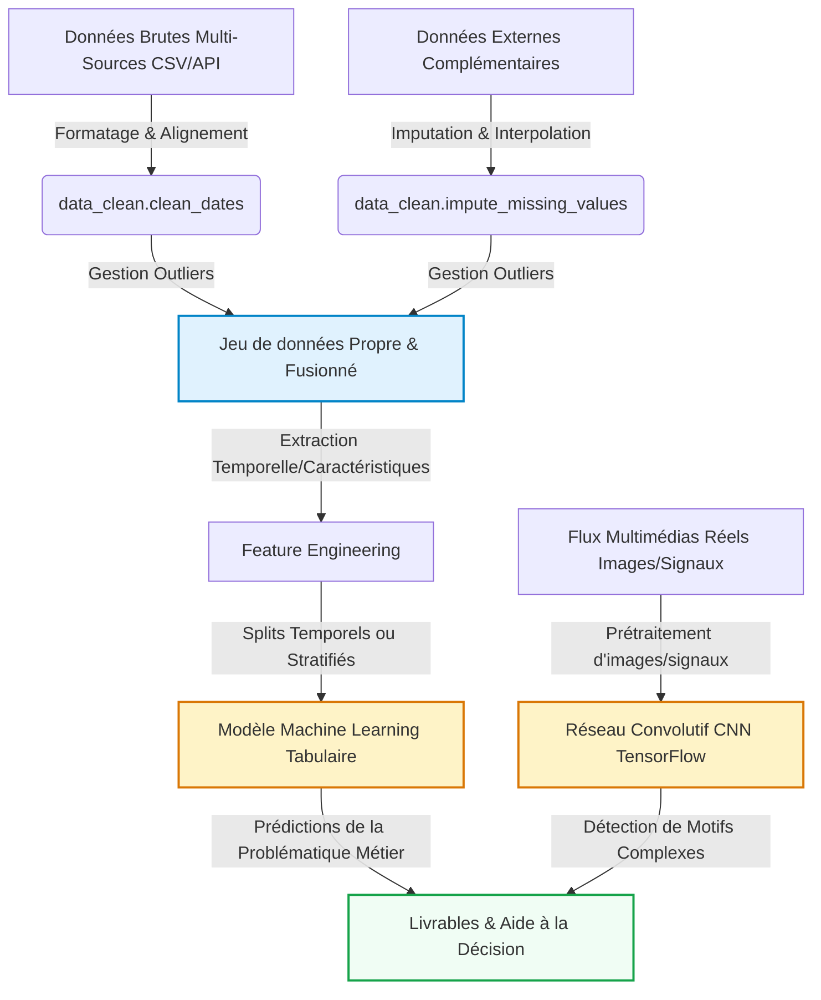

# Introduction et Contexte Métier {#sec-intro}

Ce projet analyse les données sur le Mpox (Monkeypox) pour mieux comprendre la propagation du virus. Face à l’émergence de cette maladie dans plusieurs pays, il est important de pouvoir suivre l’évolution des cas et identifier les zones à risque.

La problématique est de savoir comment prédire et anticiper la propagation du Mpox à partir de données réelles. Cela pose des questions scientifiques sur les tendances temporelles, les différences entre pays et les facteurs influençant la diffusion du virus.

L’objectif est d’offrir des insights utiles pour la prise de décision en santé publique : où surveiller davantage, quand anticiper un pic, et comment optimiser les moyens de prévention.

## Contexte du Projet

Ce projet étudie la propagation du Mpox dans le but de détecter des tendances et des zones à risque. Le domaine d’étude est la santé publique, avec un focus sur l’épidémiologie et l’analyse de données temporelles.

Ce sujet est stratégique car le Mpox représente une menace sanitaire émergente, et sa surveillance permet de mieux préparer les systèmes de santé. Comprendre sa dynamique aide à prévenir de futures vagues de contamination.

L’analyse quantitative est indispensable car elle transforme des données brutes en indicateurs actionnables. Elle permet de mesurer objectivement l’évolution des cas, de comparer les pays et de fonder les décisions sur des faits plutôt que sur des intuitions.

## Objectif Analytique
Les variables cibles principales sont la date, le pays, les new cases et new deaths (nouveaux cas et décès quotidiens), ainsi que les total cases et total deaths (cas et décès cumulés). L'objectif est d'analyser l'évolution de ces indicateurs dans le temps et d'identifier les pays les plus touchés par le Mpox.

Ce dataset est tabulaire avec des données épidémiologiques quotidiennes par pays sur une période d'un an. L’analyse se concentre sur les variables principales conservées après nettoyage

---

# Acquisition et Préparation des Données (Data Wrangling) {#sec-wrangling}

Le succès de tout projet de Data Science repose sur la qualité de la préparation des données [@pandas2020]. Cette section documente l'audit de qualité et les étapes de nettoyage appliquées à vos jeux de données bruts.

## Audit de Qualité
Le fichier de données a été vérifié sur les aspects essentiels de qualité, notamment la structure des colonnes, la présence de valeurs manquantes et la présence éventuelle de doublons. L’audit a montré que certaines colonnes contenaient trop de cases vides, ce qui risquait de nuire à la fiabilité des analyses.

Nous avons donc choisi de supprimer ces colonnes afin de conserver uniquement les variables réellement exploitables. En parallèle, les doublons ont aussi été contrôlés pour éviter les répétitions dans le jeu de données et garantir une base plus propre.

Après ce tri, les données restantes ont pu être analysées sans difficulté majeure. Le dataset final est donc mieux adapté aux étapes d’exploration, de visualisation et de modélisation.
## Algorithme de Nettoyage
Le traitement des données a commencé par un nettoyage des dates afin d’obtenir un format homogène et exploitable pour l’analyse temporelle. Nous avons ensuite supprimé les colonnes contenant trop de valeurs manquantes, car elles apportaient peu d’information et risquaient de fragiliser les analyses.

Comme le jeu de données contenait à la fois des informations au niveau des pays et des continents, nous avons conservé uniquement les données par pays afin d’avoir une analyse plus précise et plus cohérente. 

Enfin, nous avons supprimé les colonnes jugées non utiles car redondantes, afin de simplifier le jeu de données et de garder uniquement les variables pertinentes pour l’analyse. Nous avons également traité les valeurs manquantes de la variable `total_deaths` à l’aide d’une imputation adaptée, afin de garantir la cohérence du dataset avant l’analyse.
## Travaux Pratiques de Wrangling


---

# Analyse Exploratoire des Données (EDA) {#sec-eda}

Dans cette section, nous analysons les relations statistiques fondamentales qui régissent votre domaine d'étude au sein du jeu de données.

## Statistiques Descriptives

Le jeu de données nettoyé contient les variables principales liées au suivi du Mpox, notamment le pays, la date, le nombre total de cas, le nombre total de décès, les nouveaux cas quotidiens et les nouveaux décès quotidiens. Les premières observations montrent une structure temporelle cohérente, avec des valeurs numériques qui varient selon les pays.

Les variables cumulées comme `total_cases` et `total_deaths` permettent de suivre l’évolution globale de l’épidémie, tandis que les variables journalières `daily_new_cases` et `daily_new_deaths` mettent en évidence les fluctuations d’un jour à l’autre. On observe aussi que, dans certains pays, les décès restent nuls sur plusieurs périodes, ce qui traduit une faible mortalité observée dans ces données.

Dans l’ensemble, les variables nettoyées sont bien adaptées à une analyse descriptive, car elles permettent de comparer les pays, d’étudier l’évolution dans le temps et d’identifier les zones où la propagation est la plus marquée.

## Ingénierie de Variables (Feature Engineering)

Dans notre cas, l’ingénierie de variables est restée assez limitée, car le dataset contient déjà les informations utiles pour suivre l’évolution du Mpox. Nous avons donc conservé les variables principales comme le pays, la date, les nouveaux cas, les nouveaux décès, les cas totaux et les décès totaux. Quand certaines valeurs de total_deaths étaient manquantes, nous les avons recalculées à partir des informations disponibles afin de garder une variable exploitable et cohérente.

L’intérêt de cette étape est de s’assurer que les données utilisées pour la suite du projet soient fiables et complètes. Cela permet aussi de garder une base propre pour l’analyse descriptive et la modélisation. En pratique, cela montre une démarche rigoureuse de préparation des données, ce qui est important dans un projet de data science.
Cette étape a surtout servi à nettoyer, compléter et organiser les variables déjà présentes et enrichir la colonne `date` avec des variables temporelles simples : l’année, le mois, le mois au format année-mois et le jour de la semaine. Ces variables permettent de faciliter les regroupements temporels et l’analyse de l’évolution du Mpox dans le temps. C’est une approche adaptée à un rapport étudiant, parce qu’elle reste fidèle aux données réelles et au travail effectivement réalisé.
## Travaux Pratiques d'Exploration Visuelle (EDA)


---

---

# Modélisation et Apprentissage {#sec-modelling}

## Schéma Global du Pipeline de Données

Après l’étape de nettoyage et d’analyse exploratoire, nous avons mis en place une première approche de modélisation prédictive. L’objectif n’est pas de prédire médicalement l’apparition de la maladie, mais plutôt d’estimer le nombre de nouveaux cas quotidiens de Mpox à partir de l’historique disponible dans le dataset.

Le projet repose sur des données tabulaires organisées par pays et par date. Le pipeline est donc centré sur une approche de Machine Learning supervisé, avec une cible numérique : `daily_new_cases`.

## Modélisation Tabulaire (Machine Learning)
La modélisation réalisée dans ce projet correspond à un problème de régression supervisée. La variable cible choisie est daily_new_cases, qui représente le nombre de nouveaux cas quotidiens de Mpox.

Ce choix est plus pertinent que la prédiction des cas cumulés (total_cases), car les cas cumulés augmentent mécaniquement au fil du temps. Prédire une variable cumulative risquerait donc de produire un résultat artificiellement bon, mais peu utile d’un point de vue analytique. À l’inverse, les nouveaux cas quotidiens sont plus difficiles à prédire, mais ils décrivent mieux la dynamique réelle de l’épidémie.

Pour éviter de mélanger des comportements très différents entre pays, la modélisation a été réalisée sur un seul pays : celui qui présente le plus grand nombre de nouveaux cas cumulés dans le dataset. Cette décision permet de travailler sur une série temporelle plus cohérente, avec une dynamique locale mieux identifiable.

Les variables explicatives utilisées sont principalement issues de l’historique des jours précédents. Nous avons créé plusieurs variables de retard, par exemple les nouveaux cas observés 1, 2, 3, 7, 14 et 21 jours auparavant. Nous avons également ajouté des moyennes mobiles et des maximums mobiles afin de lisser les variations quotidiennes et de mieux représenter les tendances récentes.

Plusieurs modèles ont été comparés :

une baseline naïve, qui prédit que les nouveaux cas du jour sont égaux à ceux de la veille ;
un modèle Random Forest ;
un modèle Extra Trees ;
un modèle Gradient Boosting.

La baseline naïve est importante, car elle sert de point de comparaison. Un modèle de Machine Learning n’est intéressant que s’il apporte une amélioration par rapport à une règle simple.

Le modèle final est sélectionné automatiquement selon la MAE, c’est-à-dire l’erreur absolue moyenne. Cette métrique est adaptée à notre cas, car elle mesure directement l’écart moyen entre les nouveaux cas réels et les nouveaux cas prédits.

### Travaux Pratiques de Modélisation Tabulaire



## Modélisation Vision / Deep Learning

La partie Deep Learning de type CNN n’a pas été retenue dans ce projet, car le dataset utilisé est un jeu de données tabulaire épidémiologique. Il ne contient pas d’images, de signaux ou de données visuelles nécessitant l’utilisation d’un réseau de neurones convolutif.

Dans ce contexte, il est plus cohérent d’utiliser des modèles de régression tabulaire adaptés aux séries temporelles simples. Ce choix permet de rester aligné avec la nature réelle des données et d’éviter d’appliquer un modèle complexe qui ne serait pas justifié par le format du dataset.

---

# Évaluation Métrique et Validation {#sec-evaluation}

## Stratégie de Validation
La validation du modèle repose sur un découpage chronologique des données. Les premières observations de la série temporelle sont utilisées pour entraîner les modèles, tandis que les observations les plus récentes sont réservées au test.

Ce choix est essentiel dans un projet temporel. Un split aléatoire classique mélangerait des observations passées et futures, ce qui pourrait provoquer une fuite de données. Le modèle pourrait alors apprendre indirectement des informations issues du futur, ce qui donnerait une évaluation trop optimiste.

Le découpage chronologique simule une situation plus réaliste : on entraîne le modèle sur l’historique disponible, puis on teste sa capacité à prédire une période plus récente.

Nous avons également utilisé des variables de retard et des moyennes mobiles calculées uniquement à partir des valeurs passées. Cela permet de respecter la causalité temporelle : pour prédire une date donnée, le modèle n’utilise pas d’information provenant de cette date ou des jours suivants.

## Résultats et Interprétation

Les modèles sont évalués à l’aide de trois métriques :

MAE : erreur absolue moyenne. Elle indique de combien de cas le modèle se trompe en moyenne ;
RMSE : racine de l’erreur quadratique moyenne. Elle pénalise davantage les grosses erreurs ;
R² : coefficient de détermination. Il mesure la part de variance expliquée par le modèle.

| Modèle | Métrique 1 (MAE / Précision) | Métrique 2 (RMSE / F1-Score) | Métrique 3 (R² / Score (%)) |
|--------|-----------------|------------------|-----------|
| Baseline | 3.781250 | 9.022541 | -1.181799 |
| **Random Forest** | **1.984375** | **5.789268** | **0.101735** |

La comparaison avec la baseline naïve permet d’évaluer si les modèles de Machine Learning apportent une réelle valeur ajoutée. Si le modèle choisi obtient une MAE plus faible que la baseline, cela signifie qu’il améliore la prédiction par rapport à une simple répétition de la valeur de la veille.

Le graphique de comparaison entre les valeurs réelles et les prédictions montre que le modèle arrive à produire des estimations dans le même ordre de grandeur que les observations réelles. Cependant, certains pics de nouveaux cas restent difficiles à anticiper. Cette limite est normale, car les données épidémiologiques quotidiennes peuvent être très irrégulières.

Les variations soudaines peuvent être liées à des facteurs qui ne sont pas présents dans le dataset, par exemple les retards de déclaration, les changements de politique de dépistage, les différences de surveillance sanitaire ou encore des événements locaux spécifiques.

Ainsi, le modèle doit être interprété comme une première approche exploratoire de prédiction. Il permet de tester la faisabilité d’une prévision à partir des données disponibles, mais il ne doit pas être considéré comme un outil opérationnel de prévision sanitaire.

---

# Data Storytelling et Communication {#sec-storytelling}

## Recommandations Stratégiques / Métier
L’analyse exploratoire et la modélisation montrent que la propagation du Mpox présente une forte dimension temporelle et géographique. Les cas ne sont pas répartis de manière uniforme entre les pays, et les dynamiques d’évolution peuvent fortement varier d’un territoire à l’autre.

Une première recommandation serait donc de mettre en place un suivi différencié par pays plutôt qu’une analyse uniquement mondiale. Les pays les plus touchés doivent faire l’objet d’un suivi plus détaillé, car ils concentrent une part importante des cas et présentent des dynamiques plus marquées.

Une deuxième recommandation concerne l’importance du suivi temporel. Les nouveaux cas quotidiens étant très variables, il est préférable de compléter l’analyse journalière par des indicateurs lissés, comme les moyennes mobiles sur 7 ou 14 jours. Cela permet d’éviter de surinterpréter des pics isolés et de mieux identifier les tendances de fond.

Enfin, la modélisation prédictive peut être utilisée comme un outil d’aide à la surveillance. Même si le modèle ne prédit pas parfaitement les pics, il permet d’identifier des tendances et de comparer les prédictions aux observations réelles. Un écart important entre la prédiction et la réalité pourrait signaler une variation inhabituelle nécessitant une analyse plus approfondie.

## Limites et Perspectives

Le projet présente plusieurs limites importantes.

Tout d’abord, le dataset utilisé contient principalement des informations sur les cas, les décès, les pays et les dates. Il ne contient pas de variables externes comme la population, le taux de dépistage, les mesures sanitaires, la couverture vaccinale ou les différences de systèmes de surveillance. Ces facteurs peuvent pourtant influencer fortement le nombre de cas déclarés.

Ensuite, les données quotidiennes sont naturellement irrégulières. Certains pics peuvent être dus à des retards de déclaration ou à des corrections administratives, et non à une hausse réelle des contaminations. Cela rend la prédiction quotidienne particulièrement difficile.

Une autre limite concerne le choix de modéliser un seul pays. Cette approche améliore la cohérence temporelle, mais elle limite la généralisation du modèle à d’autres pays. Chaque territoire peut avoir une dynamique différente, ce qui nécessiterait idéalement une modélisation spécifique par pays ou un modèle global plus avancé intégrant mieux les différences géographiques.

Pour aller plus loin, plusieurs pistes d’amélioration sont possibles :

intégrer des variables externes, comme la population ou le nombre de tests réalisés ;
comparer davantage de modèles spécialisés dans les séries temporelles ;
réaliser une validation temporelle glissante au lieu d’un seul split train/test ;

Ce document dynamique a été compilé en Quarto [@quarto2024].

---

# Bibliographie {.unnumbered}

::: {#refs}
:::
